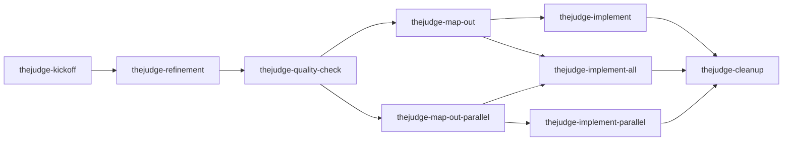

# Agent Workflow Skills

TheJudge uses 9 `thejudge-*` skills to drive PRD-based feature work, including
sequential single-slice, unattended all-slice, and dependency-wave
implementation modes. All 9 are
**model-invocable** — the agent may select the matching skill when context
clearly indicates it — and every skill remains callable explicitly
(`/thejudge-*` in Cursor and Claude Code, `$thejudge-*` in Codex).

## Single source + sync

Skills are **not** maintained in three separate copies. Edit only:

`.cursor/skills/thejudge-*/`

Codex and Claude Code load skills from their own conventional paths. This repo
copies the canonical tree into those paths with:

```bash
npm run skills:ai-sync
```

| Platform | Discovery path | Role |
| --- | --- | --- |
| Cursor | `.cursor/skills/` | **Canonical** — edit here |
| Codex | `.agents/skills/` | Synced copy |
| Claude Code | `.claude/skills/` | Synced copy |

Run `npm run skills:ai-sync` after any skill change, then commit
`.cursor/skills/`, `.agents/skills/`, and `.claude/skills/` together. All
three trees are byte-identical after a sync — every skill runs in every
runtime, including both parallel flavors (`thejudge-implement-parallel`
degrades to sequential execution in runtimes with no parallel-agent
primitive, such as Codex — see its own `SKILL.md`).

## Workflow sequence



## Skill catalog

| Skill | When | Writes | Status | Next |
| --- | --- | --- | --- | --- |
| `thejudge-kickoff` | New session or new feature idea | `IDEA.md`, `README.md`, `STATUS.ideation`, board row | → `ideation` | `thejudge-refinement` |
| `thejudge-refinement` | An idea needs product definition | `DESIGN-BRIEF.md`, section updates | `refining` → (on approval) `refined` | `thejudge-quality-check` |
| `thejudge-quality-check` | After refinement, before slicing | PASS/FAIL report only | PASS keeps `refined`; FAIL → `refining` | `thejudge-map-out` (PASS) or `thejudge-refinement` (FAIL) |
| `thejudge-map-out` | Quality-check passed; slices are sequential | `GAMEPLAN.md`, `slice-*.md`, README | → `active` | `thejudge-implement` or unattended `thejudge-implement-all` |
| `thejudge-map-out-parallel` | Quality-check passed; slices are independent enough to wave | `GAMEPLAN.md` with wave plan, `slice-*.md`, README | → `active` | `thejudge-implement-parallel` or sequential unattended `thejudge-implement-all` |
| `thejudge-implement` | Executing one planned slice | Product code and tests for that slice | Last slice done → `ship-ready` | `thejudge-implement` (next slice) or `thejudge-cleanup` |
| `thejudge-implement-all` | Executing every remaining slice in one unattended single-agent run | Product code, tests, milestone commits, shared GitHub branch, and review PR | All slices done → `ship-ready` | Manual review/merge, then `thejudge-cleanup` after shipping |
| `thejudge-implement-parallel` | Executing a whole wave of planned slices | Product code and tests for every slice in the wave, orchestrator-verified | Last slice done → `ship-ready` | `thejudge-implement-parallel` (next wave) or `thejudge-cleanup` |
| `thejudge-cleanup` | Package is `ship-ready` (or force override), or explicit corpus hygiene | Receipt under `PRD/instructions/receipts/`, section promotions, board strip | Delete folder + remove board row | Optional `thejudge-kickoff` |

Package status signals (skill-maintained on every transition):

- `PRD/work/<slug>/README.md` — `status: <value>`
- Exactly one empty `PRD/work/<slug>/STATUS.<value>` marker
- Board: `PRD/work/STATUS.md` (canonical list; `PRD/README.md` has a single-line pointer only)

Full vocabulary and rules: `PRD/instructions/workflow-reference.md`.

## Session handoffs

Every skill that hands off ends with a **Next step**: one sentence plus the
literal command, prefixed `/thejudge-*` (Cursor, Claude Code) or `$thejudge-*`
(Codex).

## Adding or updating a skill

1. Create or edit under `.cursor/skills/<skill-name>/`.
2. Run `npm run skills:ai-sync`.
3. Verify: `diff -rq .cursor/skills .claude/skills` and `diff -rq .cursor/skills .agents/skills` — both must produce no output (the trees are now a plain three-way mirror; no expected exclusions).
4. Commit all three skill trees.

## Related docs

- `PRD/instructions/workflow-reference.md` — handoff prefix rule, work-folder lifecycle, package status vocabulary + STATUS.* markers
- `PRD/work/STATUS.md` — skill-maintained work-package board
- `PRD/README.md` — product control plane
- `.cursor/skills/thejudge-kickoff/reference.md` — PRD quick map
