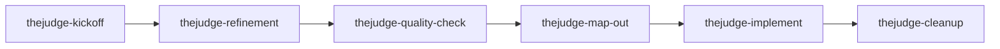

# Agent Workflow Skills

TheJudge uses six project skills to drive PRD-based feature work. Attach the matching skill manually at the start of each agent session.

## Single source + sync

Skills are **not** maintained in three separate copies. Edit only:

`.cursor/skills/thejudge-*/`

Codex and Claude Code load skills from their own conventional paths. This repo copies the canonical tree into those paths with:

```bash
npm run skills:ai-sync
```

| Platform | Discovery path | Role |
| --- | --- | --- |
| Cursor | `.cursor/skills/` | **Canonical** — edit here |
| Codex | `.agents/skills/` | Synced copy |
| Claude Code | `.claude/skills/` | Synced copy |

Run `npm run skills:ai-sync` after any skill change, then commit `.cursor/skills/`, `.agents/skills/`, and `.claude/skills/` together.

## Workflow sequence



## Skill catalog

### thejudge-kickoff

**When:** New session or new feature idea.

**Synopsis:** Loads minimal onboarding (`README.md`, `PRD/README.md`). Optionally captures `PRD/work/<slug>/IDEA.md`.

**Inputs:** Optional idea description.

**Writes:** `IDEA.md`, `README.md` (status `ideation`) when capturing an idea.

**Next:** `thejudge-refinement` (if idea captured).

### thejudge-refinement

**When:** An idea needs product definition.

**Synopsis:** Shapes the feature and writes `DESIGN-BRIEF.md` plus aligned `PRD/sections/` updates after user approval.

**Inputs:** Work slug.

**Writes:** `DESIGN-BRIEF.md`, section updates, `README.md` → `status: refined`.

**Next:** `thejudge-quality-check`.

### thejudge-quality-check

**When:** After refinement, before slicing.

**Synopsis:** Gates map-out with a PASS/FAIL report against PRD alignment and implementability.

**Inputs:** Work slug.

**Writes:** Report only (trivial fixes only with approval).

**Next:** `thejudge-map-out` (PASS) or `thejudge-refinement` (FAIL).

### thejudge-map-out

**When:** After quality-check passes.

**Synopsis:** Creates `GAMEPLAN.md` and lettered slice docs for agent implementation.

**Inputs:** Work slug.

**Writes:** `GAMEPLAN.md`, `slice-*.md`, `README.md` → `status: active`.

**Next:** `thejudge-implement` (first slice).

### thejudge-implement

**When:** Executing a planned slice (usually in Codex or Claude).

**Synopsis:** Implements one slice end to end — code, tests, verification, slice status updates.

**Inputs:** Work slug; optional slice letter.

**Writes:** Product code and tests per slice scope.

**Next:** `thejudge-implement` (next slice) or `thejudge-cleanup` (all done).

### thejudge-cleanup

**When:** Feature shipped or corpus hygiene.

**Synopsis:** Promotes durable PRD truth, writes receipt, deletes `PRD/work/<slug>/`.

**Inputs:** Work slug.

**Writes:** Receipt under `PRD/instructions/receipts/`, section promotions.

**Next:** Optional `thejudge-kickoff` for new work.

## Session handoffs

Every skill that hands off ends with a **Next step** section containing copy-paste blocks for **Cursor**, **Codex**, and **Claude Code**. Full templates: `PRD/instructions/workflow-reference.md` (Handoff blocks).

## Adding or updating a skill

1. Create or edit under `.cursor/skills/<skill-name>/`.
2. Run `npm run skills:ai-sync`.
3. Verify: `diff -rq .cursor/skills .agents/skills` and `diff -rq .cursor/skills .claude/skills` (no output = identical).
4. Commit all three skill trees.

## Related docs

- `PRD/instructions/workflow-reference.md` — handoff templates, slice format, checklists
- `PRD/README.md` — product control plane
- `.cursor/skills/thejudge-kickoff/reference.md` — PRD quick map
