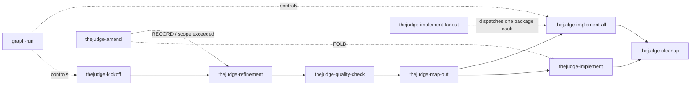

# Agent Workflow Skills

TheJudge uses 11 `thejudge-*` skills to drive PRD-based feature work — including
autonomous preparation, sequential single-slice, unattended all-slice, and
cross-package fanout modes — plus 3 `graph-*` skills that chain those 11 into
autonomous runs. All 14 are **model-invocable** — the agent may select the
matching skill when context clearly indicates it — and every skill remains
callable explicitly (`/thejudge-*` and `/graph-*` in Claude Code,
`$thejudge-*` and `$graph-*` in Codex).

## Single source + sync

Skills are **not** maintained in two separate copies. Edit only:

`.claude/skills/<skill-name>/` — both `thejudge-*` and `graph-*`

Codex loads skills from its own conventional path. This repo copies the
canonical tree into that path with:

```bash
npm run skills:ai-sync
```

| Platform | Discovery path | Role |
| --- | --- | --- |
| Claude Code | `.claude/skills/` | **Canonical** — edit here |
| Codex | `.agents/skills/` | Synced mirror |

Run `npm run skills:ai-sync` after any skill change, then commit
`.claude/skills/` and `.agents/skills/` together. Both trees are
byte-identical after a sync — every skill runs in both runtimes.

## Workflow sequence



`thejudge-amend` is the intake door for new items arriving at an `active`
package. It routes each item to an existing slice, holds it for refinement, or
refuses it — and owns no status transitions, so a mid-flight package keeps
implementing while a batch is triaged. It exists so that folding a few reports
into already-sliced work does not require a full
refinement → quality-check → map-out round-trip. Before map-out it refuses:
refinement is the cheap path while nothing is sliced.

`thejudge-implement-fanout` is the cross-package entry point: given two or
more simultaneously `active` packages, it dispatches one isolated worktree +
agent per package, each running `thejudge-implement-all` against that
package's own GAMEPLAN. It does not replace `thejudge-implement` or
`thejudge-implement-all` — it drives one unattended run per package.

`thejudge-defer` can move any non-`ship-ready` package to `deferred` and back,
orthogonal to the pipeline shown above.

## Skill catalog

| Skill | When | Writes | Status | Next |
| --- | --- | --- | --- | --- |
| `thejudge-prepare` | Autonomous preparation of one arbitrary request is wanted directly, outside `graph-run`, before an unattended implementation loop | One reviewed `PRD/work/<slug>/` package plus a docs-only preparation branch/PR, or `NO ACTIONABLE PACKAGE` | READY → `active`; BLOCKED preserves the furthest valid status | After human merge, `thejudge-implement-all` |
| `thejudge-kickoff` | New session or new feature idea | `IDEA.md`, `README.md`, `STATUS.ideation`, board row | → `ideation` | `thejudge-refinement` |
| `thejudge-refinement` | An idea needs product definition | `DESIGN-BRIEF.md`, section updates | `refining` → (on approval) `refined` | `thejudge-quality-check` |
| `thejudge-quality-check` | After refinement, before slicing | PASS/FAIL report only | PASS keeps `refined`; FAIL → `refining` | `thejudge-map-out` (PASS) or `thejudge-refinement` (FAIL) |
| `thejudge-map-out` | Quality-check passed; slices are sequential | `GAMEPLAN.md`, `slice-*.md`, README | → `active` | `thejudge-implement` or unattended `thejudge-implement-all` |
| `thejudge-implement` | Executing one planned slice | Product code and tests for that slice | Last slice done → `ship-ready` | `thejudge-implement` (next slice) or `thejudge-cleanup` |
| `thejudge-implement-all` | Executing every remaining slice in one unattended single-agent run | Product code, tests, milestone commits, shared GitHub branch, and review PR | All slices done → `ship-ready` | Manual review/merge, then `thejudge-cleanup` after shipping |
| `thejudge-implement-fanout` | Two or more packages are `active` and should implement concurrently | Nothing directly; dispatches one isolated worktree/agent per package into `thejudge-implement-all` | Owned per-package by the dispatched skill | Manual review/merge each PR, then `thejudge-cleanup` per package |
| `thejudge-amend` | New issues/requests arrive for an `active` package that is already mapped out | Slice requirements for folded items; a dated `## Amendments` entry for held items; nothing else | None — never transitions status | `thejudge-implement` for folded work; `thejudge-refinement` for held items |
| `thejudge-defer` | A package should be parked as not-next work, or a parked package restored | README deferral record, `STATUS.deferred` marker, board row | Toggles current ⇄ `deferred` | None when deferring; the typical next skill for the restored status when restoring |
| `thejudge-cleanup` | Package is `ship-ready` (or force override), or explicit corpus hygiene | Receipt under `PRD/instructions/receipts/`, section promotions, board strip | Delete folder + remove board row | Optional `thejudge-kickoff` |

## Graph workflow skills

Three `graph-*` skills chain the lifecycle above into one autonomous run. They
**delegate** to the `thejudge-*` skills rather than reimplementing them — the
graph adds sequencing, a ledger, and gates, not a second pipeline. The phase
skills recognize `graph-run is controlling` alongside
`thejudge-prepare is controlling`; that predicate is the only graph-specific
behavior they carry.

| Skill | When | Writes | Delegates to |
| --- | --- | --- | --- |
| `graph-preflight` | Before an autonomous run, to guarantee a clean freshly branched checkout | Auto-commit or stash, new pushed branch, handoff record | `scripts/graph-preflight.mjs` |
| `graph-run` | Advancing one package through the full lifecycle without per-step input | `PRD/work/<slug>/GRAPH-RUN.md` ledger, package README `## Autonomous metadata` and `## Preparation gate`, status transitions, gate parks | `graph-preflight`, the boundary hook (`scripts/graph-boundary-hook.mjs`, always on), then 6 of the 11 phase skills — `thejudge-kickoff`, `-refinement`, `-quality-check`, `-map-out`, `-implement-all`, `-cleanup` — plus a no-write reviewer subagent at node 7 |
| `graph-gate-review` | After a run parks at the `define` gate, to walk the recorded `PRD/sections/` diff one stable ID at a time | `GRAPH-RUN.md`'s `## Gate verdicts` and resolved `## Open gate`, the restored `STATUS.*` marker and board row, and `PRD/sections/` edits — only to apply an owner verdict | nothing; it never dispatches and never advances a node |

Graph runs load `.claude/graph-profile.json` as their permission profile:

```bash
claude --settings .claude/graph-profile.json
```

Without that flag the profile is inert: nothing loads it, nothing detects its
absence, and every boundary it encodes falls back to convention. Launch graph
runs with it.

Full contract, node table, model map, and boundaries:
`PRD/instructions/graph-workflow-contract.md`.

Package status signals (skill-maintained on every transition):

- `PRD/work/<slug>/README.md` — `status: <value>`
- Exactly one empty `PRD/work/<slug>/STATUS.<value>` marker
- Board: `PRD/work/STATUS.md` (canonical list; `PRD/README.md` has a single-line pointer only)

Full vocabulary and rules: `PRD/instructions/workflow-reference.md`.

## Off-lifecycle investigation skills

Two skills sit **outside** the lifecycle above — they investigate and report,
they do not move a package through statuses. Neither carries `STATUS.*`
machinery, and both are model-invocable and explicitly callable.

| Skill | When | Writes | Lands as |
| --- | --- | --- | --- |
| `thejudge-investigate` | An open-ended question needs working out before it's a feature — what a change takes, which option wins, is it worth building — with optional ad-hoc subagents | `PRD/work/probe-<slug>/` (thin `PROBE.md`, `FINDINGS-*.md`, and — build-bound only — a `GRAPH-BRIEF.md`) | A plain answer, or a `/graph-run` handoff |
| `thejudge-sweep` | One question applied across many comparable places (a corpus that splits into sections, one score per item) | `PRD/work/sweep-<slug>/` (finding doc per section + one `ROLLUP.md`) | One PR — the single review gate |

`thejudge-investigate` is the freeform front door; `thejudge-sweep` is the
structured audit it calls when a question collapses to one-question-across-many-
places. Investigate delegates to sweep and to `graph-run`; it never reimplements
them.

## Session handoffs

Every skill that hands off ends with a **Next step**: one sentence plus the
literal command, prefixed `/thejudge-*` (Claude Code) or `$thejudge-*`
(Codex).

## Adding or updating a skill

1. Create or edit under `.claude/skills/<skill-name>/`.
2. If the edit changes behavior — gates, refusal conditions, outcome taxonomy,
   rationalizations, or the `description` — run that skill's fixture under
   `PRD/instructions/skill-fixtures/` before merging. Format and re-run triggers:
   `PRD/instructions/skill-testing.md`. Method: `superpowers:writing-skills`.
3. Run `npm run skills:ai-sync`.
4. Verify: `diff -rq .claude/skills .agents/skills` — must produce no output (the trees are a plain two-way mirror; no expected exclusions).
5. Commit both skill trees.

## Related docs

- `PRD/instructions/workflow-reference.md` — handoff prefix rule, work-folder lifecycle, package status vocabulary + STATUS.* markers
- `PRD/work/STATUS.md` — skill-maintained work-package board
- `PRD/instructions/preparation-contract.md` — autonomous one-package preparation, assumptions, blockers, and publication
- `PRD/README.md` — product control plane
- `.claude/skills/thejudge-kickoff/reference.md` — PRD quick map
