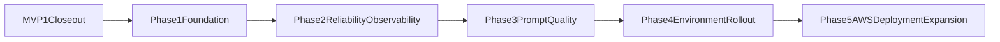

# MVP2 Bedrock Integration Roadmap

## Purpose

This document is an execution handoff for agents to:

- close remaining MVP1 engineering debt safely
- transition the backend from Phase A mock responses to real Amazon Bedrock calls
- preserve existing API contract and staged UX behavior

This roadmap follows current product truth from:

- `PRD/sections/decisions.md`
- `PRD/sections/integrations-and-data.md`
- `PRD/sections/non-functional-requirements.md`
- `README.md` story checklist

Historical MVP1 continuity references:
- `PRD/archive/mvp1/README.md`
- `PRD/archive/mvp1/key-decisions.md`
- `PRD/archive/mvp1/reference-links.md`

## Current Baseline (Start State)

- Monorepo with `apps/frontend` and `apps/backend`
- Backend provider boundary already exists and is Bedrock-ready in principle (`STORY-014`, `STORY-028`)
- API contract must remain stable:
  - `POST /api/ask-ai` request shape remains unchanged
  - success response remains `{ "answer": "string" }`
  - error response remains `{ "error": "string", "retryAfterSeconds"?: number }`
- MVP1 flow and context capture are implemented; outstanding hardening stories remain

## Hard Rules For MVP2

- Keep frontend and backend independently deployable release units.
- Bedrock credentials remain backend-only (NFR-003).
- Do not introduce rules-engine logic, legality checks, or board simulation.
- Preserve stack order semantics (`stack[0]` bottom, last item top).
- Do not break existing frontend behavior while changing backend provider internals.

## MVP1 Closeout Gate (Must Finish First)

Complete these open stories before beginning live Bedrock rollout:

- `STORY-046` backend error taxonomy + centralized middleware
- `STORY-047` prompt/context build ownership consolidation
- `STORY-048` backend logging standardization (`pino`) + payload toggle
- `STORY-049` backend test layering + fixture reuse
- `STORY-050` shared target editor extraction
- `STORY-051` battlefield step componentization
- `STORY-052` stack builder componentization
- `STORY-053` ask-ai submit/retry orchestration polish

### Exit Criteria For MVP1 Closeout

- quality gate passes (`npm run quality:check`)
- no contract regressions in backend tests
- frontend staged-flow regressions remain green
- logging/error behavior is deterministic and documented

## MVP2 Phase Plan

## Phase 1 - Bedrock Runtime Foundation

### Goal

Enable real Bedrock invocation behind the existing provider interface without changing external API shape.

### Scope

- finalize provider selection strategy:
  - `mock` for local/CI baseline
  - `bedrock` for integration environments
- define required backend env vars (region, model id, timeout, retries, provider mode)
- add startup validation with clear fail-fast errors
- implement Bedrock client factory and invoke path in provider layer

### Deliverables

- backend config module with strict validation
- provider factory with explicit mode selection
- Bedrock provider implementation + typed adapter response
- updated `.env.example` and provider docs

### Exit Criteria

- backend starts only when Bedrock config is valid in Bedrock mode
- mock mode still works exactly as before
- no request/response schema change on `/api/ask-ai`

## Phase 2 - Reliability and Observability

### Goal

Make Bedrock behavior safe to debug and operate.

### Scope

- map Bedrock failures into stable machine-readable error codes (build on `STORY-046`)
- standardize structured logs with correlation IDs (build on `STORY-048`)
- capture timing metrics per provider call:
  - total request latency
  - provider latency
  - timeout/retry counts
- define payload logging policy with a safe redaction strategy

### Deliverables

- error mapper for Bedrock SDK/runtime failures
- structured log fields contract in backend docs
- alarm-ready metric naming guidance for future AWS deployment

### Exit Criteria

- known failure classes return stable API error semantics
- correlation ID traces include provider lifecycle milestones
- logs are useful without exposing secrets

## Phase 3 - Prompt and Output Quality Hardening

### Goal

Improve answer usefulness while staying inside current product constraints.

### Scope

- preserve deterministic context-build rules while integrating model calls
- calibrate system/user prompt instructions for:
  - uncertainty language (assistant, not judge)
  - no hidden-state invention
  - concise table-friendly output for gameplay pace
- expand eval harness scenarios for high-context and edge targeting cases

### Deliverables

- prompt template versions with clear ownership
- regression fixtures for context-heavy scenarios
- acceptance checklist for response quality (accuracy tone + usefulness)

### Exit Criteria

- eval harness passes with Bedrock-enabled runs in controlled environments
- no increase in contract or schema drift risk

## Phase 4 - Environment Rollout Strategy

### Goal

Introduce Bedrock in staged environments with low regression risk.

### Scope

- rollout sequence:
  - local dev (mock default, bedrock opt-in)
  - preview/staging (bedrock enabled)
  - production (bedrock enabled with guarded fallback behavior)
- define fallback behavior when Bedrock is degraded:
  - return stable error with retry guidance
  - optional temporary mock fallback only if explicitly approved
- create go/no-go checklist for production enablement

### Deliverables

- rollout runbook with rollback steps
- environment matrix (provider mode per environment)
- release checklist for backend deployments

### Exit Criteria

- staged rollout completed without contract regressions
- on-call/debug playbook exists for provider failures

## Phase 5 - AWS Deployment Expansion (Post-Bedrock Stabilization)

### Goal

Adopt balanced AWS hosting while keeping frontend/backend independently deployable.

### Scope

- backend: managed compute (App Runner or ECS Fargate) with autoscaling
- frontend: static hosting (S3 + CloudFront or Amplify Hosting)
- secrets/config: Secrets Manager or SSM Parameter Store
- runtime logs/alerts: CloudWatch

### Exit Criteria

- frontend and backend release independently
- CORS and environment config are stable across preview/prod
- cost and latency are within acceptable targets

## Suggested Agent Execution Order

1. Finish MVP1 closeout stories (`046` -> `053`) in dependency-aware order.
2. Implement Phase 1 foundation with no behavior changes in mock mode.
3. Add Phase 2 reliability/observability before broad Bedrock enablement.
4. Run Phase 3 prompt quality loop until acceptance criteria are met.
5. Execute Phase 4 staged rollout and capture findings.
6. Plan and execute Phase 5 infrastructure hardening.

## Dependency Graph (High Level)

## Risks and Mitigations

- Risk: Bedrock integration breaks request/response contract
  - Mitigation: schema-first tests and contract fixtures remain blocking gates
- Risk: noisy logs or missing traces slow debugging
  - Mitigation: structured logging fields + correlation ID lifecycle checks
- Risk: latency degrades gameplay usefulness
  - Mitigation: timeout/retry policy + p95 tracking + prompt budget controls
- Risk: infrastructure decisions made too early
  - Mitigation: Bedrock quality and reliability gates before full AWS hosting expansion

## Definition of Done for MVP2

- `/api/ask-ai` runs Bedrock in production-intended environments
- output quality is validated by fixture and playtest loops
- failure handling is predictable and user-safe
- docs and runbooks are complete enough for a new agent to continue delivery

