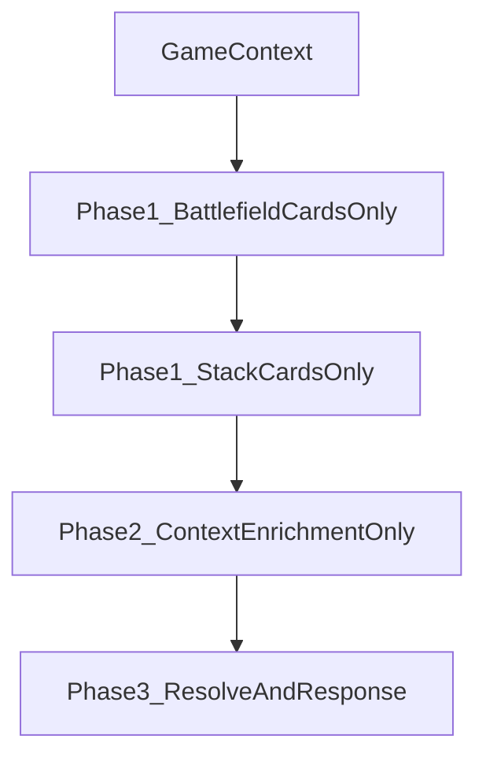

# Context Flow Three-Phase UI Gameplan

## Document Purpose

Define the pre-implementation gameplan for refining the frontend into a strict three-phase flow:

1. Phase 1: collect card identities only
2. Phase 2: enrich context only
3. Phase 3: resolve and review response

This document is intended to be the implementation contract for the next pass before additional code changes.

## Problem Statement

The current flow improved by adding a review/enrichment checkpoint, but still feels mixed because collection and context editing concerns overlap in early steps. The user intent is to break the workflow into clean phases with a single responsibility per phase.

## Goals

- Make phase boundaries obvious in UI behavior and available controls.
- Ensure autocomplete is used only for card-name lookup/selection during collection.
- Keep context editing concentrated in the enrichment phase.
- Keep submit/resolve controls concentrated in the final phase.

## Non-Goals

- No backend contract/schema changes (`AskAiRequest` shape unchanged).
- No new product-scope expansion outside flow separation and UX clarity.
- No new strict context-completion requirements beyond card lookup/selection.

## Scope Constraints

- Collection phases should not expose per-card context editing controls.
- Enrichment phase should be the single place where caster/targets/mana/notes are edited.
- Resolve controls should not appear until enrichment phase is active.

## Target Flow Contract

## Phase Definitions

### Phase 1A: Battlefield Cards Only

- User action: search and add battlefield cards to list.
- Allowed controls: search input, suggestions, preview, add/remove list entries, continue/skip.
- Disallowed controls: battlefield target-kind editing, target entry forms, details editing unrelated to card lookup.
- Exit criteria: user continues with optional battlefield list collected.

### Phase 1B: Stack Cards Only

- User action: search and add stack cards to list.
- Allowed controls: search input, suggestions, preview, add/remove list entries, continue.
- Disallowed controls: per-card caster/targets/mana/notes editing in this phase.
- Exit criteria: at least one stack card collected to continue.

### Phase 2: Context Enrichment Only

- User action: review collected cards and add/edit context on each card.
- Allowed controls: per-card context editors (caster, targets, mana, notes), question input.
- Exit criteria: user chooses to proceed to resolve.

### Phase 3: Resolve and Response

- User action: submit request, handle retry, inspect response.
- Allowed controls: submit/retry and response panel controls only relevant to resolution.
- Exit criteria: response shown or retry path engaged.

## UX Acceptance Criteria

- In collection phases, context-editing controls are not visible.
- In enrichment phase, collection controls are minimized/hidden.
- Submit button is unavailable until enrichment phase is entered.
- Flow labels and button text communicate current phase clearly.

## Test Impact Plan

- Update integration tests in `apps/frontend/src/App.test.tsx` to assert strict phase separation.
- Update focused flow/gating tests in `apps/frontend/src/App.story-074.test.tsx`:
  - no context controls in collection
  - context controls present in enrichment
  - submit gated behind enrichment step
- Run full frontend suite:
  - `npm --workspace apps/frontend run test -- --run`

## Implementation Touchpoints (Planned)

- `apps/frontend/src/App.tsx`
- `apps/frontend/src/components/BattlefieldStep.tsx`
- `apps/frontend/src/components/StackBuilderStep.tsx`
- `apps/frontend/src/App.test.tsx`
- `apps/frontend/src/App.story-074.test.tsx`

## Open Clarifications Resolved

- Remaining flow work priority: refine the new phased flow end-to-end.
- Context completion strictness: completion requirements are not being expanded; card-name lookup/selection remains the critical required behavior during collection.
