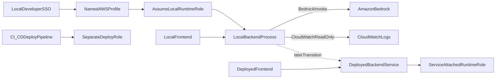

# Local IAM and AWS Transition Game Plan

## Purpose

Define a secure, practical path for running TheJudge locally while allowing only the backend to call Amazon Bedrock, then cleanly transition the same permission model to AWS-hosted backend/frontend deployments later.

This plan aligns with:
- `PRD/instructions/secrets-handling.md`
- `apps/backend/src/providers/README.md`
- `PRD/analysis/MVP2-bedrock-integration-roadmap.md` (especially Phase 5 IAM intent)

## Scope and Assumptions

- Frontend and backend run locally for current development.
- Only backend can call Bedrock.
- Authentication method is AWS SSO profile + assume-role.
- Initial permission scope is Bedrock invoke plus CloudWatch read-only diagnostics.
- No secrets are committed to git; local secret workflow follows `.secrets/` convention.

## Security Baseline (Non-Negotiable)

1. Do not store real credentials in tracked files (`.env`, `.env.example`, PRD docs, story docs, commits).
2. Keep local secret material under `.secrets/` only.
3. Keep repository env files placeholder-only; runtime values are injected from local environment/session.
4. Use short-lived credentials (SSO/assumed role), not long-lived static IAM user keys.

## Phase A: Local Development IAM Setup

### 1) Identity and Role Boundary

- Create one dedicated local runtime role (example: `TheJudgeLocalBackendRuntimeRole`).
- Allow assumption only from approved SSO principal/group.
- Avoid using broad admin roles for day-to-day local execution.

### 2) Least-Privilege Policy (Initial)

Grant only what local backend needs now:
- Bedrock runtime invoke action(s) used by provider implementation.
- Region-limited scope to selected dev AWS region.
- Model-limited scope to approved model IDs for MVP2 work.
- CloudWatch read-only diagnostics permissions for troubleshooting.

Avoid:
- wildcard action sets across unrelated AWS services
- write/admin permissions for logs or IAM during normal backend runtime

### 3) Local Credential Flow

- Configure AWS SSO profile locally (`aws configure sso`).
- Configure role chaining so local profile assumes `TheJudgeLocalBackendRuntimeRole`.
- Use SDK default credential chain in backend (profile/session-based), not hardcoded keys.
- Keep any optional local helper files in `.secrets/` and out of git.

### 4) Backend Config Contract

Backend uses non-secret runtime config only:
- `ASK_AI_PROVIDER=bedrock`
- `AWS_REGION`
- `BEDROCK_MODEL_ID`

Credential material is resolved from AWS profile/session, not app config files.

### 5) Local Verification Checklist

- `aws sts get-caller-identity` shows assumed runtime role identity.
- Backend startup validation succeeds in Bedrock mode.
- `/api/ask-ai` success path works.
- Forced failure path returns canonical contract errors and is diagnosable from read-only logs.

### 6) Tightening Pass

After first successful end-to-end execution:
- reduce action/resource scope further based on actual call patterns
- remove any temporary broad permissions
- document final runtime permissions in PRD story notes

## Operator Runbook: Create Local Role End-to-End

Use this when you are ready to actually set up local IAM access.

### Inputs You Must Decide First

- `ACCOUNT_ID`: your AWS account id
- `AWS_REGION`: dev region (example: `us-east-1`)
- `BEDROCK_MODEL_ID`: model id you will invoke from backend
- `ROLE_NAME`: recommended `TheJudgeLocalBackendRuntimeRole`
- `SSO_PROFILE_NAME`: example `thejudge-sso`
- `ASSUME_PROFILE_NAME`: example `thejudge-bedrock-local`

### Step 1: Create the runtime role

Create IAM role `ROLE_NAME` with trust policy allowing your SSO principal/group to assume it.

Trust policy shape (template):

```json
{
  "Version": "2012-10-17",
  "Statement": [
    {
      "Effect": "Allow",
      "Principal": {
        "AWS": "arn:aws:iam::<ACCOUNT_ID>:root"
      },
      "Action": "sts:AssumeRole",
      "Condition": {
        "ArnLike": {
          "aws:PrincipalArn": [
            "arn:aws:iam::<ACCOUNT_ID>:role/aws-reserved/sso.amazonaws.com/*/AWSReservedSSO_*"
          ]
        }
      }
    }
  ]
}
```

Notes:
- Restrict `aws:PrincipalArn` to your specific SSO permission-set role ARN(s), not broad account-wide patterns.
- If your org uses different SSO ARN format, adapt this condition to your actual principal ARN.

### Step 2: Attach least-privilege permissions to runtime role

Attach a starter policy to `ROLE_NAME` and narrow further after verification.

Policy template (starter):

```json
{
  "Version": "2012-10-17",
  "Statement": [
    {
      "Sid": "BedrockInvokeScoped",
      "Effect": "Allow",
      "Action": [
        "bedrock:InvokeModel",
        "bedrock:InvokeModelWithResponseStream"
      ],
      "Resource": [
        "arn:aws:bedrock:<AWS_REGION>::foundation-model/<BEDROCK_MODEL_ID>"
      ]
    },
    {
      "Sid": "CloudWatchReadOnlyDiagnostics",
      "Effect": "Allow",
      "Action": [
        "logs:DescribeLogGroups",
        "logs:DescribeLogStreams",
        "logs:GetLogEvents",
        "logs:FilterLogEvents"
      ],
      "Resource": "*"
    }
  ]
}
```

Notes:
- Keep CloudWatch read-only for local troubleshooting only.
- Depending on Bedrock model/provider behavior, you may need to adjust Bedrock action/resource scope.

### Step 3: Configure AWS SSO profile locally

Run:

```bash
aws configure sso --profile thejudge-sso
```

Then in `~/.aws/config`, add an assume-role profile that chains to SSO:

```ini
[profile thejudge-bedrock-local]
role_arn = arn:aws:iam::<ACCOUNT_ID>:role/TheJudgeLocalBackendRuntimeRole
source_profile = thejudge-sso
region = <AWS_REGION>
```

### Step 4: Login and verify assumed identity

Run:

```bash
aws sso login --profile thejudge-sso
aws sts get-caller-identity --profile thejudge-bedrock-local
```

Expected result:
- `Arn` should be an `assumed-role/TheJudgeLocalBackendRuntimeRole/...` identity.

### Step 5: Wire backend local runtime

For local run session, export profile and non-secret app config:

```bash
export AWS_PROFILE=thejudge-bedrock-local
export ASK_AI_PROVIDER=bedrock
export AWS_REGION=<AWS_REGION>
export BEDROCK_MODEL_ID=<BEDROCK_MODEL_ID>
```

Then start backend via project command.

### Step 6: Functional and failure-path checks

1. Health check passes (`/api/health`).
2. Ask endpoint succeeds once with Bedrock mode.
3. Intentionally break one input (for example invalid model id) and confirm:
   - canonical error contract is returned
   - diagnostics are visible through read-only CloudWatch access

### Step 7: Hardening after first success

- Tighten SSO trust policy principal patterns.
- Reduce CloudWatch scope from `*` if practical.
- Lock Bedrock resources to exact model IDs used.
- Document final policy JSON and trust JSON under `STORY-066`.

### Common Failure Modes and Fixes

- `AccessDeniedException` on Bedrock invoke:
  - role policy missing Bedrock invoke action or wrong model ARN/region.
- `UnrecognizedClientException` / credential resolution issues:
  - wrong `AWS_PROFILE`, expired SSO login, or profile chain misconfigured.
- Backend config validation errors:
  - missing `AWS_REGION` or `BEDROCK_MODEL_ID` when `ASK_AI_PROVIDER=bedrock`.
- Calls work in CLI but fail in app:
  - app process not inheriting `AWS_PROFILE` environment variable.

## Phase B: Transition to AWS Deployment

You can reuse the permission *intent* and many policy statements, but deployment requires additional IAM/service configuration.

### 1) Replace Trust Relationship (Critical)

- Local trust (SSO principal/group) must be replaced with service trust for deployed backend compute:
  - App Runner service role trust, or
  - ECS task role trust, or
  - Lambda execution role trust

Policy permissions may stay similar, but trust principal must change.

### 2) Separate Runtime and Deploy Roles

- Runtime role: used by backend process to call Bedrock/logging/secrets reads.
- Deploy role: used by CI/CD to publish images/artifacts and update infrastructure.
- Do not reuse runtime role for deployment operations.

### 3) Role Attachment at Service Layer

- Attach runtime role directly to backend compute service configuration.
- Ensure frontend has no Bedrock credentials and only communicates with backend HTTPS endpoint.

### 4) Secrets Promotion

- Migrate from local-only secret handling to managed stores (`Secrets Manager` or `SSM Parameter Store`) for deployed environments.
- Keep committed env files as placeholders across all environments.

### 5) Post-Deploy IAM Validation

- Confirm deployed backend identity resolves to runtime service role (not human user role).
- Validate ask-ai success path and known failure path contract behavior.
- Confirm CloudWatch visibility supports incident triage without elevated IAM rights.

### 6) Permission Drift Controls

- Any role permission broadening requires a short documented exception.
- Add follow-up task to tighten scope after emergency access changes.

## Deployment Target Notes (When Chosen)

If backend target is not yet finalized, keep this plan provider-neutral. Once target is selected, fill these specifics:
- exact trust principal(s)
- exact Bedrock API actions used by provider implementation
- exact CloudWatch log group/resource ARN constraints
- exact CI/CD actions required for deploy role

## Suggested Story/Doc Follow-Through

- Capture concrete role names, trust relationships, and permission decisions in `STORY-066`.
- Keep `apps/backend/src/providers/README.md` current with local auth and runtime mode behavior.
- Update MVP2 roadmap checklist status only when verification evidence exists.

## Architecture View



## Definition of Done for This Plan

- Local backend calls Bedrock using assumed role credentials, with no committed secrets.
- Runtime config and credential resolution are documented and reproducible.
- Transition checklist is documented before AWS deployment work begins.
- Runtime/deploy role separation is explicit and ready to implement in infrastructure.
