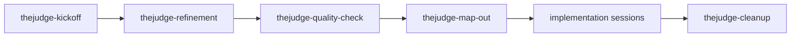

# workflow-reference.md

## Purpose

This file is the lean operator reference for TheJudge PRD-driven work.
Humans manually attach the matching `thejudge-*` skill for each session; no router or orchestrator is part of the workflow.

## Skill Sequence



## Platform Skill Paths

| Platform | Path |
| --- | --- |
| Cursor | `.cursor/skills/thejudge-*/` |
| Codex | `.codex/skills/thejudge-*/` |
| Claude Code | `.claude/skills/thejudge-*/` |

## Session Openers

- `Attach thejudge-kickoff and orient on this repo.`
- `Attach thejudge-kickoff and capture this idea: <idea>.`
- `Attach thejudge-refinement for PRD/work/<slug>/.`
- `Attach thejudge-quality-check for PRD/work/<slug>/.`
- `Attach thejudge-map-out for PRD/work/<slug>/.`
- `Implement slice A from PRD/work/<slug>/.`
- `Attach thejudge-cleanup for PRD/work/<slug>/.`

## Slice Doc Template

```markdown
# Slice A — <name>

## Status: planned

## Goal

<one objective>

## Requirements

1. <requirement>

## Acceptance criteria

- [ ] <check>

## Verification

```bash
<command>
```

## Files touched

- `<path>`
```

## Quality-Check Checklist

- No contradictions with active `DEC-###` entries.
- Current vocabulary is used in new or edited content.
- Stack ordering is preserved if work touches UI, API, or prompts.
- `technical-design-rules.md` constraints are followed.
- Scope can be implemented without hidden assumptions.
- Open questions are reserved for genuine product ambiguity.

## Terminology Modernization

| Retire | Replace with |
| --- | --- |
| old milestone labels | core product |
| old provider-stage labels | provider modes (`mock` / `openai`) |
| retired provider names | current provider boundary language |
| simplification language | intentional constraints |

## Work Folder Lifecycle

1. `ideation` — kickoff may capture `IDEA.md` and `README.md`.
2. `refined` — refinement writes `DESIGN-BRIEF.md` and approved PRD updates.
3. `active` — map-out writes `GAMEPLAN.md` and lettered slice docs.
4. Deleted — cleanup writes the durable receipt, then removes `PRD/work/<slug>/`.

## Receipt Convention

Cleanup receipts live at:

`PRD/instructions/receipts/<slug>-<YYYY-MM-DD>.md`

Receipts list date, actions taken, files created, files updated, files deleted, verification, and notes.
