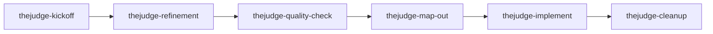

# workflow-reference.md

## Purpose

This file is the lean operator reference for TheJudge PRD-driven work.
Humans manually attach the matching `thejudge-*` skill for each session; no router or orchestrator is part of the workflow.

## Skill Sequence



## Platform Skill Paths

| Platform | Path |
| --- | --- |
| Cursor | `.cursor/skills/thejudge-*/` (canonical — edit here) |
| Codex | `.agents/skills/thejudge-*/` (synced copy) |
| Claude Code | `.claude/skills/thejudge-*/` (synced copy) |

After any edit under `.cursor/skills/`, run `npm run skills:ai-sync` before commit. See `AGENT-SKILLS.md`.

## Session Openers

### Cursor

- `/thejudge-kickoff` — orient on this repo
- `/thejudge-kickoff` — capture this idea: `<idea>`
- `/thejudge-refinement PRD/work/<slug>/`
- `/thejudge-quality-check PRD/work/<slug>/`
- `/thejudge-map-out PRD/work/<slug>/`
- `/thejudge-map-out-parallel PRD/work/<slug>/` — wave-grouped slices for concurrent work
- `/thejudge-implement PRD/work/<slug>/ slice A`
- `/thejudge-implement PRD/work/<slug>/`
- `/thejudge-implement-codex PRD/work/<slug>/ wave 1` — delegate to Codex CLI, verify inline
- `/thejudge-cleanup PRD/work/<slug>/`

### Codex

- `$thejudge-kickoff` — orient on this repo
- `$thejudge-kickoff` — capture this idea: `<idea>`
- `$thejudge-refinement PRD/work/<slug>/`
- `$thejudge-quality-check PRD/work/<slug>/`
- `$thejudge-map-out PRD/work/<slug>/`
- `$thejudge-map-out-parallel PRD/work/<slug>/` — wave-grouped slices (Codex implements them one wave-slice at a time)
- `$thejudge-implement PRD/work/<slug>/ slice A`
- `$thejudge-implement PRD/work/<slug>/`
- `$thejudge-cleanup PRD/work/<slug>/`

> `thejudge-implement-codex` is orchestrator-only and is intentionally not synced into the Codex runtime. In Codex, use `$thejudge-implement`.

### Claude Code

- `/thejudge-kickoff` — orient on this repo
- `/thejudge-kickoff` — capture this idea: `<idea>`
- `/thejudge-refinement PRD/work/<slug>/`
- `/thejudge-quality-check PRD/work/<slug>/`
- `/thejudge-map-out PRD/work/<slug>/`
- `/thejudge-map-out-parallel PRD/work/<slug>/` — wave-grouped slices for concurrent work
- `/thejudge-implement PRD/work/<slug>/ slice A`
- `/thejudge-implement PRD/work/<slug>/`
- `/thejudge-implement-codex PRD/work/<slug>/ wave 1` — delegate to Codex CLI, verify inline
- `/thejudge-cleanup PRD/work/<slug>/`

## Handoff blocks

Every skill that hands off must end the session with a **Next step** section:

1. One sentence: what finished and what to run next.
2. **Cursor** fenced block (`/thejudge-*` syntax).
3. **Codex** fenced block (`$thejudge-*` syntax).
4. **Claude Code** fenced block (`/thejudge-* <args>` syntax).

Substitute `<slug>`, slice letters, and skill names from the session.

### kickoff → refinement (idea captured)

**Cursor**

```text
/thejudge-refinement PRD/work/<slug>/
```

**Codex**

```text
$thejudge-refinement PRD/work/<slug>/
```

**Claude Code**

```text
/thejudge-refinement PRD/work/<slug>/
```

### refinement → quality-check

**Cursor**

```text
/thejudge-quality-check PRD/work/<slug>/
```

**Codex**

```text
$thejudge-quality-check PRD/work/<slug>/
```

**Claude Code**

```text
/thejudge-quality-check PRD/work/<slug>/
```

### quality-check PASS → map-out

**Cursor**

```text
/thejudge-map-out PRD/work/<slug>/
```

**Codex**

```text
$thejudge-map-out PRD/work/<slug>/
```

**Claude Code**

```text
/thejudge-map-out PRD/work/<slug>/
```

### quality-check FAIL → refinement

**Cursor**

```text
/thejudge-refinement PRD/work/<slug>/
```

**Codex**

```text
$thejudge-refinement PRD/work/<slug>/
```

**Claude Code**

```text
/thejudge-refinement PRD/work/<slug>/
```

### map-out → implement (first slice)

**Cursor**

```text
/thejudge-implement PRD/work/<slug>/ slice <letter>
```

**Codex**

```text
$thejudge-implement PRD/work/<slug>/ slice <letter>
```

**Claude Code**

```text
/thejudge-implement PRD/work/<slug>/ slice <letter>
```

### map-out-parallel → implement-codex (first wave)

Cursor/Claude delegate the wave to the Codex CLI; Codex runs slices one at a time.

**Cursor**

```text
/thejudge-implement-codex PRD/work/<slug>/ wave <n>
```

**Codex**

```text
$thejudge-implement PRD/work/<slug>/ slice <letter>
```

**Claude Code**

```text
/thejudge-implement-codex PRD/work/<slug>/ wave <n>
```

### implement-codex → next wave

**Cursor**

```text
/thejudge-implement-codex PRD/work/<slug>/ wave <n>
```

**Codex**

```text
$thejudge-implement PRD/work/<slug>/ slice <letter>
```

**Claude Code**

```text
/thejudge-implement-codex PRD/work/<slug>/ wave <n>
```

### implement → next slice

**Cursor**

```text
/thejudge-implement PRD/work/<slug>/ slice <letter>
```

**Codex**

```text
$thejudge-implement PRD/work/<slug>/ slice <letter>
```

**Claude Code**

```text
/thejudge-implement PRD/work/<slug>/ slice <letter>
```

Or when the next letter is unknown:

```text
/thejudge-implement PRD/work/<slug>/ next slice
```

### implement → cleanup (all slices done)

**Cursor**

```text
/thejudge-cleanup PRD/work/<slug>/
```

**Codex**

```text
$thejudge-cleanup PRD/work/<slug>/
```

**Claude Code**

```text
/thejudge-cleanup PRD/work/<slug>/
```

### cleanup → kickoff (optional restart)

**Cursor**

```text
/thejudge-kickoff
```

**Codex**

```text
$thejudge-kickoff
```

**Claude Code**

```text
/thejudge-kickoff
```

## Slice Doc Template

```markdown
# Slice A — <name>

## Status: planned

## Goal

<one objective>

## Requirements

1. <requirement>

## Acceptance criteria

- [ ] <check>

## Verification

```bash
<command>
```

## Files touched

- `<path>`
```

Final slice docs (or cleanup) may append:

```markdown
## Ship gates

- [ ] Slice acceptance criteria satisfied and verified
- [ ] Tests updated; `npm run quality:check` green for touched areas
- [ ] Public contract unchanged unless slice scoped a change
- [ ] No secrets committed
- [ ] Durable outcomes promoted; `PRD/work/<slug>/` ready to delete
```

## Quality-Check Checklist

- No contradictions with active `DEC-###` entries.
- Current vocabulary is used in new or edited content.
- Stack ordering is preserved if work touches UI, API, or prompts.
- `technical-design-rules.md` constraints are followed.
- Scope can be implemented without hidden assumptions.
- Open questions are reserved for genuine product ambiguity.

## Terminology Modernization

| Retire | Replace with |
| --- | --- |
| old milestone labels | core product |
| old provider-stage labels | provider modes (`mock` / `openai`) |
| retired provider names | current provider boundary language |
| simplification language | intentional constraints |

## Work Folder Lifecycle

1. `ideation` — kickoff may capture `IDEA.md` and `README.md`.
2. `refined` — refinement writes `DESIGN-BRIEF.md` and approved PRD updates.
3. `active` — map-out writes `GAMEPLAN.md` and lettered slice docs.
4. Deleted — cleanup writes the durable receipt, then removes `PRD/work/<slug>/`.

## Receipt Convention

Cleanup receipts live at:

`PRD/instructions/receipts/<slug>-<YYYY-MM-DD>.md`

Receipts list date, actions taken, files created, files updated, files deleted, verification, and notes.
