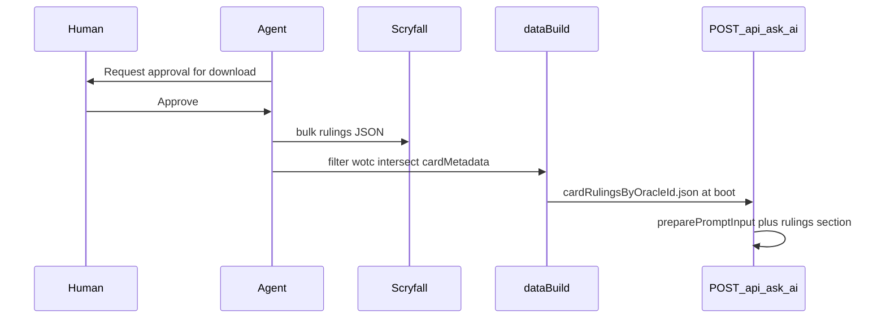

# Gameplan — Card WotC rule enrichment

## Overview

TheJudge already sends card `oracleText` and game context from the frontend to `POST /api/ask-ai`. This work adds **published WotC Oracle rulings** as additional **reference text** in the backend-built LLM prompt, keyed by the same `cardId` (Scryfall `oracle_id`) used in [`scripts/build-card-metadata.mjs`](../../../scripts/build-card-metadata.mjs).

Goals:

- Improve model grounding on card-specific Oracle rulings without changing the API contract or frontend flow.
- Keep metadata strategy static: download and trim at build time; load at server start.
- Stay within the existing 12k prompt char budget with explicit caps.

Non-goals for this package:

- Official judge-grade **output** (product still disclaims tournament rulings in the system preamble).
- New HTTP routes, frontend rulings UI, runtime Scryfall fetches, rules engine, or Scryfall-sourced (`scryfall`) notes.

## Architecture



### Request path (unchanged endpoint)

1. Frontend posts `AskAiRequest` to **`POST /api/ask-ai`** ([`apps/backend/src/app.ts`](../../../apps/backend/src/app.ts)).
2. Zod validation (unchanged).
3. `preparePromptInput(request)` ([`apps/backend/src/promptPreparation.ts`](../../../apps/backend/src/promptPreparation.ts)):
   - `buildPromptContext(request)` — normalize stack/zones (unchanged).
   - **New:** collect unique `cardId`s from context; lookup capped WotC rulings from in-memory index.
   - `buildPromptText(context, rulings)` — append rulings section (unchanged response: `{ answer }`).

No changes to `AskAiRequest` shape for this feature.

## Data pipeline

| Stage | Input | Output | Notes |
| --- | --- | --- | --- |
| Download (slice A) | `GET https://api.scryfall.com/bulk-data` → `rulings` `download_uri` | `apps/backend/data/scryfall/rulings.json` | **Gitignored** raw bulk (~24 MB). **Requires human approval.** |
| Metadata (prerequisite) | `default-cards.json` | `apps/frontend/public/data/cardMetadata.json` | Existing `npm run data:build` |
| Trim (slice B) | Raw rulings + cardMetadata `cardId` set | `apps/backend/data/cardRulingsByOracleId.json` | **Committed** to repo |
| Runtime (slice C) | Committed map | In-memory `Map` at boot | Missing file → log warning; rulings section omitted |

### Trim rules (slice B)

1. Stream-parse rulings JSON array (low memory; mirror metadata builder).
2. Keep rows where `source === "wotc"`.
3. Group by `oracle_id`.
4. **Intersect:** only oracle IDs present in `cardMetadata.json` as `cardId`.
5. Per card: sort by `published_at` descending.
6. Emit: `{ [oracleId]: [{ publishedAt: string, comment: string }] }`.
7. Drop: `id`, `source`, non-WotC rows, oracle IDs not in metadata.

### Scripts (target state)

- `npm run data:build` — runs card metadata build **and** rulings trim (B can run without re-download if raw exists).
- `npm run data:refresh` — downloads Scryfall bulks (after approval) then `data:build`.

## Prompt format spec

**Placement:** after all `ZONE:` blocks, before `SCOPE` and `QUESTION` in [`buildPromptText`](../../../apps/backend/src/promptNormalization.ts).

**Omit when empty:** if no submitted card has rulings in the index, skip the entire section.

### Section template

```text
OFFICIAL RULINGS (WotC reference)
Use these published Oracle rulings as reference for how each card works. They do not override the user's stack order, zones, or stated game state.

{cardName}
- {YYYY-MM-DD}: {comment}
- {YYYY-MM-DD}: {comment}
```

### Formatting rules

| Rule | Behavior |
| --- | --- |
| Card inclusion | Only cards in the submission (stack + populated zones) |
| Dedup | One block per distinct `cardId` |
| Card order | Stack bottom→top, then non-stack zones in canonical order (`stack` → `battlefield` → `hand` → …) |
| Cards without rulings | Omit block (no placeholder) |
| Rulings per card | Newest first; max **3** (`MAX_RULINGS_PER_CARD`) |
| Dates | Include `published_at` on every line |
| IDs in prompt | Do **not** print `cardId` / `oracle_id` to the model |
| Truncation | Per-comment and whole-section char caps; use existing `...(truncated)` suffix |
| Budget | Must respect `MAX_PROMPT_CHAR_BUDGET` (12000) |

### Example (between zones and SCOPE)

```text
OFFICIAL RULINGS (WotC reference)
Use these published Oracle rulings as reference for how each card works. They do not override the user's stack order, zones, or stated game state.

Rhystic Study
- 2020-04-17: If an opponent casts a spell, you may draw a card unless that player pays {1}.

Lightning Bolt
- 2009-10-01: Lightning Bolt deals 3 damage to any target.

SCOPE
Zones with no cards or not included in this submission ...
```

### Suggested cap constants (slice C)

- `MAX_RULINGS_PER_CARD = 3`
- `MAX_RULING_COMMENT_CHARS` — align with other prompt truncations (e.g. 480 or lower)
- `MAX_RULINGS_SECTION_CHARS` — tune so near-cap eval fixtures stay under 12k

## Human approval gate (slice A)

**Mandatory stop:** Before any command that downloads from Scryfall (`npm run data:refresh`, extended refresh script, `curl`, or `fetch` to `api.scryfall.com` / bulk `download_uri`), the agent must:

1. Tell the human what will be downloaded (rulings bulk size estimate; note if `default_cards` is bundled).
2. Wait for explicit approval in chat.
3. Record approver + date in [slice-a-scryfall-download.md](slice-a-scryfall-download.md) status notes.

If not approved, proceed only with slices B/C/D using an already-present raw `rulings.json` or committed `cardRulingsByOracleId.json` from a prior run.

## Verification checklist

- [ ] Slice A: human approval documented; raw `rulings.json` present or slice skipped with documented reason
- [ ] Slice B: `cardRulingsByOracleId.json` committed; only WotC + metadata oracle IDs; `npm run data:build` succeeds on clean checkout (with committed artifact)
- [ ] Slice C: `POST /api/ask-ai` prompt includes rulings section when fixture cards have data; section omitted when none
- [ ] Slice C: prompt stays under budget for eval fixtures (update goldens only intentionally)
- [ ] Slice C: no new routes; frontend unchanged
- [ ] Slice D: `DEC-###` in `decisions.md`; `integrations-and-data.md` updated
- [ ] `npm run quality:check` green
- [ ] Work folder deleted after promotion

## Risks

- **Prompt size:** verbose ruling histories can approach the 12k cap — caps and diagnostics are required.
- **Stale data:** committed artifact ages until next approved `data:refresh` — acceptable per static metadata strategy.
- **Missing artifact in dev:** backend should degrade gracefully (no rulings section) if JSON missing before first build.

## References

- Scryfall bulk data: https://scryfall.com/docs/api/bulk-data (type `rulings`)
- Existing metadata: [`scripts/build-card-metadata.mjs`](../../../scripts/build-card-metadata.mjs), [`scripts/refresh-scryfall-data.mjs`](../../../scripts/refresh-scryfall-data.mjs)
- Prompt assembly: [`apps/backend/src/promptPreparation.ts`](../../../apps/backend/src/promptPreparation.ts), [`apps/backend/src/promptNormalization.ts`](../../../apps/backend/src/promptNormalization.ts)
