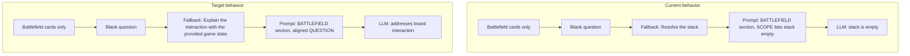
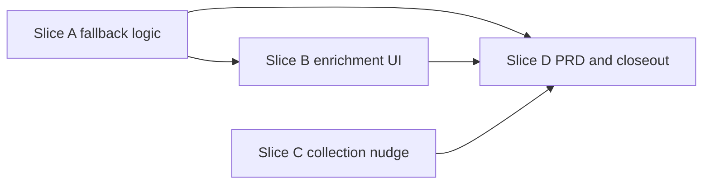

# Gameplan — Empty stack fallback fix

## Overview

TheJudge allows submit when **any** selected zone has cards. Phase defaults (e.g. `main_1`) often preselect **stack** alongside battlefield, hand, and graveyard — but users may only populate battlefield. If the question is left blank, both frontend and backend substitute the fallback **`"Resolve the stack"`**, which asks the LLM to resolve a stack that was never submitted. The model correctly reports an empty stack.

**Reported walkthrough (2026-06-05):**

- Turn phase: **Pre Combat Main Phase** (`main_1`)
- Multiple zones selected (defaults include stack + battlefield + hand + graveyard)
- Cards added **only to battlefield**
- Enrichment: card-by-card wizard completed; **targets skipped** (allowed)
- Question left blank → **Decrypt Stack**
- AI answer: stack provided was empty

**Root cause:** mismatch between populated zones and fallback question — **not** missing targets. Skipped targets render as `targets: (none)` on each card in the prompt; stack cards (if any) still appear under `ZONE: STACK (BOTTOM TO TOP)`.

## Architecture (current vs target)



### Relevant code today

| Area | File | Behavior |
| --- | --- | --- |
| Submit gate | [`flow.ts`](../../../apps/frontend/src/lib/contextFlow/flow.ts) `hasAtLeastOneCardInSelectedZones` | Passes when any selected zone has cards |
| Payload | [`flow.ts`](../../../apps/frontend/src/lib/contextFlow/flow.ts) `buildAskAiRequest` | Omits empty zone keys; blank question → `"Resolve the stack"` |
| Backend fallback | [`context.ts`](../../../apps/backend/src/prompt/context.ts) | Same unconditional fallback |
| Prompt stack section | [`normalization.ts`](../../../apps/backend/src/prompt/normalization.ts) `formatStackSection` | Omitted when `orderedStack.length === 0` |
| Phase defaults | [`phaseZoneDefaults.ts`](../../../apps/frontend/src/lib/contextFlow/phaseZoneDefaults.ts) | `main_1`: battlefield, hand, stack, graveyard |
| Enrichment hint | [`EnrichmentStep.tsx`](../../../apps/frontend/src/components/EnrichmentStep.tsx) | Always shows fallback `"Resolve the stack"` |

## Fallback question spec (slice A)

Export a shared helper (frontend; mirror logic in backend):

```ts
function resolveFallbackQuestion(zones: Partial<Record<ZoneId, ZoneCardItem[]>>): string
```

| Condition | Fallback |
| --- | --- |
| `(zones.stack?.length ?? 0) > 0` | `"Resolve the stack"` |
| Any other zone has cards | `"Explain the interaction with the provided game state"` |
| No cards (should not submit) | `"Resolve the stack"` (defensive; submit already blocked) |

**Backend parity:** [`buildPromptContext`](../../../apps/backend/src/prompt/context.ts) must apply the same rule when `normalizeQuestion(payload.question)` is empty, using `gameCtx.zones`.

**API contract:** `question` string in request/response unchanged in shape; only the default value when blank changes for non-stack submissions.

## UX additions (slices B & C)

### Slice B — Enrichment summary

Before **Decrypt Stack**, show a compact **Sending to TheJudge** block:

- Populated zones: `Stack: 2 cards`, `Battlefield: 3 cards`, …
- Selected-but-empty zones (optional): `Stack: selected, no cards added`
- Dynamic fallback hint when question is blank (uses helper from slice A)

**Do not** disable Decrypt for empty stack when other zones have cards (locked decision).

### Slice C — Zone collection nudge

On **Continue** from zone collection, when `stack ∈ selectedZones` and `zones.stack` is empty, flash a non-blocking status:

> Stack zone is selected but empty — fine for board-state questions; add stack cards if you want stack resolution.

## Out of scope

- Requiring targets before submit
- Auto-adding `{ kind: "none" }` when user skips targets in the wizard
- Renaming `targets: (none)` → `(unspecified)` in prompts (optional follow-up; separate package if pursued)
- Changing `phaseZoneDefaults.ts` or requiring stack cards when stack is selected

## Verification checklist

Reproduce the reported walkthrough end-to-end:

1. Turn phase: **Pre Combat Main Phase**
2. Keep default selected zones; add cards **only to Battlefield**
3. Finish enrichment wizard without adding targets
4. Leave question blank → **Decrypt Stack**
5. **Assert request payload:**
   - `gameContext.zones.stack` is **absent** (or undefined)
   - `gameContext.zones.battlefield` has cards
   - `question` is **not** `"Resolve the stack"`
6. **Assert AI answer** addresses battlefield / board interaction, not “empty stack”

Additional checks:

```bash
npm run quality:check
```

- Existing stack-only tests still expect `"Resolve the stack"` when stack has cards and question is blank
- New tests in slice D for `main_1` + battlefield-only path

## Slice dependency graph



Slice C is independent of A/B and may ship in parallel.
