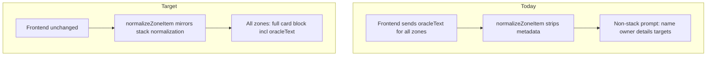

# Design Brief — Full Card Oracle in Every Zone

> **Status:** refined. Decisions confirmed — see resolved questions below.

## Scope

Backend-only changes to the prompt pipeline:

1. Preserve full card metadata (including oracle text) for non-stack zones in `PromptContext`.
2. Render the same core card field block for every populated zone in `buildPromptText`.
3. Raise all prompt/truncation/enrichment limit constants to effectively unlimited values while keeping diagnostics and enforcement infrastructure.
4. Update supplemental-rules query text to include non-stack oracle.

No API, frontend, or provider contract changes.

## Root cause analysis

| Symptom | Actual cause | Fixed by |
| --- | --- | --- |
| Hand/battlefield cards have no oracle in prompt | `normalizeZoneItem` + `formatNonStackZoneSections` omit fields | Slice A |
| Stack oracle ends with `...(truncated)` | `MAX_ORACLE_TEXT_CHARS = 480` via `normalizeCardText` | Slice B |
| Request fails with “prompt exceeds max budget” | `MAX_PROMPT_CHAR_BUDGET = 35000` hard reject in `askAi.ts` | Slice B |
| Follow-up history missing early turns | `MAX_CONVERSATION_HISTORY_CHARS = 6000` | Slice B |
| Poor supplemental rule retrieval for board cards | `buildQueryText` ignores non-stack oracle | Slice B |

## Current vs target behavior



### Before (non-stack — from `multi-zone.prompt.golden.txt`)

```
ZONE: HAND
Hand 1
name: Snapcaster Mage
owner: (none)
details: (none)
targets: (none)
```

### After (target)

```
ZONE: HAND
Hand 1
name: Snapcaster Mage
manaCost: {1}{U}
manaValue: 2
typeLine: Creature — Human Wizard
colors: U
supertypes: (none)
subtypes: Human, Wizard
owner: (none)
targets: (none)
contextNotes: (none)
oracleText: Flash. When Snapcaster Mage enters the battlefield, target instant or sorcery card in your graveyard gains flashback until end of turn. The flashback cost is equal to its mana cost.
```

Stack section keeps stack-specific lines unchanged in meaning:

```
Stack item 1 (top)
card: Lightning Bolt
...
caster: Player 2
manaSpent: 1
contextNotes: (none)
oracleText: Lightning Bolt deals 3 damage to any target.
```

## Field matrix: stack vs non-stack prompt lines

| Field | Stack section | Non-stack sections | Notes |
| --- | --- | --- | --- |
| Item header | `Stack item N (role)` | `{ZoneLabel} N` e.g. `Hand 1` | Keep existing labels |
| Name | `card: {name}` | `name: {name}` | Intentional asymmetry preserved |
| `manaCost` | yes | yes | `(none)` when empty |
| `manaValue` | yes | yes | |
| `typeLine` | yes | yes | |
| `colors` | yes | yes | |
| `supertypes` | yes | yes | |
| `subtypes` | yes | yes | |
| `caster` | yes | omit always | Non-stack cards are not cast; field does not apply outside stack |
| `owner` | no | yes | |
| `targets` | yes | yes | |
| `manaSpent` | yes | no | Stack-only |
| `contextNotes` | yes | yes | Replace old `details:` label |
| `oracleText` | yes | **add** | Required on every card |
| `cardId` | no | no | Eval harness: must not appear in prompt |
| `imageUrl` | no | no | Existing omission rule |

## Type changes (draft)

Extend `PromptContextZoneItem` in `apps/backend/src/types/index.ts`:

```typescript
export type PromptContextZoneItem = {
  cardId: string;
  name: string;
  oracleText: string;
  imageUrl: string;
  manaCost: string;
  manaValue: number;
  typeLine: string;
  colors: string[];
  supertypes: string[];
  subtypes: string[];
  owner?: PlayerLabel;
  targets: PromptContextStackTarget[];
  contextNotes?: string;
};
```

Remove `details?: string` from the type (replace with `contextNotes` aligned to stack). Update `normalizeZoneItem` accordingly.

Shared formatter sketch in `normalization.ts`:

```typescript
function formatZoneCardLines(card: {
  name: string;
  oracleText: string;
  manaCost: string;
  manaValue: number;
  typeLine: string;
  colors: string[];
  supertypes: string[];
  subtypes: string[];
  targets: PromptContextStackTarget[];
  contextNotes?: string;
}, opts: { nameLabel: "card" | "name"; displayNamesByPlayer: ... }): string[]
```

Stack wrapper adds role header, `caster`, `manaSpent`. Non-stack wrapper adds `owner`. `caster` is never emitted in non-stack sections — non-stack cards have not been cast.

## Limit constant policy

Keep all constants and truncation helpers. Introduce a single shared `EFFECTIVELY_UNLIMITED_CHARS = 1_000_000` constant in `normalization.ts` and point all `MAX_*` at it (or `EFFECTIVELY_UNLIMITED_CHARS / 10` for secondary caps). Values stay high so they can be tuned down if latency or cost concerns materialize.

| Constant | Location | Current | Target |
| --- | --- | ---: | ---: |
| `EFFECTIVELY_UNLIMITED_CHARS` | `normalization.ts` | _(new)_ | 1,000,000 |
| `MAX_PROMPT_CHAR_BUDGET` | `normalization.ts` | 35,000 | 1,000,000 |
| `PROMPT_BUDGET_NEAR_LIMIT_BUFFER` | `normalization.ts` | 800 | 10,000 |
| `MAX_ORACLE_TEXT_CHARS` | `normalization.ts` | 480 | 100,000 |
| `MAX_CONVERSATION_HISTORY_CHARS` | `normalization.ts` | 6,000 | 1,000,000 |
| `MAX_CONTEXT_DETAILS_CHARS` | `normalization.ts` | 220 | 100,000 |
| `MAX_CONTEXT_NOTES_CHARS` | `normalization.ts` | 180 | 100,000 |
| `MAX_TARGET_LABEL_CHARS` | `normalization.ts` | 120 | 100,000 |
| Per-turn history cap | `formatConversationHistorySection` | 2,000 | 100,000 |
| `MAX_RULINGS_SECTION_CHARS` | `normalization.ts` | 2,400 | 1,000,000 |
| `MAX_RULING_COMMENT_CHARS` | `normalization.ts` | 480 | 100,000 |
| `MAX_RULINGS_PER_CARD` | `normalization.ts` | 3 | 100 |

**Enforcement:** Keep `askAi.ts` budget rejection and `getPromptDiagnostics`. With 1M cap, normal fixtures and manual flows should not 400. Logging for `nearLimit` / `exceedsBudget` remains useful during testing.

**Inbound validation unchanged:** Zod `zoneCardItemSchema.oracleText` stays `boundedText(2000)` — sufficient for real cards.

## Proposed durable requirements (draft)

### REQ-030 (draft) — All-zone card metadata in prompt

- Title: Prompt assembly includes full card metadata in every populated zone
- Priority: high
- Acceptance criteria:
  - every card in every populated zone section includes `oracleText`, `manaCost`, `manaValue`, `typeLine`, `colors`, `supertypes`, `subtypes`, `targets`, and `contextNotes` lines in the assembled prompt
  - stack section retains stack-specific fields (`stackRole`, `caster`, `manaSpent`)
  - non-stack sections use `owner` and zone item labels (`Hand 1`, etc.)
  - `buildPromptContext` preserves oracle and metadata for non-stack zone items
  - eval harness includes check that every populated non-stack card name is followed by an `oracleText:` line in the same card block (new check recommended in slice C)
- Constraints: prompt-only; no API shape change

### DEC-042 (draft) — All-zone oracle in LLM prompt

- Decision: Backend prompt assembly must include full card metadata (including oracle text) for every submitted card in every populated zone, not only stack items.
- Context: PRD already stated “oracle text for each card” but implementation was stack-only; phase-scoped defaults increased non-stack submissions.
- Impact: `PromptContextZoneItem`, `normalizeZoneItem`, `formatNonStackZoneSections`, eval goldens, `buildQueryText`
- Related: REQ-030, DEC-035, integrations-and-data AI Prompt Context Rules

### DEC-030 amendment (draft) — Temporary high caps

- Note under DEC-030: `MAX_PROMPT_CHAR_BUDGET` and related truncation constants raised to 1M/100k for testing while diagnostics remain; revisit after latency/cost sampling.

## `buildQueryText` update

Current non-stack loop (lines ~122–129 in `gameRulesRetrieval.ts`):

```typescript
const itemParts = [zone.zoneId, item.name];
if (item.details) {
  itemParts.push(item.details);
}
```

Target after slice A:

```typescript
const itemParts = [zone.zoneId, item.name, item.typeLine, item.oracleText];
if (item.contextNotes) {
  itemParts.push(item.contextNotes);
}
```

Improves supplemental rule retrieval for battlefield/hand scenarios without changing max-5 supplemental rule count (DEC-032).

## Risks and mitigations

| Risk | Likelihood | Mitigation |
| --- | --- | --- |
| Larger prompts → higher latency/cost | Medium | Diagnostics already track size; caps remain tunable |
| Golden fixture churn | High | Regenerate with env flag; review diffs for oracle additions only |
| `app.contract.test.ts` budget test breaks | High | Update test strategy (see slice B) |
| Shared formatter refactor breaks stack goldens | Medium | Slice A tests + golden regen in slice B |
| Empty oracle on payload (`oracleText: ""`) | Low | Still emit `oracleText: (none)` or empty line consistently |

## Resolved questions (confirmed during refinement)

1. **`caster` on non-stack cards** — Always omit. Non-stack cards have not been cast; the field has no semantic meaning outside the stack section. Do not add `caster` to `PromptContextZoneItem`.
2. **Empty oracle** — When `oracleText` trims to empty, emit `oracleText: (none) — no oracle text recorded for this card`. The suffix gives the model context for why oracle is absent, rather than leaving a silent `(none)`.
3. **Single shared unlimited constant** — Add `EFFECTIVELY_UNLIMITED_CHARS = 1_000_000` to `normalization.ts`. All `MAX_*` constants reference it (or a fraction of it). Keeps values high and tunable from one place.

## PRD promotion targets (slice C)

| File | Edit |
| --- | --- |
| `sections/integrations-and-data.md` | Clarify “oracle text for each card” applies to all zone sections; list full field block; note temporary high caps |
| `sections/functional-requirements.md` | Add REQ-030; update REQ-022 budget value |
| `sections/decisions.md` | Add DEC-042; amend DEC-030 note |
