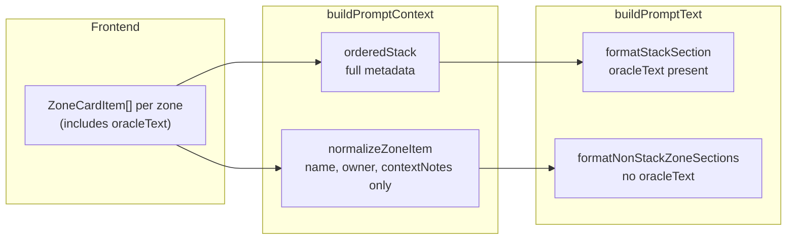

# Design Brief — Full Card Oracle in Every Zone

> **Status:** active. Limit policy confirmed: keep all settings, raise to very large values for testing.

## Scope

Backend-only changes to the prompt pipeline:

1. Preserve full card metadata (including oracle text) for non-stack zones in `PromptContext`.
2. Render the same core card field block for every populated zone in `buildPromptText`.
3. Raise all prompt/truncation/enrichment limit constants to effectively unlimited values while keeping diagnostics and enforcement infrastructure.

## Current state



Key files:

- [`apps/backend/src/prompt/context.ts`](../../../apps/backend/src/prompt/context.ts) — `normalizeZoneItem()` drops oracle and card metadata for non-stack cards.
- [`apps/backend/src/prompt/normalization.ts`](../../../apps/backend/src/prompt/normalization.ts) — non-stack formatter omits `oracleText`; stack oracle truncated via `normalizeCardText` / `MAX_ORACLE_TEXT_CHARS = 480`.
- [`apps/backend/src/types/index.ts`](../../../apps/backend/src/types/index.ts) — `PromptContextZoneItem` lacks oracle and metadata fields.
- [`apps/backend/src/gameRulesRetrieval.ts`](../../../apps/backend/src/gameRulesRetrieval.ts) — `buildQueryText()` does not include non-stack oracle for supplemental rule scoring.

Evidence: [`multi-zone.prompt.golden.txt`](../../../apps/backend/src/eval/fixtures/multi-zone.prompt.golden.txt) shows oracle on stack Lightning Bolt only; hand/graveyard cards have no oracle lines.

PRD already states intent: “oracle text for each card” in [`integrations-and-data.md`](../../sections/integrations-and-data.md).

## Target prompt shape (non-stack example)

```
ZONE: HAND
Hand 1
name: Snapcaster Mage
manaCost: {1}{U}
manaValue: 2
typeLine: Creature — Human Wizard
colors: U
supertypes: (none)
subtypes: Human, Wizard
owner: Player 1
targets: (none)
contextNotes: (none)
oracleText: Flash. When Snapcaster Mage enters the battlefield, target instant or sorcery card in your graveyard gains flashback until end of turn. The flashback cost is equal to its mana cost.
```

Stack section keeps stack-specific lines: `Stack item N (role)`, `caster`, `manaSpent`.

Replace ambiguous `details:` with `contextNotes:` for consistency with stack formatting.

## Limit constant policy

Keep all constants and truncation helpers. Raise to very large test values:

| Constant | Current | Target |
| --- | ---: | ---: |
| `MAX_PROMPT_CHAR_BUDGET` | 35,000 | 1,000,000 |
| `MAX_ORACLE_TEXT_CHARS` | 480 | 100,000 |
| `MAX_CONVERSATION_HISTORY_CHARS` | 6,000 | 1,000,000 |
| `MAX_CONTEXT_DETAILS_CHARS` | 220 | 100,000 |
| `MAX_CONTEXT_NOTES_CHARS` | 180 | 100,000 |
| `MAX_TARGET_LABEL_CHARS` | 120 | 100,000 |
| Per-turn history line cap | 2,000 | 100,000 |
| `MAX_RULINGS_SECTION_CHARS` | 2,400 | 1,000,000 |
| `MAX_RULING_COMMENT_CHARS` | 480 | 100,000 |
| `MAX_RULINGS_PER_CARD` | 3 | 100 |

Budget rejection in [`askAi.ts`](../../../apps/backend/src/routes/askAi.ts) stays in place; with a 1M cap it should not fire under normal test payloads. Diagnostics (`promptChars`, `exceedsBudget`, `nearLimit`) unchanged.

## Confirmed direction

- **All card information always provided** in the LLM prompt for every card in every populated zone.
- **Limits stay instrumented** but raised so they do not materially affect content during testing.
- **No frontend changes** required.

## Risks

| Risk | Mitigation |
| --- | --- |
| Much larger prompts increase provider cost/latency | Limits remain tunable; diagnostics already track size; revisit after manual sampling |
| Golden fixture churn | Regenerate via `UPDATE_CONTEXT_EVAL_FIXTURES=1`; review multi-zone and full-context fixtures |
| Contract test for budget exceed | Update test to reflect new cap or inject low budget in test only |
| `buildQueryText` scoring change | Expected improvement; verify supplemental rules fixtures still pass |

## PRD updates (minimal)

- `sections/integrations-and-data.md` — explicitly require full card metadata block in all zone sections, not stack-only oracle.
- Optional `sections/decisions.md` entry confirming all-zone card metadata policy.
- Update REQ-022 budget references when constants change.
