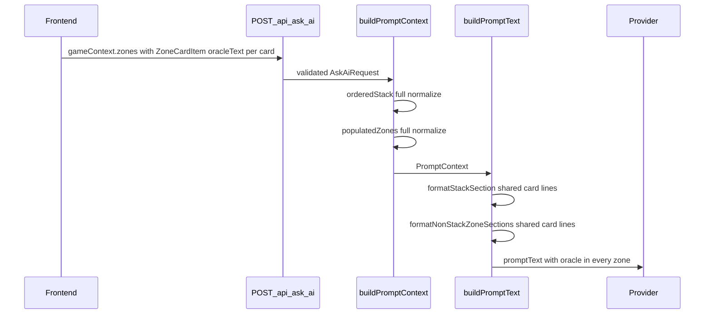

# GAMEPLAN — Full Card Oracle in Every Zone

## Architecture

### End-to-end data flow (target)



### Pipeline detail

```
[Frontend buildAskAiRequest]
  └─ gameContext.zones[*] as ZoneCardItem[] (oracleText + metadata from card metadata pipeline)

[buildPromptContext — context.ts]
  ├─ orderedStack → existing stack map (full fields + normalizeCardText)
  └─ populatedZones → normalizeZoneItem mirrors stack field pass-through + owner

[buildPromptText — normalization.ts]
  ├─ formatStackSection → formatZoneCardLines + stackRole/caster/manaSpent
  └─ formatNonStackZoneSections → formatZoneCardLines + owner + zone label

[preparePromptInput — preparation.ts]
  └─ unchanged flow; diagnostics include promptChars vs budget

[askAi route — askAi.ts]
  └─ exceedsBudget check retained (should not fire at 1M for normal payloads)

[gameRulesRetrieval.buildQueryText]
  └─ non-stack items contribute name, typeLine, oracleText, contextNotes
```

### Prompt section order (unchanged)

1. SYSTEM ROLE PREAMBLE
2. INSTRUCTIONS
3. MTG REFERENCE
4. GENERAL GAME CONTEXT
5. PHASE GUIDANCE
6. Zone sections (STACK then non-stack canonical order)
7. GAME RULES (reference)
8. ADDITIONAL RELEVANT RULE EXCERPTS (when scored)
9. OFFICIAL RULINGS (when matched)
10. SCOPE
11. CONVERSATION HISTORY (when present)
12. QUESTION

Only zone section **content** changes — not section order.

### Key constraints

- Public API unchanged — no new request fields.
- Stack ordering semantics unchanged — `stack[0]` bottom, last entry top.
- `cardId` still omitted from prompt text (`checkPromptOmitsCardId` eval check).
- `imageUrl` still omitted from LLM-facing output.
- Limit constants remain exported and tested; only values change in slice B.
- Mock provider continues embedding full prompt in `answer` blob.

## File map

### Slice A — Context + formatting

| File | Change |
| --- | --- |
| `apps/backend/src/types/index.ts` | Extend `PromptContextZoneItem`; remove `details` in favor of `contextNotes` + full metadata |
| `apps/backend/src/prompt/context.ts` | Rewrite `normalizeZoneItem()` to mirror stack normalization |
| `apps/backend/src/prompt/normalization.ts` | Add `formatZoneCardLines()`; refactor stack + non-stack formatters |
| `apps/backend/src/prompt/context.test.ts` | Non-stack oracle + metadata assertions |
| `apps/backend/src/prompt/normalization.test.ts` | Non-stack `oracleText:` in prompt; battlefield/hand/graveyard cases |

### Slice B — Limits + retrieval + tests + PRD

| File | Change |
| --- | --- |
| `apps/backend/src/prompt/normalization.ts` | Raise all `MAX_*` constants |
| `apps/backend/src/prompt/preparation.ts` | Uses updated ruling limit imports (no logic change) |
| `apps/backend/src/gameRulesRetrieval.ts` | `buildQueryText()` non-stack oracle + typeLine |
| `apps/backend/src/gameRulesRetrieval.test.ts` | Query text includes non-stack oracle (if test file exists; add if not) |
| `apps/backend/src/prompt/normalization.test.ts` | Update budget/truncation tests for new caps |
| `apps/backend/src/app.contract.test.ts` | Budget-exceed test strategy |
| `apps/backend/src/eval/contextEvaluationHarness.ts` | Optional new `oracle-in-all-zones` check |
| `apps/backend/src/eval/fixtures/*` | Regenerate goldens |
| `PRD/sections/integrations-and-data.md` | All-zone metadata + cap note |
| `PRD/sections/functional-requirements.md` | REQ-030 + REQ-022 budget update |
| `PRD/sections/decisions.md` | DEC-042 + DEC-030 amend |

### Slice C — Ship

| File | Change |
| --- | --- |
| `PRD/instructions/receipts/full-card-oracle-prompt-YYYY-MM-DD.md` | Ship receipt |
| `PRD/work/full-card-oracle-prompt/` | Delete after promotion |
| `PRD/README.md` | Remove from active work table |

## Eval harness impact

Existing checks (unchanged intent):

| Check ID | Impact |
| --- | --- |
| `populated-zones-section` | Still passes — headers unchanged |
| `prompt-omits-card-id` | Still must pass |
| `mana-spent-output` | Stack-only — unchanged |
| `prompt-under-budget` | Passes after 1M cap |
| `prompt-section-order` | Unchanged |

**Recommended new check (slice B or C):**

- `oracle-text-all-zones` — for each item in `context.populatedZones` and `context.orderedStack`, prompt contains `oracleText:` after the card name within the same zone section.

## Golden fixtures to review after regen

| Fixture | Why it matters |
| --- | --- |
| `multi-zone` | Hand + graveyard oracle additions |
| `full-context` | Battlefield Rhystic Study oracle |
| `follow-up-chat` | Non-stack cards in follow-up scenario |
| `battlefield-skip` | Battlefield-only cards |
| `cascade-keyword` | Battlefield creature oracle |
| `ambiguous-wording` | Multi-card battlefield/stack mix |
| All `*.context.golden.json` | Non-stack items gain oracle fields in normalized context |

## Verification checklist

### Slice A gate

- [ ] `npx vitest run apps/backend/src/prompt/context.test.ts`
- [ ] `npx vitest run apps/backend/src/prompt/normalization.test.ts`
- [ ] Manual: `npm run prompt:preview` — inspect `multi-zone` for hand/graveyard `oracleText:`

### Slice B gate

- [ ] `npm run test` (root)
- [ ] `UPDATE_CONTEXT_EVAL_FIXTURES=1 npm run test -- apps/backend/src/eval`
- [ ] `npx vitest run apps/backend/src/app.contract.test.ts`
- [ ] Confirm no `...(truncated)` on typical card oracle in goldens

### Slice C gate

- [ ] PRD sections promoted (REQ-030, DEC-042)
- [ ] Receipt written
- [ ] Work folder deleted
- [ ] `PRD/README.md` active work table updated

## Commands reference

```bash
# Slice A unit tests
npx vitest run apps/backend/src/prompt/context.test.ts apps/backend/src/prompt/normalization.test.ts

# Full test suite
npm run test

# Regenerate eval goldens (review diff before commit)
UPDATE_CONTEXT_EVAL_FIXTURES=1 npm run test -- apps/backend/src/eval

# Prompt preview
npm run prompt:preview

# Typecheck
npx tsc --noEmit -p apps/backend
```

## Rollback strategy

If provider latency becomes unacceptable before caps are re-tuned:

1. Lower `MAX_PROMPT_CHAR_BUDGET` first (diagnostics show utilization).
2. Re-enable oracle truncation only as last resort — conflicts with DEC-042 intent; prefer reducing enrichment sections over truncating card oracle.
