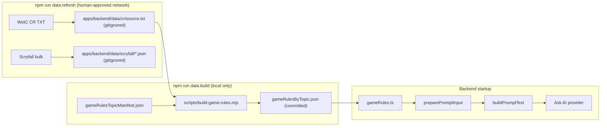

# GAMEPLAN — general-game-rules-prompt

## Status

Active work package (map-out 2026-06-05). Product truth: [DESIGN-BRIEF.md](./DESIGN-BRIEF.md). Durable PRD already promoted (DEC-030, REQ-022, integrations-and-data, NFR-002 note).

## Goal

Ship verbatim WotC Comprehensive Rules excerpts in every Ask AI prompt via a committed backend artifact and data pipeline — without changing API, frontend, or request shape.

## Architecture



## Data flow

1. **Refresh** — `scripts/refresh-scryfall-data.mjs` downloads Scryfall bulk feeds (existing) and WotC CR TXT (new). Each download is best-effort: failure logs a warning and continues; never aborts the whole refresh for one source.
2. **Build** — `scripts/build-game-rules.mjs` reads `gameRulesTopicManifest.json` + gitignored `cr/source.txt`, extracts verbatim prose for listed rule numbers, writes `gameRulesByTopic.json`. Missing source or failed per-topic extract → log warning, preserve prior committed excerpt, exit 0.
3. **Runtime** — `loadGameRulesTopics()` at startup (mirror `loadCardRulingsIndex`). `preparePromptInput` passes the full library to `buildPromptText`. `formatGameRulesSection` renders all topics in stable manifest `id` order.
4. **Prompt order** — zone sections → **GAME RULES (reference)** → OFFICIAL RULINGS → SCOPE → QUESTION.

## Artifact schemas

**Manifest** (`apps/backend/data/gameRulesTopicManifest.json`):

```json
[
  {
    "id": "stack-basics",
    "title": "The Stack",
    "ruleNumbers": ["405.1", "405.2"]
  }
]
```

**Artifact** (`apps/backend/data/gameRulesByTopic.json`):

```json
[
  {
    "id": "stack-basics",
    "title": "The Stack",
    "ruleNumbers": ["405.1", "405.2"],
    "excerpt": "405.1. …\n405.2. …"
  }
]
```

Topics sorted by `id` at build time and runtime. `excerpt` is verbatim WotC CR prose only.

## Token budget

| Component | Chars (approx) |
|-----------|----------------|
| Full game-rules library | 18,000–22,000 |
| Rest of prompt (typical) | 3,000–3,500 |
| Static MTG REFERENCE | ~1,500 |
| Card rulings (max) | up to ~2,400 |
| **Total typical** | **~25,000–27,000** |
| **Worst case** | **~29,000–32,000** |

`MAX_PROMPT_CHAR_BUDGET` = **35,000** (DEC-030). Active product risk against NFR-002 latency target.

## Slice sequence

| Slice | Objective | Depends on |
|-------|-----------|------------|
| [A](./slice-a-cr-pipeline.md) | CR download + `build-game-rules.mjs` + npm scripts | — |
| [B](./slice-b-topic-curation.md) | Curated manifest + committed artifact | A |
| [C](./slice-c-backend-prompt.md) | Runtime load + prompt section + 35k cap | B |
| [D](./slice-d-eval-latency-closeout.md) | Eval goldens + latency spike + closeout | C |

## Verification checklist (full work)

Run after slice D (or incrementally per slice):

```bash
# Data pipeline (slice A–B)
npm run data:build

# Unit + integration tests (slice A–C)
npm --workspace apps/backend run test -- src/gameRules.test.ts
npm --workspace apps/backend run test -- src/prompt/normalization.test.ts
npm --workspace apps/backend run test -- src/prompt/preparation.test.ts

# Eval goldens (slice D)
npm --workspace apps/backend run test:eval

# Full quality gate (slice D)
npm run quality:check
```

**Manual (slice D):** `npm run dev:openai` — 5–10 live scenarios; record p50/p95 latency and informal accuracy notes in slice D doc.

## Out of scope (v1)

- Per-request topic selection
- Rules engine / layer adjudication
- Format-specific rules
- Runtime CR fetch
- Frontend or `AskAiRequest` changes

## Agent read order

1. [README.md](./README.md)
2. [DESIGN-BRIEF.md](./DESIGN-BRIEF.md)
3. This GAMEPLAN
4. The slice doc being implemented
5. `PRD/sections/decisions.md` (DEC-030, DEC-029, DEC-025)
6. `PRD/sections/functional-requirements.md` (REQ-022)
