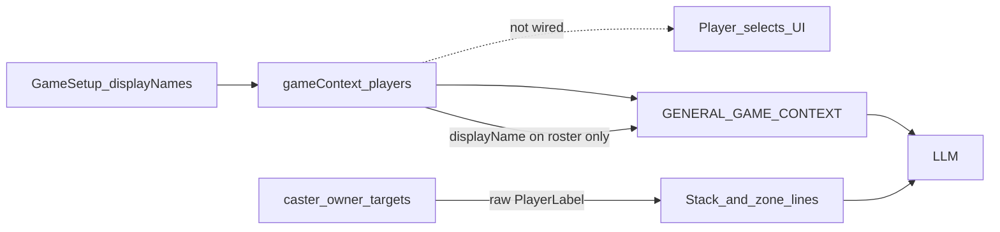
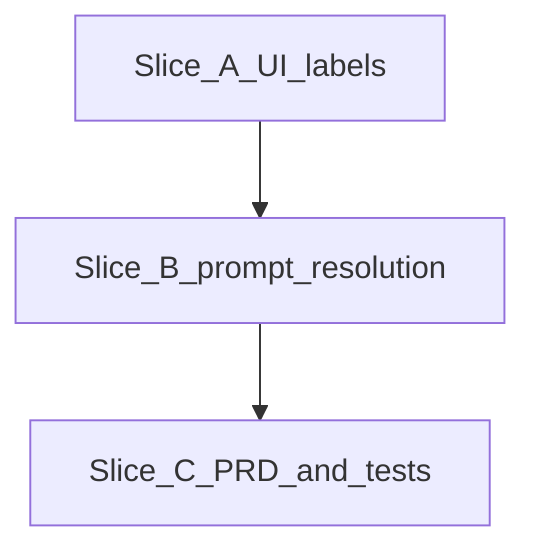

# Player display names — gameplan

> **Canonical location:** `PRD/work/player-display-names/`  
> **Handoff:** Implement slices A → C per [README.md](README.md). Cursor plan files are non-authoritative copies.

## Summary

After UX Wave 2 slice 01, users can enter per-player display names in game setup. Those names are stored in `gameContext.players[].displayName` and appear partially in the LLM prompt (roster block only). The rest of the flow still shows and prompts **`Player 1` … `Player N`** everywhere else — including the active player dropdown, owner/caster/target selects, and stack/zone card lines (`caster`, `owner`, `player:` targets).

This work package closes that gap so **user-entered names flow through UI labels and the full prompt**, while the API contract keeps fixed `PlayerLabel` values.

---

## Reported issue → root cause

| Symptom | Root cause in code today |
| --- | --- |
| Active player list does not reflect edited names | Active player `<select>` renders `{player}` only ([`App.tsx`](../../../apps/frontend/src/App.tsx) ~412–415); slice 01 explicitly left active player unchanged |
| Owner / caster / target selects show `Player N` | Same pattern in [`ZoneCardPicker.tsx`](../../../apps/frontend/src/components/ZoneCardPicker.tsx), [`EnrichmentStep.tsx`](../../../apps/frontend/src/components/EnrichmentStep.tsx) |
| LLM sees mixed naming | [`promptNormalization.ts`](../../../apps/backend/src/promptNormalization.ts) appends `displayName=` on roster lines but emits raw labels for `caster`, `owner`, and `player:` targets |
| `activePlayer` missing from prompt | [`PromptContext`](../../../apps/backend/src/types.ts) omits `activePlayer`; `formatGameContext` never writes it |



---

## Implementation order



| Order | Slice doc | Outcome |
| --- | --- | --- |
| 1 | [slice-a-ui-player-labels.md](slice-a-ui-player-labels.md) | Shared formatter; all player `<select>` and target summary labels use display names |
| 2 | [slice-b-prompt-player-resolution.md](slice-b-prompt-player-resolution.md) | Prompt resolves player refs; `activePlayer` in game context block |
| 3 | [slice-c-prd-and-tests.md](slice-c-prd-and-tests.md) | DEC-025, section updates, test sweep, closeout |

---

## Locked display format

Use one formatter everywhere (frontend + backend) for consistency:

| Condition | UI option / prompt text |
| --- | --- |
| No display name, or display name equals label | `Player 1` |
| Display name set and differs from label | `Player 1 (Alice)` |

Examples in prompt after slice B:

```
GENERAL GAME CONTEXT
turnPhase: stack_resolving
playerCount: 2
Player 1: lifeTotal=40 displayName=Alice
Player 2: lifeTotal=40 displayName=Bob
activePlayer: Player 1 (Alice)

...
caster: Player 2 (Bob)
targets: player:Player 1 (Alice)
owner: Player 1 (Alice)
```

Roster lines keep the existing `displayName=` field **and** resolved refs elsewhere use the parenthetical format above.

---

## Verification checklist

After all slices:

- [ ] Manual: expand players, set names (e.g. Alice, Bob) → active player dropdown shows `Player 1 (Alice)` / `Player 2 (Bob)`
- [ ] Manual: zone collection owner select and enrichment caster/target selects show the same labels; selected values still submit as `Player 1` / `Player 2`
- [ ] Manual: Decrypt with named players → prompt (debug log or test) shows resolved names on `activePlayer`, `caster`, `owner`, and `player:` target lines
- [ ] `npm run quality:check` green from repo root
- [ ] Backend eval harness passes if golden fixtures updated

---

## Files touched (summary)

| Area | Files |
| --- | --- |
| Shared UI helper | `apps/frontend/src/lib/playerLabels.ts` (new), `playerLabels.test.ts` (new) |
| UI labels | `App.tsx`, `ZoneCardPicker.tsx`, `ZoneCollectionStep.tsx`, `EnrichmentStep.tsx`, optional `BattlefieldStep.tsx` |
| Prompt resolution | `promptNormalization.ts`, `promptContext.ts`, `types.ts` |
| Tests | `App.test.tsx`, `promptNormalization.test.ts`, optional eval fixture + golden |
| Docs | `PRD/sections/decisions.md`, `user-flows.md`, `functional-requirements.md`, `integrations-and-data.md` |

No API validation schema changes expected (`playerLabelSchema` unchanged).

---

## Relationship to other work

| Package | Relationship |
| --- | --- |
| `user-flow-refinements` slice 01 | Introduced display names; this package completes propagation |
| `user-flow-gap-fixes` | Independent; do not merge or reorder with gap-fix slices |
