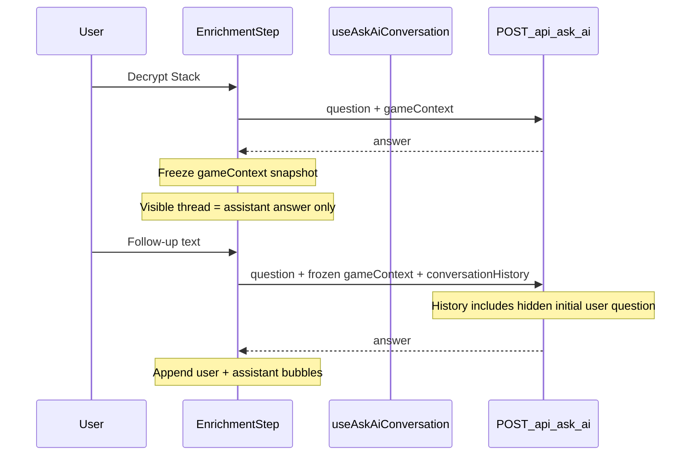

# Design Brief — Post-Decrypt Follow-Up Chat

> **Status:** draft for refinement. Decisions and requirement IDs below are proposed, not yet confirmed in `sections/decisions.md`.

## Scope

Add ephemeral post-decrypt follow-up chat on top of the existing single-endpoint ask-ai flow:

1. Extend `POST /api/ask-ai` with optional `conversationHistory` for follow-up turns.
2. Insert a `CONVERSATION HISTORY` section into backend prompt assembly when history is present.
3. Replace single-shot frontend answer state with in-session conversation state, frozen `gameContext`, and chat UI on the enrichment step.

## Current state

- **Decrypt Stack** posts `{ question, gameContext }` to `/api/ask-ai` and stores one `answer: string | null`.
- [`EnrichmentStep.tsx`](../../../apps/frontend/src/components/EnrichmentStep.tsx) gates post-success UX with `hasAnswer`: hides decrypt form, question input, and "Back to zones".
- Backend [`buildPromptText`](../../../apps/backend/src/prompt/normalization.ts) has no conversation section.
- DEC-020 / DEC-021 freeze request shape to `{ question, gameContext }` only.
- PRD non-goal: no saved sessions; intentional constraint: one main backend endpoint.

## Target flow



## Proposed decisions (to confirm in refinement)

- **DEC-0XX** — `POST /api/ask-ai` may accept optional `conversationHistory` for follow-up turns; success/error response shapes unchanged. Amends DEC-020 contract freeze for this additive optional field only.
- **DEC-0XX** — Follow-up chat uses client-side ephemeral history only; no server-side session store. Consistent with "no saved sessions" non-goal.
- **DEC-0XX** — Game context is frozen after first successful decrypt for the duration of the in-session conversation; follow-ups are text-only in v1.

## Proposed requirements (to confirm in refinement)

- **REQ-0XX** — After a successful Decrypt Stack, the enrichment step shows a conversation thread whose first visible message is the assistant answer.
- **REQ-0XX** — Users can submit text follow-ups that append to the thread; each follow-up uses the frozen game context from the initial decrypt.
- **REQ-0XX** — Follow-up requests include `conversationHistory` with the full prior exchange, including the initial user question (which may be hidden in the UI).
- **REQ-0XX** — Users can start over from the conversation state, clearing the thread and unfreezing enrichment editing without persisting history.

## API contract extension

Add optional field to existing endpoint:

```typescript
conversationHistory?: Array<{
  role: "user" | "assistant";
  content: string;
}>;
```

### Semantics

| Turn | `question` | `gameContext` | `conversationHistory` |
| --- | --- | --- | --- |
| First decrypt | User question or fallback | Live context | Omitted |
| Follow-up N | Current follow-up text | Frozen snapshot from decrypt | Full prior exchange |

**History contents on follow-up:**

- Must include the **hidden** initial user question (including fallback e.g. `"Resolve the stack"`) and first assistant answer.
- Then all visible follow-up user messages and assistant responses in order.
- Current follow-up text goes in `question`, not duplicated in history.

### Validation (proposed)

In [`askAiRequest.ts`](../../../apps/backend/src/validation/askAiRequest.ts):

- Optional; if present: non-empty array
- Max turns (e.g. 20)
- Max chars per message (e.g. 2000)
- Same control-character guardrails as `question`
- Must start with `role: "user"` and alternate `user` / `assistant`
- Last entry must be `assistant` (prior answer being continued)

Document in `sections/integrations-and-data.md` and `sections/user-flows.md` after confirmation.

## Backend prompt changes

In [`normalization.ts`](../../../apps/backend/src/prompt/normalization.ts), when history is present, insert before `QUESTION`:

```
CONVERSATION HISTORY
User: <initial question>
Assistant: <first answer>
User: <follow-up 1>
Assistant: <response 1>

QUESTION
<current follow-up>
```

### Budget protection (DEC-030, 35k cap)

- Add `MAX_CONVERSATION_HISTORY_CHARS` (proposed: 6,000)
- Truncate oldest turns first; truncate individual messages via existing `truncateOracleText` pattern
- Include history contribution in `getPromptDiagnostics` for prompt-preview visibility

### Pipeline wiring

- Extend `AskAiRequest` / `PreparedPromptInput` in [`types/index.ts`](../../../apps/backend/src/types/index.ts)
- Pass history through [`preparation.ts`](../../../apps/backend/src/prompt/preparation.ts) → `buildPromptText`
- Provider layer unchanged — still single `promptText` string

### Instructions tweak

When history exists, add one `INSTRUCTIONS` line: treat follow-ups as refinements/clarifications against the frozen game state and prior answers.

## Frontend state and orchestration

Evolve [`useAskAiSubmitOrchestration.ts`](../../../apps/frontend/src/hooks/useAskAiSubmitOrchestration.ts) (rename optional) to track:

```typescript
type ConversationMessage = { role: "user" | "assistant"; content: string };
```

| State field | Purpose |
| --- | --- |
| `visibleMessages` | UI thread; starts `[{ role: "assistant", content: answer }]` |
| `frozenGameContext` | Snapshot at first decrypt success |
| `hiddenInitialQuestion` | Initial `payload.question` for API history; not shown in UI |

### Submit sources

| Source | Payload |
| --- | --- |
| `decrypt` | `{ question, gameContext }` — live context |
| `followup` | `{ question, gameContext: frozen, conversationHistory }` |
| `retry` | Same as failed attempt |

On follow-up success: append user message, then assistant answer. Keep `frozenGameContext` unchanged.

Extend [`ZoneAskAiPayload`](../../../apps/frontend/src/lib/contextFlow/flow.ts) and frontend [`types.ts`](../../../apps/frontend/src/types.ts).

## Frontend UI changes

Primary surface: [`EnrichmentStep.tsx`](../../../apps/frontend/src/components/EnrichmentStep.tsx)

**After first successful decrypt:**

1. **Conversation thread** — scrollable bubbles; first bubble is assistant answer
2. **Follow-up composer** — textarea + Send; 300-char limit (same as optional question today)
3. **Frozen enrichment** — disable card editing; show compact read-only context summary (zone counts + card names)
4. **Hide** initial decrypt form and Decrypt Stack button
5. **Waiting** — `AskAiWaitingPanel` during follow-up submit
6. **Error + retry** — retry resubmits failed follow-up (or initial decrypt) with same frozen context + history
7. **Start over** — clears conversation, unfreezes editing, returns to pre-decrypt enrichment (no persistence)

[`App.tsx`](../../../apps/frontend/src/App.tsx): wire `handleFollowUp`; pass messages and frozen context into `EnrichmentStep`.

Optional extraction if `EnrichmentStep` grows too large: `ConversationThread.tsx`, `AskAiFollowUpForm.tsx`.

## UI vs API history (important)

| Layer | First user message visible? |
| --- | --- |
| UI thread | **No** — thread opens with assistant answer only |
| API `conversationHistory` on follow-up | **Yes** — includes hidden initial user question + first assistant answer |

## Slices (draft)

### Slice A — PRD decision + API contract

- Confirm DEC/REQ in `sections/decisions.md`, `functional-requirements.md`, `user-flows.md`, `integrations-and-data.md`
- Extend Zod schema and types for `conversationHistory`
- Contract tests for valid/invalid history shapes

### Slice B — Backend prompt

- `CONVERSATION HISTORY` section in `buildPromptText`
- Budget caps and diagnostics
- Prompt unit tests

### Slice C — Frontend conversation hook

- Frozen context snapshot on first success
- History assembly for follow-ups
- `followup` and `retry` submit paths

### Slice D — Frontend chat UI

- Thread + follow-up composer on enrichment step
- Read-only frozen context summary
- Start over escape hatch

### Slice E — Tests + closeout

- Update `App.test.tsx` (replace "hides submit controls" expectation)
- Hook tests for multi-turn append
- Optional `prompt-preview` fixture with follow-up history
- Receipt + delete work folder when shipped

## Verification (draft)

```bash
npm run quality:check
npm run prompt:preview -- --fixture <follow-up-fixture>  # after Slice E
```

## Risks and mitigations

| Risk | Mitigation |
| --- | --- |
| Prompt budget exceeded with long threads | Cap history chars; truncate oldest turns; surface existing budget error |
| DEC-020 contract freeze | New confirmed decision allows optional additive field only |
| User stuck with wrong frozen context | Start over resets in-session state |
| Latency on follow-ups | Full prompt rebuild each turn; acceptable for v1 with frozen context |

## Open questions for refinement

- Exact max turns and max chars per history message
- Follow-up button label: "Send" vs "Ask follow-up"
- Whether start-over should also navigate back to zone collection or only reset enrichment
- Whether mock provider sidecars should echo `conversationHistory` in prompt-preview artifacts
- REQ ID numbering and DEC ID assignment

## Out of scope (v1)

- Editing zones/cards during chat
- Server-side conversation IDs
- New endpoints
- OpenAI messages-array provider refactor
- Re-decrypt with updated context
