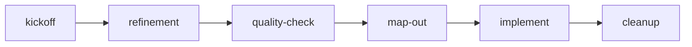

# Gameplan — PRD workflow skills rollout

## Overview

Deploy a **lean 5-skill workflow** for TheJudge PRD-driven development. Skills are copied to Cursor, Codex, and Claude Code. Old `kickoff` skill is removed. Sections corpus gets a terminology modernization pass. Every cleanup run (including this rollout) produces a durable markdown receipt.

## Goals

- Five manually-attached skills: kickoff → refinement → quality-check → map-out → cleanup
- Tri-platform deployment (15 skill folders total)
- Modernized kickoff with optional `IDEA.md` capture
- Sections terminology aligned to **core product** (retire MVP/Phase A/B framing)
- Self-contained rollout via this `PRD/work/` package

## Non-goals

- Orchestrator / router skill
- Dedicated slice-execute skill (normal sessions + slice docs)
- `docs/superpowers/` or `.cursor/plans/` persistence
- Product code changes

## Architecture

Human picks which skill to attach each session. No automatic routing.

## Skill specs

### `thejudge-kickoff`

- **Reads:** `README.md`, `PRD/README.md` only
- **Writes:** optional `PRD/work/<slug>/IDEA.md` + `README.md` (`status: ideation`)
- **Response:** 2–3 sentences; no section preload

### `thejudge-refinement`

- **Reads:** `IDEA.md` + `decisions.md` + relevant `sections/` + `requirement-format.md`, `technical-design-rules.md`
- **Writes:** `DESIGN-BRIEF.md`, section updates (`REQ/FLOW/DEC`), README `status: refined`
- **Gate:** user approval before PRD writes; ≤3 clarifying questions per round

### `thejudge-quality-check`

- **Reads:** `DESIGN-BRIEF.md` + affected sections + `workflow-reference.md` checklist
- **Writes:** pass/fail report; trivial fixes only with approval

### `thejudge-map-out`

- **Reads:** `DESIGN-BRIEF.md` + sections + `workflow-reference.md` + `doc-lifecycle.md`
- **Writes:** `GAMEPLAN.md`, `slice-*.md`, README `status: active`

### `thejudge-cleanup`

- **Reads:** work package + `doc-lifecycle.md` + `DEFINITION-OF-DONE.md`
- **Writes:** `PRD/instructions/receipts/<slug>-<date>.md` then deletes `PRD/work/<slug>/` when shipped

## Tri-platform paths

| Platform | Path |
| -------- | ---- |
| Cursor | `.cursor/skills/thejudge-*/` |
| Codex | `.codex/skills/thejudge-*/` |
| Claude | `.claude/skills/thejudge-*/` |

Staging during rollout: `PRD/work/prd-workflow-skills/skills/`

## Terminology table

| Retire | Replace with |
| ------ | ------------ |
| MVP1 / MVP2 | **Core product** |
| UX Wave 2 | **Core product** (or omit) |
| Phase A / B | **Provider modes** (`mock` / `openai`) |
| Bedrock | remove |
| MVP simplifications | **Intentional constraints** |

Add **Current Product Status** section to `PRD/sections/overview.md`.

Delete Q-001–Q-003 from `open-questions.md` (empty stub with date).

## Receipt template

Path: `PRD/instructions/receipts/<slug>-<YYYY-MM-DD>.md`

Sections: date, actions taken, files created/updated/deleted, verification, notes.

This rollout's receipt: `skill-migration-<YYYY-MM-DD>.md`

## Verification checklist

- [ ] 5 skills in each of `.cursor/skills/`, `.codex/skills/`, `.claude/skills/`
- [ ] No `kickoff/` folders under any platform skills path
- [ ] `PRD/instructions/workflow-reference.md` exists
- [ ] `PRD/instructions/receipts/skill-migration-*.md` exists with full action log
- [ ] Grep: no `Bedrock`, `Phase A`, `Phase B`, `MVP1` outside historical DEC Context
- [ ] `PRD/work/prd-workflow-skills/` deleted after slice F

## Risks

- Skill drift if only one platform updated — slice C must copy all three
- `.cursor` in `.prettierignore` — skills still commit to git
- Old kickoff may exist on multiple platforms — slice D greps all three
