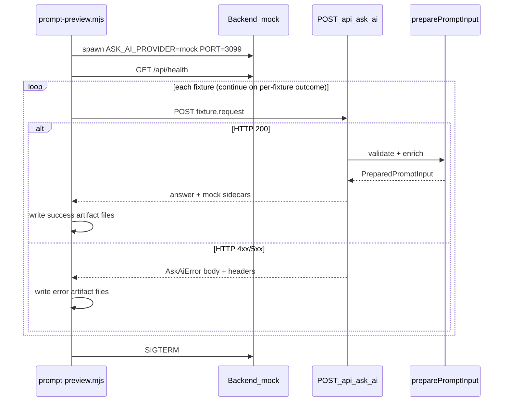

# DESIGN-BRIEF — prompt preview command

## Architecture




- **Backend only** — frontend not required for prompt assembly
- **Mock provider** — full prompt already embedded in `answer`; OpenAI not needed
- **No new routes** — extend mock response with optional structured fields

## Mock response shape (after Slice A)

```ts
type AskAiResponse = {
  answer: string;                      // always — UI reads this only
  context?: PromptContext;             // mock only
  diagnostics?: PromptDiagnostics;     // mock only — budget + counts
  enrichmentDebug?: EnrichmentDebug;   // mock only — rules retrieval trace
};
```

OpenAI provider continues returning `{ answer }` only. Frontend unchanged.

---

### `answer` (string)

Built by `[buildMockAnswer](../../../apps/backend/src/mockAskAi.ts)`. Preview script parses section C only.


| Section                              | Contents                                                                                     |
| ------------------------------------ | -------------------------------------------------------------------------------------------- |
| A — header                           | `MOCK RESPONSE` label                                                                        |
| B — `PROMPT STATS`                   | Budget summary (chars, utilization, token estimates) — overlaps partially with `diagnostics` |
| C — `FULL PROMPT (SENT TO PROVIDER)` | Exact LLM string → `**production.prompt.txt**`                                               |


**Prompt section order** (from `[buildPromptText](../../../apps/backend/src/prompt/normalization.ts)`):


| #   | Header                              | When                           |
| --- | ----------------------------------- | ------------------------------ |
| 1   | `SYSTEM ROLE PREAMBLE`              | always                         |
| 2   | `INSTRUCTIONS`                      | always                         |
| 3   | `MTG REFERENCE`                     | always                         |
| 4   | `GENERAL GAME CONTEXT`              | always                         |
| 5   | `ZONE: STACK (BOTTOM TO TOP)`       | stack populated                |
| 6   | `ZONE: …` (battlefield, hand, etc.) | per populated non-stack zone   |
| 7   | `GAME RULES (reference)`            | artifact loaded                |
| 8   | `ADDITIONAL RELEVANT RULE EXCERPTS` | supplemental retrieval matches |
| 9   | `OFFICIAL RULINGS (WotC reference)` | cards match rulings index      |
| 10  | `SCOPE`                             | always                         |
| 11  | `QUESTION`                          | always                         |


Parse delimiter (stable, tested in `mockAskAi.test.ts`):

```
FULL PROMPT (SENT TO PROVIDER)

<promptText>
```

**Do not** add `promptText` as a separate response field — it duplicates section C.

---

### `context` (PromptContext)

Post-normalization internal model from `[buildPromptContext](../../../apps/backend/src/prompt/context.ts)`. Written to `**context.json`**.

```ts
{
  finalQuestion: string;
  gameContext: {
    playerCount: number;
    players: Array<{ label: PlayerLabel; lifeTotal: number; displayName?: string }>;
    turnPhase: TurnPhase;
    activePlayer?: PlayerLabel;
    selectedZones: ZoneId[];
  };
  populatedZones: Array<{
    zoneId: Exclude<ZoneId, "stack">;
    items: Array<{
      cardId: string;
      name: string;
      owner?: PlayerLabel;
      details?: string;
      targets: PromptContextStackTarget[];
    }>;
  }>;
  orderedStack: Array<PromptContextStackItem>;  // bottom index 0 → top
}
```

Target kinds: `stack`, `battlefield`, `player`, `none`, `other`.

**Review use:** compare fixture input → `context` → formatted LLM zones.

---

### `diagnostics` (PromptDiagnostics)

From `[getPromptDiagnostics](../../../apps/backend/src/prompt/normalization.ts)`. Written to `**diagnostics.json`**.

**Always:** `promptChars`, `promptBudgetChars` (35000), `remainingChars`, `utilizationPercent`, `nearLimit`, `exceedsBudget`

**When enrichment ran:** `rulingsSectionChars`, `rulingsCardCount`, `gameRulesSectionChars`, `gameRulesTopicCount`, `supplementalRuleCount`, `supplementalRulesSectionChars`, `supplementalRuleIds`

---

### `enrichmentDebug` (EnrichmentDebug) — new

Rules trace not recoverable from `answer` or aggregate diagnostics. Written to `**enrichment.json`**.

Today `RetrievedGameRule.score` is computed then discarded (only ids reach diagnostics).

```ts
type EnrichmentDebug = {
  supplemental: {
    queryText: string;               // buildQueryText(context)
    queryTokens: string[];
    queryRuleIds: string[];          // extracted from question, e.g. ["704.5"]
    excludedCuratedRuleCount: number;
    selected: Array<{ ruleId: string; sectionTitle: string; score: number }>;
    runnerUp: Array<{ ruleId: string; sectionTitle: string; score: number }>;  // cap ~10
    candidatesScored: number;
  };
  curatedGameRules: {
    topicIds: string[];
    topics: Array<{ id: string; title: string; ruleNumbers: string[] }>;
  };
  rulings: {
    cardsConsidered: Array<{ cardId: string; name: string }>;
    cardsIncluded: Array<{ cardId: string; name: string; rulingCount: number }>;
    cardsSkippedNoMatch: Array<{ cardId: string; name: string }>;
    sectionTruncated: boolean;
  };
};
```

Scoring constants (from `[gameRulesRetrieval.ts](../../../apps/backend/src/gameRulesRetrieval.ts)`): exact rule id +100, parent id +20, dotted token +8, token +1.

Implementation: extend retrieval with debug return (or sibling function); thin rulings debug wrapper; collect enrichment debug **only when `ASK_AI_PROVIDER=mock`**; wire through `preparePromptInput` → mock response only.

---

## Output layout

Gitignored `**output/prompt-preview/**`. **One directory per fixture.** No bundled multi-scenario files — each HTTP response artifact is its own labeled file so reviewers can open one concern at a time without parsing a monolith.

```
output/prompt-preview/
  manifest.json                 # run summary only (ids, outcomes, paths)
  full-context/
    meta.json                   # fixture id, description, httpStatus, result
    request.json                # POST body sent to /api/ask-ai
    production.prompt.txt       # parsed prompt (200 only)
    context.json                # mock sidecar (200 only)
    diagnostics.json            # mock sidecar (200 only)
    enrichment.json             # mock sidecar (200 only)
  zero-cards/
    meta.json
    request.json
    api-error.json              # exact AskAiError body the frontend receives
    response-headers.json       # e.g. X-Correlation-Id
  cascade-keyword/
    ...
```

### Success fixture files (HTTP 200)


| Source                    | File                    |
| ------------------------- | ----------------------- |
| fixture input             | `request.json`          |
| run metadata              | `meta.json`             |
| `answer` §C parsed        | `production.prompt.txt` |
| `context` sidecar         | `context.json`          |
| `diagnostics` sidecar     | `diagnostics.json`      |
| `enrichmentDebug` sidecar | `enrichment.json`       |


### Error fixture files (HTTP 4xx/5xx)

Capture the **exact API error contract** (`askAiErrorSchema`) so reviewers can see what the frontend may surface to users.


| Source           | File                                                                  |
| ---------------- | --------------------------------------------------------------------- |
| fixture input    | `request.json`                                                        |
| run metadata     | `meta.json`                                                           |
| response body    | `api-error.json` — `{ code, message, metadata?, retryAfterSeconds? }` |
| response headers | `response-headers.json` — at minimum `x-correlation-id`               |


Do **not** merge success and error payloads into a single file. Do **not** require a post-run Python parser — the orchestrator writes separated files directly.

### `manifest.json`

Run-level index only: fixture `id`, `description`, `result` (`ok` | `api_error` | `failed`), `httpStatus`, relative paths to written files, and aggregate failure count. Not a dump of response bodies.

### Per-fixture `meta.json`

```json
{
  "id": "zero-cards",
  "description": "...",
  "httpStatus": 400,
  "result": "api_error"
}
```

`result` values:

- `**ok**` — HTTP 200 and all required mock sidecars written
- `**api_error**` — HTTP non-2xx; `api-error.json` + `response-headers.json` written (expected for fixtures like `zero-cards`)
- `**failed**` — script could not complete artifact write (missing sidecars on 200, parse error, network error)

## Orchestrator (Slice B)

`[scripts/prompt-preview.mjs](../../../scripts/prompt-preview.mjs)`:

1. Spawn `ASK_AI_PROVIDER=mock PORT=3099 npm run dev --workspace apps/backend`
2. Poll `/api/health` (~15s timeout)
3. POST each fixture `request` to `/api/ask-ai`
4. Write per-fixture directory with labeled files (success or error layout)
5. Continue remaining fixtures when one returns `api_error` or `failed`; do not stop early
6. Write `manifest.json` with full run summary
7. SIGTERM backend

**Exit codes:**

- `0` — all fixtures reached a terminal outcome (`ok` or `api_error`) with artifacts written
- `1` — orchestrator failure (health timeout) or any fixture `result: failed`

Flags: `--fixture <id>`, `--all-fixtures`, `--output-dir`, `--port`

### Fixture sets


| Mode                               | Fixtures                                                                                          |
| ---------------------------------- | ------------------------------------------------------------------------------------------------- |
| Default (`npm run prompt:preview`) | `full-context`, `cascade-keyword`, `state-based-actions`, `near-cap-stack`                        |
| `--all-fixtures`                   | Every `*.fixture.json` under eval fixtures, **including error-path fixtures** (e.g. `zero-cards`) |


`--all-fixtures` intentionally exercises validation and budget-error paths so reviewers can inspect frontend-visible error payloads, not only successful prompts.

## npm scripts

```json
"prompt:preview": "node scripts/prompt-preview.mjs",
"prompt:preview:all": "node scripts/prompt-preview.mjs --all-fixtures"
```

## Future extensions

- `flavors?: Record<string, string>` on mock response when multiple prompt shapes exist
- `--keep-server` for manual curl/UI iteration

