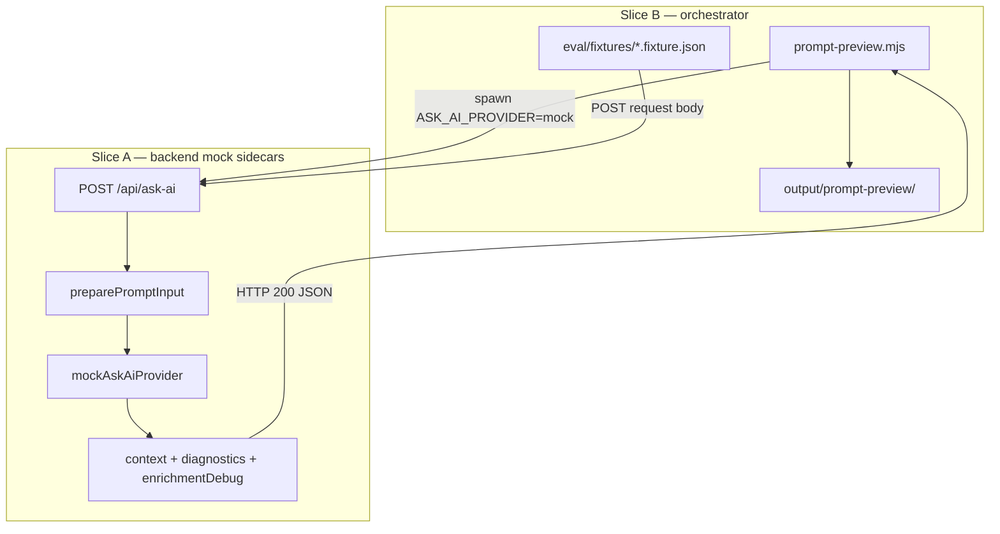

# GAMEPLAN — prompt preview command

## Architecture



## Data flow (success path)

1. Orchestrator spawns backend with `ASK_AI_PROVIDER=mock` and polls `GET /api/health`.
2. For each fixture, orchestrator `POST /api/ask-ai` with `fixture.request`.
3. Route validates request → `preparePromptInput` (normalization + enrichment + budget check).
4. Mock provider calls `buildMockAnswer`, attaching optional sidecars from `PreparedPromptInput`.
5. Orchestrator writes per-fixture directory:
   - `request.json`, `meta.json` (always)
   - `production.prompt.txt` (parsed from `answer` §C)
   - `context.json`, `diagnostics.json`, `enrichment.json` (from sidecars)
6. Run ends with `manifest.json` summary; backend receives `SIGTERM`.

## Data flow (error path)

1. Validation or budget errors return HTTP 4xx with `askAiErrorSchema` body.
2. Orchestrator writes `api-error.json` + `response-headers.json` (includes `x-correlation-id`).
3. Fixture `result` is `api_error` — not a command failure.

## Dependencies

| Dependency | Location | Notes |
|------------|----------|-------|
| Eval fixtures | `apps/backend/src/eval/fixtures/` | 11 `*.fixture.json` files today |
| Game rules artifacts | loaded at backend startup | curated + rule index for supplemental retrieval |
| Card rulings index | loaded at backend startup | rulings debug needs real index |
| Mock provider | `apps/backend/src/providers/mockAskAiProvider.ts` | only provider that emits sidecars |
| DEC-033 | `PRD/sections/decisions.md` | optional mock-only response fields |
| NFR-009 | `PRD/sections/non-functional-requirements.md` | developer workflow constraints |

## Slice order

| Order | Slice | Outcome |
|-------|-------|---------|
| 1 | [slice-a-mock-sidecars-and-enrichment-debug.md](./slice-a-mock-sidecars-and-enrichment-debug.md) | Mock response sidecars + enrichment trace collector |
| 2 | [slice-b-preview-script-and-closeout.md](./slice-b-preview-script-and-closeout.md) | Orchestrator script, npm, gitignore, closeout |

## Verification checklist (full ship)

```bash
# Slice A — backend unit tests
npm --workspace apps/backend run test -- src/mockAskAi.test.ts src/app.behavior.test.ts src/gameRulesRetrieval.test.ts

# Slice B — end-to-end preview
npm run prompt:preview
ls output/prompt-preview/manifest.json
ls output/prompt-preview/cascade-keyword/

# Full quality gate
npm run quality:check
```

### Manual review targets

| Fixture | File | What to confirm |
|---------|------|-----------------|
| `cascade-keyword` | `enrichment.json` | supplemental `selected` includes cascade-related rules with numeric scores |
| `full-context` | `production.prompt.txt` | `ZONE: STACK`, battlefield zone, `GAME RULES (reference)` sections |
| `near-cap-stack` | `diagnostics.json` | high `utilizationPercent`, `nearLimit: true` |
| `zero-cards` (via `--all-fixtures`) | `api-error.json` | validation error body matches `askAiErrorSchema` |

### Exit code behavior

| Condition | Exit code |
|-----------|-----------|
| All fixtures `ok` or `api_error` with artifacts written | 0 |
| Health poll timeout | 1 |
| Any fixture `failed` (missing sidecars, parse error, network, write failure) | 1 |

## Out of scope

- Eval harness alignment to use `preparePromptInput` (separate improvement)
- Frontend changes
- Live OpenAI calls
- Committing generated output
- Multiple prompt flavors in v1 (extension point only in DESIGN-BRIEF)
