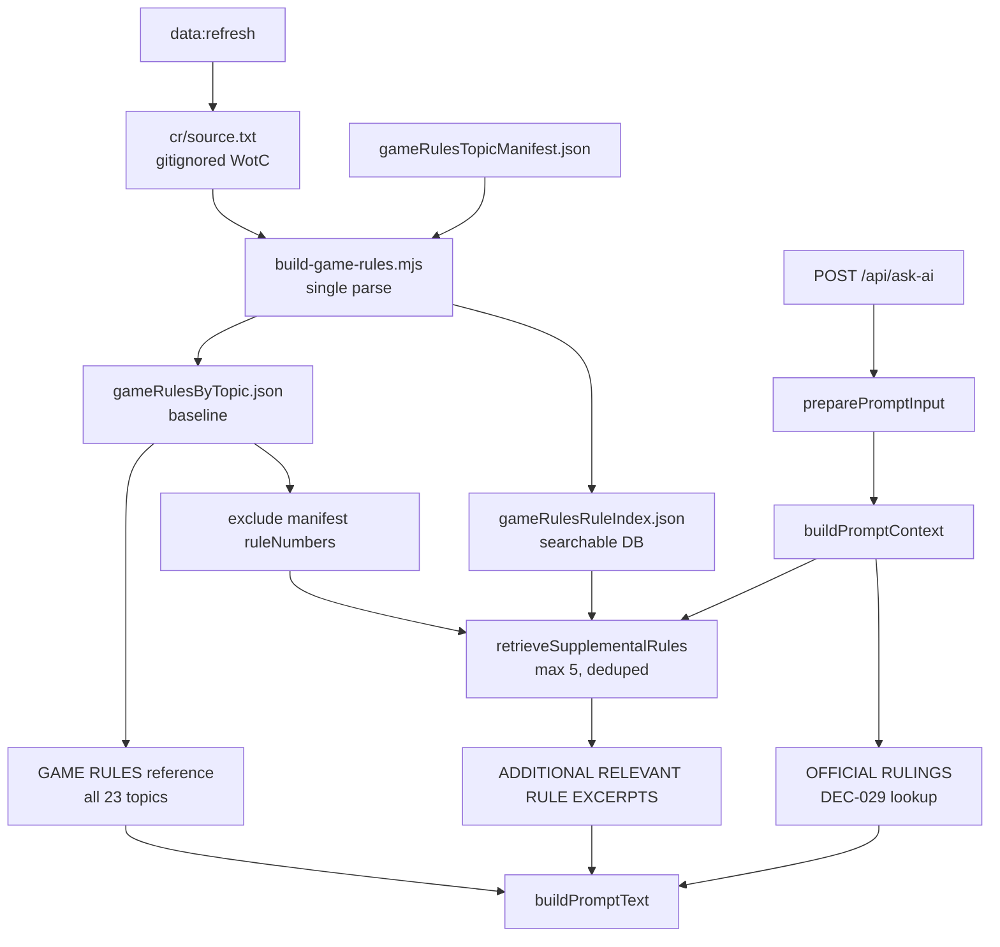

# GAMEPLAN — supplemental-game-rules-retrieval

## Architecture

Backend-only. No API or frontend contract changes.

### Mental model

```
gameRulesByTopic.json     →  always-included baseline (23 topics)
gameRulesRuleIndex.json   →  searchable DB ( ~3000 rules )
                              ↓ context query per request
                              up to 5 supplemental rules (deduped)
```

### Module map

```
scripts/build-game-rules.mjs          — EXTEND: shared CR parse → dual artifacts
apps/backend/data/gameRulesRuleIndex.json  — NEW committed artifact
apps/backend/src/gameRulesRetrieval.ts     — NEW: query, score, retrieve
apps/backend/src/gameRules.ts              — existing baseline loader (unchanged API)
apps/backend/src/prompt/preparation.ts     — wire supplemental retrieval
apps/backend/src/prompt/normalization.ts   — new section + diagnostics
apps/backend/src/index.ts                  — load rule index at startup
```

### Data flow



### Build-time flow (unified parser)

1. Read `apps/backend/data/cr/source.txt`
2. Parse once into `Map<ruleId, RuleEntry>` (port/adapt PR #30 rule-line pattern; merge with existing `extractRuleExcerpt` behavior)
3. For each manifest topic → assemble excerpts from parsed map → write `gameRulesByTopic.json`
4. Serialize full rule array → write `gameRulesRuleIndex.json`
5. If source missing → preserve both prior artifacts (exit 0)

### Runtime flow (per request)

1. Load all curated topics (startup — existing)
2. Load rule index (startup — new)
3. `collectCuratedRuleIds(gameRulesTopics)` → `Set<string>`
4. `retrieveSupplementalRules(context, ruleIndex, excludeIds, max = 5)`
5. `buildPromptText(context, { gameRulesTopics, supplementalRules, rulings })`

### Supplemental section format (draft)

```
ADDITIONAL RELEVANT RULE EXCERPTS
Use these official rule excerpts as additional reference. They do not override submitted game state, stack order, zones, targets, notes, or card oracle text.

608.2b. [verbatim rule text]
704.5. [verbatim rule text]
```

### Diagnostics (draft)

Extend `PromptDiagnostics`:

- `supplementalRuleCount?: number`
- `supplementalRulesSectionChars?: number`
- `supplementalRuleIds?: string[]` (optional — confirm in refinement)

## Verification checklist

- [ ] `npm run data:build` produces both `gameRulesByTopic.json` and `gameRulesRuleIndex.json` when CR source present
- [ ] `npm run data:build` preserves both artifacts when CR source missing
- [ ] `npm run quality:check` passes
- [ ] Supplemental section appears after `GAME RULES`, before `OFFICIAL RULINGS`
- [ ] Supplemental section omitted when no matches or index missing
- [ ] Rules already in manifest `ruleNumbers` never appear in supplemental section
- [ ] At most 5 supplemental rules per request
- [ ] Eval harness includes supplemental section ordering checks
- [ ] Golden fixtures updated for at least one out-of-manifest scenario
- [ ] No changes to `AskAiRequest` or frontend
- [ ] PR #30 closed with credit note

## Prompt size note

This feature **adds** ~1–3k chars when supplemental matches exist, on top of the existing ~22k curated block. Reducing curated topic count via selection is **out of scope** (future DEC-030 mitigation).
