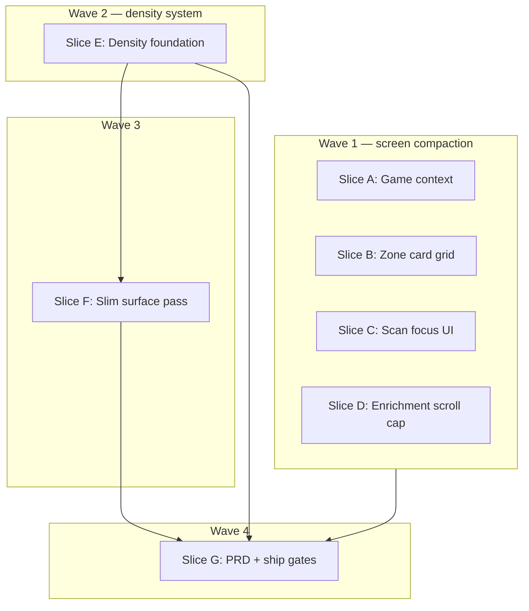

# GAMEPLAN: ui-compact-layout-refinement

> Exported from planning session 2026-06-25. Presentation-only; no API, prompt, or scan-engine changes.

## Problem

Every flow screen duplicates a tall page shell (`min-h-screen` + `max-w-2xl` card with `py-6`, `gap-4`, `p-4 md:p-6`). Inner panels repeat generous padding and unbounded vertical lists. Document scroll is the default everywhere except the conversation thread (`max-h-96`). Worst offenders:

1. **Enrichment list mode** — full card rows × many zones
2. **Zone collection + scan** — search, camera (`aspect-[3/4]`), preview, unbounded card list
3. **Game context** — hero image, duplicate panels for turn phase / active player

Users also lack a global compact layout preference beyond color palette (DEC-066).

## Architecture



### Layout density (Chunky / Slim)

Mirror the palette system: `data-layout-density="chunky" | "slim"` on `document.documentElement` (**chunky = default**, visual no-op vs today).

- `layoutDensityPrefs.ts` — `thejudge.theme.layoutDensity`
- `applyLayoutDensity.ts` — sets `dataset.layoutDensity` only
- `useLayoutDensity.ts` — hook mirroring `useThemePalette`
- `ThemeControl` — Chunky / Slim segmented control below palette swatches
- `PageShell` + semantic classes in `index.css` with `[data-layout-density="slim"]` overrides

**Constraints:** preserve touch targets (`min-h-[2.75rem]` on primary controls); do not shrink body text below existing `text-sm` / `text-xs`; chunky mode must match current visuals (regression guard).

### Scroll-cap pattern (shared concept)

Two surfaces share “max 4 visible, scroll the rest” with different row geometry:

| Surface | Layout | Cap |
| --- | --- | --- |
| Zone card list | 2-column tile grid | 2 rows = 4 tiles |
| Enrichment list mode | Full-width edit rows per zone | 4 rows per zone |

## Implementation slices

| Slice | Objective | Depends |
| --- | --- | --- |
| A | Game context: cat Easter egg, turn phase + active player row, wider player buttons | None |
| B | Zone collection: 2-col card grid, scroll after 4 cards | None |
| C | Zone scan: hide search/list while open; Exit on camera; remove manual-entry prompt | None |
| D | Enrichment: per-zone 4-row scroll cap in list mode | None |
| E | Density infra, theme toggle, `PageShell`, CSS density tokens | None |
| F | Slim overrides on high-scroll components | E |
| G | PRD promotion (DEC-069, REQ-047), tests, ship gates | A–F |

**Parallelism:** A, B, C, D, and E can start together. F needs E. G needs all prior slices.

## Verification checklist

```bash
npm --workspace apps/frontend run test
npm --workspace apps/frontend run typecheck
npm run quality:check
```

### Manual spot-check

- Game context: players expanded; Easter egg after 10 brand clicks; turn phase + active player side-by-side; no `(recommended)` text
- Zone collection: 5+ cards → grid scrolls at 4; scan open hides search + list; Exit scan top-right on camera
- Enrichment: View all cards with 5+ cards in one zone → zone list scrolls
- Theme panel: Slim toggles `data-layout-density`; chunky matches pre-change layout; preference survives reload
- Answered state: density toggle does not reset conversation or game context

## Frozen boundaries

- No change to `AskAiRequest`, Zod schemas, `GameContext`, prompt assembly, provider selection, backend routes, or scan matching/stabilizer logic
- Manual search remains available via Exit scan (DEC-050 fallback); only the redundant in-scan manual-entry **prompt UI** is removed
- Zone confirmation step (`ZoneConfirmStep`) — no layout changes
- No viewport locking, sticky footers, or `dvh` page-shell redesign in this package
- Cat Easter egg: session-only reveal (no localStorage); game context step only

## PRD promotion (Slice G)

- `PRD/sections/decisions/personalization.md` — **DEC-069**: layout density toggle (`chunky` default, `slim` compact), theme panel, localStorage
- `PRD/sections/functional-requirements.md` — **REQ-047** (or next available)
- Router line in `PRD/sections/decisions.md`

Note: DEC-066 non-goals for *palette* (“per-component overrides”) do not block this separate density feature.
