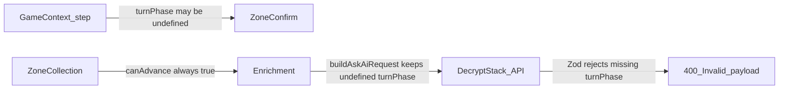
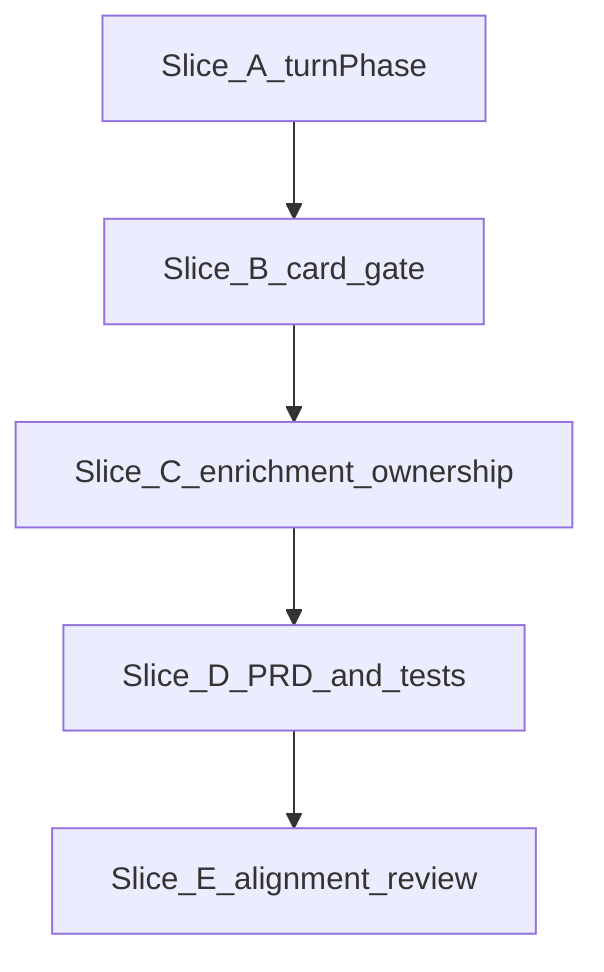

# User flow gap fixes — gameplan

> **Canonical location:** `PRD/work/user-flow-gap-fixes/`  
> **Handoff:** Implement slices A → E per [README.md](README.md). Cursor plan files are non-authoritative copies.

## Summary

Fix four reported gaps in the staged flow (game context → zone confirm → zone collection → enrichment → Decrypt Stack):

1. Users could finish the flow with **zero cards** in all selected zones.
2. Submit failed with **`gameContext.turnPhase Required`** despite selecting a phase (or leaving default “None”).
3. Turn phase should **default to stack resolving** with no unknown option.
4. **Command zone** (and other non-stack) enrichment: ownership is confused with target/context; owner should be its own control; zone-card targets still point at other zones.

---

## Reported issues → root causes

| Issue | Root cause in code today |
| --- | --- |
| Completed flow with zero cards in all selected zones | `canAdvance("zone-collection")` always `true` in `apps/frontend/src/lib/contextFlow/flow.ts`; copy says “skip zones”; enrichment allows submit with empty queue |
| `gameContext.turnPhase Required` at submit | Phase optional in UI (`<option value="">None</option>`) and `GameContext.turnPhase?` in `apps/frontend/src/types.ts`; backend `gameContextSchema` requires `turnPhase` |
| Phase should default to stack, no unknown | `turnPhase` state initializes `undefined`; no default select value |
| Command-zone enrichment confusing | Owner only at collection (`ZoneCardPicker`); enrichment only exposes “Target / context” (`EnrichmentStep`) |

---

## Implementation order

| Order | Slice doc | Outcome |
| --- | --- | --- |
| 1 | [slice-a-turn-phase-required.md](slice-a-turn-phase-required.md) | Default `stack_resolving`, remove None, required type + `canAdvance` |
| 2 | [slice-b-card-gate.md](slice-b-card-gate.md) | ≥1 card in any selected zone to continue/submit |
| 3 | [slice-c-enrichment-ownership.md](slice-c-enrichment-ownership.md) | Ownership section vs Targets in enrichment |
| 4 | [slice-d-prd-and-tests.md](slice-d-prd-and-tests.md) | DEC-024, user-flows, test sweep |
| 5 | [slice-e-alignment-review.md](slice-e-alignment-review.md) | Cross-stack audit + small fixes only |

---

## Verification checklist

After all slices:

- [ ] Manual: default phase → zone confirm → add card to **one** selected zone → enrich command card (owner + zone-card target) → Decrypt succeeds (no `turnPhase` error)
- [ ] Manual: multiple zones selected, **zero** cards → Continue disabled on collection; cannot Decrypt after removing all cards in enrichment
- [ ] `pnpm test` (or project standard) in `apps/frontend` and `apps/backend` green
- [ ] Slice E alignment checklist completed (see slice E doc)

---

## Files touched (summary)

| Area | Files |
| --- | --- |
| Phase bug + default | `App.tsx`, `types.ts`, `flow.ts`, `flow.test.ts`, `App.test.tsx` |
| Card gate | `flow.ts`, `ZoneCollectionStep.tsx`, `EnrichmentStep.tsx`, `App.tsx`, tests |
| Enrichment ownership | `EnrichmentStep.tsx`, tests |
| Docs | `PRD/sections/user-flows.md`, `PRD/sections/decisions.md`, `user-flow-refinements/slice-01-game-context-compact.md` |
| Alignment review | `contextFlow/index.ts`, contract tests, optional shared helpers |

No backend schema changes expected unless Slice E recommends defense-in-depth validation for empty `zones`.
