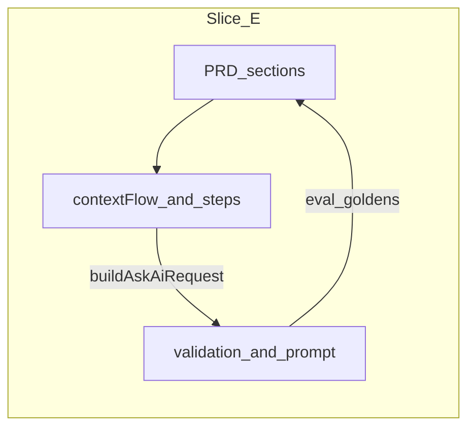

# Slice E — Cross-stack alignment and organization review

## Status: planned

## Depends on

Slice D (all feature slices green)

## Goal

Final gate before merge: ensure PRD, frontend, and backend strategy stay aligned; code is organized with flow logic centralized; apply only small justified fixes.

## Process

1. **Read-only pass** — Trace happy path and blocked path (no cards): UI → `buildAskAiRequest` → `POST /api/ask-ai` → prompt text.
2. **Diff audit** — Duplicate constants (zone order, turn phases, non-stack owner zones); consolidate if ≤30 min.
3. **Fix policy** — Fix only: (a) PRD/contract mismatch, (b) duplicate logic likely to regress, (c) obvious bug. Defer large refactors to a separate issue.
4. **Sign-off** — Full test suites + one manual Decrypt; mark this slice and [README](README.md) complete.

## Strategy alignment checklist

| # | Checkpoint | Pass | Notes |
| --- | --- | --- | --- |
| 1 | `buildAskAiRequest` matches `askAiRequestSchema` (required `turnPhase`, `selectedZones`, empty zone keys omitted) | | |
| 2 | Frontend `types.ts` enums/unions match backend Zod (`TurnPhase`, `ZoneId`, `ContextTarget`) | | |
| 3 | Gating rules only in `contextFlow` (`canAdvance`, card helper); steps do not duplicate | | |
| 4 | Prompt builders match UI semantics (owner, scope sentence, stack order) | | |
| 5 | `user-flows.md`, DEC-024, REQ-012/018/019 consistent with implementation | | |
| 6 | Eval fixtures still intentional; update if zero-card narrative changed | | |

## Frontend organization checklist

| # | Checkpoint | Pass | Notes |
| --- | --- | --- | --- |
| 7 | `App.tsx` orchestrates; step components stay presentational | | |
| 8 | Pure logic in `flow.ts`, `phaseZoneDefaults.ts`, `steps.ts`; exports via `index.ts` | | |
| 9 | Owner defaults consistent collection vs enrichment | | |
| 10 | Legacy `AskAiRequest` / `StackTarget` unused by staged flow (note only if cleanup deferred) | | |
| 11 | `canAdvance` branches covered in `flow.test.ts`; payload covered in `App.test.tsx` | | |

## Backend organization checklist

| # | Checkpoint | Pass | Notes |
| --- | --- | --- | --- |
| 12 | `validation.ts` is contract authority; prompt does not invent invalid fields | | |
| 13 | Client never sends empty zone arrays (keys omitted) | | |
| 14 | `app.contract.test.ts` covers missing `turnPhase` and bad targets | | |
| 15 | Optional server-side “zero populated zones” reject — decision: yes / no / deferred | | |

## Deliverable

Fill the Pass/Notes columns above in this file (or link PR checklist). List follow-up tickets for anything deferred.

## Acceptance

- [ ] All checklist rows addressed (pass or ticket).
- [ ] No unresolved contract mismatch between frontend submit and backend validation.
