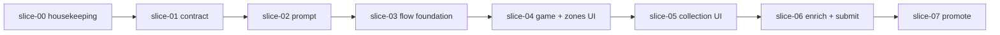

# UX Wave 2 — sequential implementation index

status: active

## Purpose

Break the UX Wave 2 gameplan into **ordered slices** you can implement and **validate independently** before moving on. Each slice has its own markdown file with scope, tasks, and a validation gate.

When the full wave ships: promote durable outcomes into `PRD/sections/`, then delete this folder per `PRD/instructions/doc-lifecycle.md`.

## Read first

| File | Role |
|------|------|
| [decisions-summary.md](./decisions-summary.md) | Locked product/tech decisions (source of truth for slices) |
| [phase-zone-assumptions.md](./phase-zone-assumptions.md) | Turn phase → default zone checklist (refine as you go) |
| [mtg-prompt-reference.md](./mtg-prompt-reference.md) | Static MTG cheat sheet copy for prompts (draft) |

## Implementation order

Complete slices **in order**. Do not start a slice until the previous slice’s validation gate is green.

| # | Slice | File | Delivers |
|---|-------|------|----------|
| 0 | Repo housekeeping | [slice-00-repo-housekeeping.md](./slice-00-repo-housekeeping.md) | Kickoff skill on `main`, **PRD slice docs pushed**, stale branches removed, `workflow/ux-wave-2` branch |
| 1 | Backend contract | [slice-01-backend-contract.md](./slice-01-backend-contract.md) | New `GameContext` parent types, Zod, request builders; **no prompt/UI yet** |
| 2 | Prompt + eval | [slice-02-prompt-and-eval.md](./slice-02-prompt-and-eval.md) | MTG reference block, scope sentence, `promptContext`, golden eval fixtures |
| 3 | Flow foundation | [slice-03-flow-foundation.md](./slice-03-flow-foundation.md) | Step config, Back/Continue, additive phase→zone defaults (logic + tests) |
| 4 | Game setup + zones UI | [slice-04-ui-game-setup-and-zones.md](./slice-04-ui-game-setup-and-zones.md) | Turn phase picker, zone checklist with defaults |
| 5 | Zone collection UI | [slice-05-ui-zone-collection.md](./slice-05-ui-zone-collection.md) | Cards-only per selected zone; stack ordering preserved |
| 6 | Enrichment + submit | [slice-06-ui-enrichment-and-submit.md](./slice-06-ui-enrichment-and-submit.md) | Single enrichment list, `ContextTarget`, wire `Decrypt Stack` |
| 7 | Promote + closeout | [slice-07-promote-and-closeout.md](./slice-07-promote-and-closeout.md) | PRD promotion, `quality:check`, delete `PRD/work/ux-wave-2/` |

## Global validation command

From repo root after any slice that touches code:

```bash
npm run quality:check
```

Backend prompt changes also require:

```bash
npm --workspace apps/backend run test:eval
```

## Dependency diagram



## Out of scope for this wave

See [decisions-summary.md](./decisions-summary.md) — rules engine, duplicate-card unblock, stack reorder, merging `skills/workflow-acceleration`.
