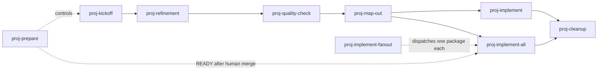

# Agent Workflow Skills

<Product> uses `proj-*` skills to drive PRD-based feature work. All are
**model-invocable** — an agent may select the matching skill when context
clearly indicates it — and every skill remains callable explicitly (`/proj-*`
in Cursor and Claude Code, `$proj-*` in Codex).

## Single source + sync

Skills are **not** maintained as separate copies per runtime. Edit only:

`.cursor/skills/proj-*/`

Other runtimes load skills from their own conventional paths. This repo mirrors
the canonical tree into those paths with:

```bash
npm run skills:ai-sync
```

| Runtime | Discovery path | Role |
| --- | --- | --- |
| Cursor | `.cursor/skills/` | **canonical — edit here** |
| Codex | `.agents/skills/` | synced copy |
| Claude Code | `.claude/skills/` | synced copy |

Run the sync after any skill change, then commit all trees together. They are
byte-identical after a sync, so every skill runs in every runtime.

<!-- Verify these discovery paths against your runtimes' current docs. They
     change. If you only use one runtime, delete this section and keep one
     tree. -->

## Workflow sequence



`proj-defer` can move any non-`ship-ready` package to `deferred` and back,
orthogonal to the pipeline above.

## Skill catalog

| Skill | When | Writes | Status | Next |
| --- | --- | --- | --- | --- |
| `proj-kickoff` | New session or new feature idea | `IDEA.md`, `README.md`, `STATUS.ideation`, board row | → `ideation` | `proj-refinement` |
| `proj-refinement` | An idea needs product definition | `DESIGN-BRIEF.md`, `PRD/sections/` updates | `refining` → `refined` on approval | `proj-quality-check` |
| `proj-quality-check` | After refinement, before slicing | A PASS/FAIL report only | PASS keeps `refined`; FAIL → `refining` | `proj-map-out` or back to refinement |
| `proj-map-out` | Quality-check passed | `GAMEPLAN.md`, `slice-*.md`, README | → `active` | `proj-implement` or `proj-implement-all` |
| `proj-implement` | Executing one planned slice | Product code and tests | Last slice done → `ship-ready` | Next slice, or `proj-cleanup` |
| `proj-implement-all` | Every remaining slice, unattended | Code, tests, milestone commits, shared branch, review PR | All slices done → `ship-ready` | Manual merge, then `proj-cleanup` |
| `proj-implement-fanout` | Two or more `active` packages should run concurrently | Nothing directly; dispatches one run per package | Owned per package by the dispatched skill | Merge each PR, then `proj-cleanup` per package |
| `proj-defer` | Park not-next work, or restore it | README deferral record, marker, board row | Toggles current ⇄ `deferred` | None when deferring; the restored status's usual next skill |
| `proj-cleanup` | Package is `ship-ready`, or corpus hygiene | Receipt, section promotions, board strip, folder delete | Package removed | Optional `proj-kickoff` |
| `proj-prepare` | One request needs autonomous preparation before an unattended loop | One reviewed package plus a docs-only PR | READY → `active`; BLOCKED preserves the furthest valid status | After human merge, `proj-implement-all` |

## Package status signals

Skill-maintained on every transition:

- `PRD/work/<slug>/README.md` — `status: <value>`
- Exactly one empty `PRD/work/<slug>/STATUS.<value>` marker
- A row in `PRD/work/STATUS.md` — the canonical list; `PRD/README.md` carries a
  single-line pointer only

Full vocabulary and rules: `PRD/instructions/workflow-reference.md`.

## Session handoffs

Every skill that hands off ends with a **Next step**: one sentence plus the
literal command, prefixed `/proj-*` (Cursor, Claude Code) or `$proj-*` (Codex),
with the real slug and slice letter substituted in.

## Adding or updating a skill

1. Create or edit under `.cursor/skills/<skill-name>/`.
2. Run `npm run skills:ai-sync`.
3. Verify: `diff -rq .cursor/skills .claude/skills` and
   `diff -rq .cursor/skills .agents/skills` — both must produce no output.
4. Commit all skill trees together.

## Related docs

- `PRD/instructions/workflow-reference.md` — status vocabulary, work-folder lifecycle, handoff rule
- `PRD/work/STATUS.md` — the work-package board
- `PRD/README.md` — the product control plane
- `.cursor/skills/proj-kickoff/reference.md` — PRD quick map
