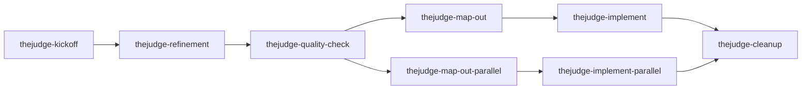

# TheJudge Skills Refresh Implementation Plan

> **For agentic workers:** REQUIRED SUB-SKILL: Use superpowers:executing-plans to implement this plan task-by-task. Steps use checkbox (`- [ ]`) syntax for tracking.

**Goal:** Recalibrate the `thejudge-*` skill tree (8 skills, model-invocable), rewrite `PRD/instructions/workflow-reference.md` and `AGENT-SKILLS.md` to match, supersede DEC-064, fix two stale cross-references, simplify the sync script, and clean up stale global Cursor/Codex config — exactly per `docs/superpowers/specs/2026-08-02-skills-refresh-design.md` ("the spec").

**Architecture:** This is a docs/config recalibration, not application code — there is no test suite to drive TDD. Each task's "test cycle" is the spec's own **Verification** section (shell `diff`/`grep` checks) plus a manual read-back of the written file against the spec's structural template. Tasks are ordered so the DEC-064 supersession (a blocking prerequisite per the spec) lands before any skill file is touched, and destructive global-config cleanup lands last, after everything reversible is done and verified.

**Tech Stack:** Markdown skill files (YAML frontmatter + body), bash (`rsync`-based sync script), PRD markdown corpus.

## Global Constraints

- Canonical skills tree is `.cursor/skills/thejudge-*` — edit only there; sync via `npm run skills:ai-sync`.
- All 8 skills are model-invocable — no skill carries `disable-model-invocation`, and all remain explicitly callable (`/thejudge-*` in Cursor/Claude Code, `$thejudge-*` in Codex).
- No skill body contains: the shared output-guidance paragraph, numbered "Process" narration, a `Rationalization | Reality` table, three-platform handoff blocks, or restated rule lists that belong in a `reference.md`.
- No skill contains runtime-specific dispatch recipes, CLI names, or flags (binds hardest on `thejudge-implement-parallel`).
- Every one of the 23 "Preserved specifics" (spec lines 296–336) must land in some skill — tracked via the traceability table in this plan's Task 12.
- Never renumber a `REQ-###` / `FLOW-###` / `DEC-###` / `Q-###`. Next free DEC-ID is **DEC-115** (index in `PRD/sections/decisions.md` ends at DEC-112).
- Never commit unless the user explicitly asks (per preserved specific #16, which also governs this session).
- `PRD/work/prompt-game-state-enrichment/` is **already deleted** (commit `58acbd6`) — no action needed, verify only.

## File Structure

```
.cursor/skills/
  thejudge-kickoff/SKILL.md          (rewrite)
  thejudge-kickoff/reference.md      (rewrite)
  thejudge-refinement/SKILL.md       (rewrite, no reference.md)
  thejudge-quality-check/SKILL.md    (rewrite, no reference.md)
  thejudge-map-out/SKILL.md          (rewrite)
  thejudge-map-out/reference.md      (new)
  thejudge-map-out-parallel/SKILL.md (rewrite)
  thejudge-map-out-parallel/reference.md (new)
  thejudge-implement/SKILL.md        (rewrite)
  thejudge-implement/reference.md    (new)
  thejudge-implement-parallel/SKILL.md   (new — replaces thejudge-implement-codex)
  thejudge-implement-parallel/reference.md (new)
  thejudge-cleanup/SKILL.md          (rewrite, no reference.md)
  thejudge-implement-codex/          (delete entire dir)
  thejudge-output-guidance.md        (delete)
.agents/skills/, .claude/skills/     (regenerated by npm run skills:ai-sync — do not hand-edit)
PRD/sections/decisions/doc-process.md  (DEC-064 → tombstone; add DEC-115 body)
PRD/sections/decisions.md              (add DEC-115 router row)
PRD/instructions/requirement-format.md (line 73 fix)
PRD/README.md                          (line 56 fix)
PRD/instructions/workflow-reference.md (rewrite, ~50 lines)
AGENT-SKILLS.md                        (rewrite)
scripts/sync-agent-skills.sh           (simplify — drop CODEX_RUNTIME_EXCLUDES)
~/.codex/skills/kickoff                (unlink)
~/.agents/skills/kickoff               (unlink)
~/.cursor/skills/kickoff/              (delete, after backup)
~/.agents/skills/, ~/.agents/          (rmdir, now empty)
```

## Load-bearing skill descriptions (finalize now — everything else derives from these)

Per the spec, `description` is what the model uses to pick the right skill, and each sibling pair must be written against the other. These are final; each skill's frontmatter must use them verbatim (wrapped in YAML `>-` folding as needed):

| Skill | `description` |
|---|---|
| `thejudge-kickoff` | Loads minimal onboarding context for TheJudge (root `README.md` + `PRD/README.md`) and optionally captures a new idea in `PRD/work/<slug>/IDEA.md`. Use when starting a new session or beginning work on a new feature idea. |
| `thejudge-refinement` | Shapes a feature idea into a `DESIGN-BRIEF.md` plus aligned `PRD/sections/` updates, after up to 3 rounds of clarifying questions and explicit user approval. Use after kickoff, when an idea needs product definition before it can be quality-checked. |
| `thejudge-quality-check` | Validates a `DESIGN-BRIEF.md` against PRD alignment and agent-readiness, producing a PASS/FAIL report — never a GAMEPLAN or slice docs. Use after refinement, before map-out, to gate whether a work package is ready to slice. |
| `thejudge-map-out` | Creates `GAMEPLAN.md` and lettered slice docs in `PRD/work/<slug>/` for sequential agent implementation. Use after quality-check passes, when the work's slices should be implemented one at a time. For work with independent slices worth running concurrently, use `thejudge-map-out-parallel` instead, which adds dependency-wave grouping. |
| `thejudge-map-out-parallel` | Creates `GAMEPLAN.md` and lettered slice docs in `PRD/work/<slug>/`, grouped into dependency waves of slices with disjoint files that can be implemented concurrently. Use after quality-check passes when the work has independent slices worth running in parallel — otherwise use `thejudge-map-out`, which sequences slices without wave grouping. |
| `thejudge-implement` | Implements one lettered slice from an existing `PRD/work/<slug>/` GAMEPLAN end to end — code, tests, verification, status update. Use after map-out, or whenever a single slice needs to be executed in this session. For dispatching an entire wave of slices across multiple agents, use `thejudge-implement-parallel` instead. |
| `thejudge-implement-parallel` | Dispatches every slice in a wave from `PRD/work/<slug>/` across concurrent agents using the host runtime's parallel-agent mechanism (or sequentially if the runtime has none), then independently re-verifies each result before marking it done. Use after map-out-parallel, when a whole wave — not a single slice — is ready to implement. For executing one slice in this session, use `thejudge-implement` instead. |
| `thejudge-cleanup` | Closes out a shipped work package: verifies slice completion, promotes durable PRD truth, writes a receipt, and deletes `PRD/work/<slug>/`. Also handles explicit corpus-hygiene sweeps. Use when a feature has shipped or when the user explicitly asks for PRD corpus hygiene — not for general code tidying requests. |

---

### Task 1: DEC-064 supersession (blocking prerequisite)

**Files:**
- Modify: `PRD/sections/decisions/doc-process.md` (trim DEC-064 body to tombstone; add DEC-115 body)
- Modify: `PRD/sections/decisions.md` (add DEC-115 router row after the DEC-112 row)

**Interfaces:**
- Produces: DEC-115, the decision every rewritten skill's response-discipline behavior must remain consistent with (no skill body should re-introduce `lean`/`standard`/`detailed` profile language).

- [ ] **Step 1: Read the current DEC-064 body**

Open `PRD/sections/decisions/doc-process.md`, find `### DEC-064` through its `Notes:` line, and read it in full so the tombstone summarizes what's actually being retired.

- [ ] **Step 2: Trim DEC-064 to a one-line tombstone**

Replace the entire `### DEC-064` section body with:

```markdown
### DEC-064

Superseded by DEC-115.
```

Keep the heading; only the body under it collapses. Do not delete the heading or renumber anything.

- [ ] **Step 3: Add the DEC-115 body in the same file**

Append a new section (respecting the file's existing per-decision format — check `### DEC-086` or `### DEC-063` in the same file for the exact field set, e.g. `Decision:`, `Impact:`, `Notes:`) with this content:

```markdown
### DEC-115

Decision: TheJudge workflow skill responses stay terse and high-signal by
construction — status, decisions, files/IDs touched, verification, and the
required handoff — with no document dumps, no restated background, and no
long command output. Supersedes DEC-064.

Impact: The DEC-064 mechanism (a shared `.cursor/skills/thejudge-output-guidance.md`
artifact referenced by every skill, plus its synced copies) is retired and
deleted. Response discipline is inherent to how each skill is written, not
delegated to a referenced file. The `lean` / `standard` / `detailed` output-profile
vocabulary and its per-session override are dropped — a plain-language request
to be more or less verbose needs no named profile system.

Unchanged from DEC-064 and still binding: profile or phrasing never alters
required reads, writes, approval gates, PASS/FAIL calls, blocker reporting,
verification, status updates, or the `Next step` handoff — mandatory output
stays mandatory. Canonical editing remains `.cursor/skills/thejudge-*`; synced
copies in `.agents/skills/` and `.claude/skills/` remain implementation
artifacts, not edit targets.

Notes: DEC-063 and DEC-086 reference DEC-064 in their own Notes as lineage —
those are historical mentions of a still-resolvable ID and are left alone. No
`sections/system-map.md` entry (consistent with DEC-044 / DEC-063 / DEC-064) —
this decision is PRD process/tooling, not a product subsystem.
```

- [ ] **Step 4: Add the router index line**

In `PRD/sections/decisions.md`, insert a new row immediately after the `DEC-112` row:

```markdown
| DEC-115 | `decisions/doc-process.md` | TheJudge workflow skill responses stay terse and high-signal by construction; supersedes DEC-064's shared output-guidance-artifact mechanism, keeping its outcome but retiring the lean/standard/detailed profile vocabulary. |
```

- [ ] **Step 5: Verify**

Run: `grep -n "DEC-064\|DEC-115" PRD/sections/decisions.md PRD/sections/decisions/doc-process.md`
Expected: the router shows both a DEC-064 row (unchanged, still pointing at `doc-process.md`) and a new DEC-115 row; `doc-process.md` shows the DEC-064 tombstone (`Superseded by DEC-115`) and the full DEC-115 body with no surviving `Impact:` block under the old DEC-064 heading.

---

### Task 2: Delete the shared output-guidance artifact

**Files:**
- Delete: `.cursor/skills/thejudge-output-guidance.md`

**Interfaces:**
- Consumes: Task 1's DEC-115 (this deletion is what DEC-115 authorizes).
- Produces: nothing downstream depends on this file after this task — every other skill task must not reference it.

- [ ] **Step 1: Delete the file**

Run: `rm .cursor/skills/thejudge-output-guidance.md`

- [ ] **Step 2: Verify no other canonical skill still points at it**

Run: `grep -rln "output-guidance" .cursor/skills/`
Expected: no output (every skill's "Shared output guidance" section is removed in Tasks 3–10, so this check will only be fully clean once those land — re-run at Task 13).

---

### Task 3: Rewrite `thejudge-kickoff`

**Files:**
- Modify: `.cursor/skills/thejudge-kickoff/SKILL.md`
- Modify: `.cursor/skills/thejudge-kickoff/reference.md`

**Interfaces:**
- Produces: `PRD/work/<slug>/IDEA.md` + `PRD/work/<slug>/README.md` (status `ideation`) when an idea is captured — the input contract `thejudge-refinement` (Task 4) depends on.

- [ ] **Step 1: Write `SKILL.md`**

```markdown
---
name: thejudge-kickoff
description: >-
  Loads minimal onboarding context for TheJudge (root README.md + PRD/README.md)
  and optionally captures a new idea in PRD/work/<slug>/IDEA.md. Use when
  starting a new session or beginning work on a new feature idea.
---

# TheJudge Kickoff

## Goal

Orient in this repo without pre-loading the full PRD, and optionally seed a new work package when the user describes an idea.

## Inputs

Optional: a feature idea description in the same message.

## Reads

1. `README.md` — stack, layout, quality gates, current product status
2. `PRD/README.md` — control plane, source-of-truth precedence, navigation

Nothing else. Do not pre-load `PRD/sections/` or `PRD/instructions/` — see `reference.md` for the full precedence model and task → read-order table used by later skills.

## Writes

Only when the user describes a new idea:

- `PRD/work/<slug>/IDEA.md` — 3–5 sentences: problem, outcome, non-goals
- `PRD/work/<slug>/README.md` — `status: ideation` at top

`<slug>` is a new kebab-case name proposed from the idea (e.g. `card-wotc-rule-enrichment`). If the user only wants orientation, write nothing.

## Gates

- Never read PRD content beyond the two required files without the user naming paths in the same message.
- Never write product code from this skill.

## Next step

Orient-only: none — point the user at `AGENT-SKILLS.md` and this skill's `reference.md`.

Idea captured: `/thejudge-refinement PRD/work/<slug>/` (Cursor / Claude Code) or `$thejudge-refinement PRD/work/<slug>/` (Codex).
```

- [ ] **Step 2: Write `reference.md`**

```markdown
# TheJudge PRD quick map

Use after kickoff, once the user names a task or work slug.

## Source-of-truth precedence

1. `PRD/sections/decisions.md` is the read-first router; indexed `PRD/sections/decisions/<domain>.md` entries override conflicting older language
2. `PRD/sections/*.md` — product scope
3. `PRD/instructions/*.md` — agent process
4. `PRD/README.md` — navigation only

## Workflow skills

All 8 are model-invocable and may also be called explicitly (`/thejudge-*` in Cursor/Claude Code, `$thejudge-*` in Codex).

| Skill | Use when |
| ----- | -------- |
| `thejudge-kickoff` | New session / new idea |
| `thejudge-refinement` | Shape idea + write PRD sections |
| `thejudge-quality-check` | Before slicing |
| `thejudge-map-out` | Create GAMEPLAN + slices, sequential |
| `thejudge-map-out-parallel` | Create GAMEPLAN + slices, grouped into dependency waves |
| `thejudge-implement` | Execute one lettered slice |
| `thejudge-implement-parallel` | Dispatch a whole wave across agents |
| `thejudge-cleanup` | Ship feature / corpus hygiene |

**Canonical skills:** edit `.cursor/skills/` only, then run `npm run skills:ai-sync` to copy into `.agents/skills/` (Codex) and `.claude/skills/` (Claude Code). See `AGENT-SKILLS.md`.

## Task → files

| Task | Read order |
| ---- | ---------- |
| Product understanding | `overview.md` → `decisions.md` → `goals-and-non-goals.md` |
| Feature implementation | `decisions.md` → `functional-requirements.md` → `user-flows.md` → `integrations-and-data.md` |
| Active work package | `PRD/work/<slug>/README.md` → `GAMEPLAN.md` → slice doc |

## Out of scope for default reads

- `PRD/archive/`
- tool-specific plan folders (not source of truth — use `PRD/work/`)
```

- [ ] **Step 3: Verify**

Run: `grep -n "manual attach\|output-guidance" .cursor/skills/thejudge-kickoff/SKILL.md .cursor/skills/thejudge-kickoff/reference.md`
Expected: no output.

---

### Task 4: Rewrite `thejudge-refinement`

**Files:**
- Modify: `.cursor/skills/thejudge-refinement/SKILL.md` (no `reference.md` — spec lists this skill's material as fitting in the body)

**Interfaces:**
- Consumes: `PRD/work/<slug>/IDEA.md` from Task 3.
- Produces: `PRD/work/<slug>/DESIGN-BRIEF.md`, `status: refined` — the input `thejudge-quality-check` (Task 5) depends on.

- [ ] **Step 1: Write `SKILL.md`**

```markdown
---
name: thejudge-refinement
description: >-
  Shapes a feature idea into a DESIGN-BRIEF.md plus aligned PRD/sections/
  updates, after up to 3 rounds of clarifying questions and explicit user
  approval. Use after kickoff, when an idea needs product definition before
  it can be quality-checked.
---

# TheJudge Refinement

## Goal

Turn an idea into approved product truth in `PRD/sections/` and a work-package design brief.

## Inputs

Work slug (e.g. `card-wotc-rule-enrichment`).

## Reads

1. `PRD/work/<slug>/IDEA.md` (or the user's description)
2. `PRD/sections/decisions.md` router, then relevant `PRD/sections/decisions/<domain>.md` files
3. Relevant `PRD/sections/*.md` for the feature
4. `PRD/instructions/requirement-format.md`
5. `PRD/instructions/technical-design-rules.md`

## Writes

- `PRD/work/<slug>/DESIGN-BRIEF.md` — scope, decisions, non-goals, REQ/FLOW references
- Updates to `PRD/sections/` (new `REQ-###`, `FLOW-###`; promote new `DEC-###` bodies into the relevant `PRD/sections/decisions/<domain>.md` file and add the router index line in `PRD/sections/decisions.md`)
- `PRD/sections/open-questions.md` only for genuine ambiguity (`Q-###`)
- `PRD/work/<slug>/README.md` → `status: refined`

## Gates

- Batch clarifying questions, up to 3 per round — never one at a time.
- Present a design summary and **wait for user approval** before writing any PRD artifact.
- No scope enters from an open question without explicit user confirmation.
- No code, no slice docs.
- Preserve stable IDs — add new `REQ-###` / `FLOW-###` / `DEC-###` / `Q-###`; never renumber.
- `PRD/sections/decisions.md` is the read-first override router; DEC bodies live in `decisions/<domain>.md`.

## Next step

`/thejudge-quality-check PRD/work/<slug>/` (Cursor / Claude Code) or `$thejudge-quality-check PRD/work/<slug>/` (Codex).
```

- [ ] **Step 2: Verify**

Run: `grep -n "Rationalization\|output-guidance\|Process\n1\." .cursor/skills/thejudge-refinement/SKILL.md`
Expected: no output.

---

### Task 5: Rewrite `thejudge-quality-check`

**Files:**
- Modify: `.cursor/skills/thejudge-quality-check/SKILL.md` (no `reference.md`)

**Interfaces:**
- Consumes: `PRD/work/<slug>/DESIGN-BRIEF.md` from Task 4.
- Produces: PASS/FAIL report (not a file) — gates Task 6/7's map-out skills.

- [ ] **Step 1: Write `SKILL.md`**

```markdown
---
name: thejudge-quality-check
description: >-
  Validates a DESIGN-BRIEF.md against PRD alignment and agent-readiness,
  producing a PASS/FAIL report — never a GAMEPLAN or slice docs. Use after
  refinement, before map-out, to gate whether a work package is ready to
  slice.
---

# TheJudge Quality Check

## Goal

Gate before map-out: report PASS or FAIL against PRD alignment and agent-readiness; fix only trivial issues with in-session user approval.

## Inputs

Work slug.

## Reads

1. `PRD/work/<slug>/DESIGN-BRIEF.md`
2. Affected `PRD/sections/*.md`
3. `PRD/sections/decisions.md` router, then relevant `PRD/sections/decisions/<domain>.md` files
4. `PRD/instructions/technical-design-rules.md`

## Checklist

- [ ] No contradictions with active `DEC-###` entries in the relevant `decisions/<domain>.md` files
- [ ] Current vocabulary is used in new/edited content
- [ ] Stack ordering is preserved if the feature touches stack/API/prompt
- [ ] `technical-design-rules.md` constraints are respected (one endpoint, no rules engine, etc.)
- [ ] Scope is implementable without hidden assumptions
- [ ] Open questions are reserved for genuine ambiguity only

## Gates

- Emit **PASS** or **FAIL** — never leave the call implicit.
- Trivial fixes only with in-session user approval; never write `GAMEPLAN.md` or slice docs; never write product code.
- Never guess an answer into committed scope.

## Next step

**PASS** → `/thejudge-map-out PRD/work/<slug>/` (or `/thejudge-map-out-parallel PRD/work/<slug>/` if slices look independent).
**FAIL** → `/thejudge-refinement PRD/work/<slug>/`, with the issue list included above the handoff.

(`$thejudge-*` in Codex.)
```

- [ ] **Step 2: Verify**

Run: `grep -n "Rationalization\|output-guidance" .cursor/skills/thejudge-quality-check/SKILL.md`
Expected: no output.

---

### Task 6: Rewrite `thejudge-map-out`

**Files:**
- Modify: `.cursor/skills/thejudge-map-out/SKILL.md`
- Modify: `.cursor/skills/thejudge-map-out/reference.md` (new — holds the slice doc template + Ship gates block)

**Interfaces:**
- Consumes: PASS from Task 5.
- Produces: `PRD/work/<slug>/GAMEPLAN.md` + `slice-*.md` + `status: active` — the input `thejudge-implement` (Task 8) depends on.

- [ ] **Step 1: Write `SKILL.md`**

```markdown
---
name: thejudge-map-out
description: >-
  Creates GAMEPLAN.md and lettered slice docs in PRD/work/<slug>/ for
  sequential agent implementation. Use after quality-check passes, when the
  work's slices should be implemented one at a time. For work with
  independent slices worth running concurrently, use thejudge-map-out-parallel
  instead, which adds dependency-wave grouping.
---

# TheJudge Map Out

## Goal

Produce an implementation-ready work package with lettered slices.

## Inputs

Work slug.

## Reads

1. `PRD/work/<slug>/DESIGN-BRIEF.md`
2. Refined `PRD/sections/` referenced in the brief
3. `PRD/instructions/doc-lifecycle.md`
4. This skill's `reference.md` for the slice template and Ship gates block

## Writes

- `PRD/work/<slug>/GAMEPLAN.md` — architecture, data flow, verification checklist
- `PRD/work/<slug>/slice-a-*.md` … `slice-n-*.md`
- Update `PRD/work/<slug>/README.md` — slice table, implementation map, `status: active`

## Gates

- One primary objective per slice; explicit dependencies stated in the README table.
- Each slice: Status, Goal, Requirements, Files touched, Tests, Acceptance criteria.
- Each acceptance criterion must be verifiable — a test command or an explicit manual check.
- Default parallel-ready; sequential only with a stated blocker.
- Final slice carries the PRD promotion checklist (execution happens in cleanup) and the Ship gates block from `reference.md`.
- Never write product code from this skill; never persist plans to tool-specific plan folders — `PRD/work/` is the only location.

## Next step

`/thejudge-implement PRD/work/<slug>/ slice <first letter>` (Cursor / Claude Code) or `$thejudge-implement PRD/work/<slug>/ slice <first letter>` (Codex) — substitute the first slice letter from the README slice table, not assumed `A`.
```

- [ ] **Step 2: Write `reference.md`**

```markdown
# thejudge-map-out reference

## Slice doc template

```markdown
# Slice A — <name>

## Status: planned

## Goal

<one objective>

## Requirements

1. <requirement>

## Acceptance criteria

- [ ] <check>

## Verification

\`\`\`bash
<command>
\`\`\`

## Files touched

- `<path>`
```

## Ship gates block

Append to the final slice doc:

```markdown
## Ship gates

- [ ] Slice acceptance criteria satisfied and verified
- [ ] Tests updated; `npm run quality:check` green for touched areas
- [ ] Public contract unchanged unless slice scoped a change
- [ ] No secrets committed
- [ ] Durable outcomes promoted; `PRD/work/<slug>/` ready to delete
```

## Slice status vocabulary

`planned` / `in-progress` / `done` / `blocked`, as a single status line near the top of the slice doc:

```markdown
## Status: in-progress
```

If a slice already uses another status format, preserve the format and change only the value.
```

- [ ] **Step 3: Verify**

Run: `grep -n "Rationalization\|output-guidance\|wave" .cursor/skills/thejudge-map-out/SKILL.md .cursor/skills/thejudge-map-out/reference.md`
Expected: no output (this is the sequential skill — no wave language belongs here).

---

### Task 7: Rewrite `thejudge-map-out-parallel`

**Files:**
- Modify: `.cursor/skills/thejudge-map-out-parallel/SKILL.md`
- Modify: `.cursor/skills/thejudge-map-out-parallel/reference.md` (new — slice template + Ship gates + wave table format)

**Interfaces:**
- Consumes: PASS from Task 5.
- Produces: `PRD/work/<slug>/GAMEPLAN.md` with a wave plan + `slice-*.md` + `status: active` — the input `thejudge-implement-parallel` (Task 9) depends on.

- [ ] **Step 1: Write `SKILL.md`**

```markdown
---
name: thejudge-map-out-parallel
description: >-
  Creates GAMEPLAN.md and lettered slice docs in PRD/work/<slug>/, grouped
  into dependency waves of slices with disjoint files that can be implemented
  concurrently. Use after quality-check passes when the work has independent
  slices worth running in parallel — otherwise use thejudge-map-out, which
  sequences slices without wave grouping.
---

# TheJudge Map Out (Parallel)

## Goal

Produce an implementation-ready work package whose slices are grouped into dependency **waves**, so independent slices can be implemented concurrently.

## Inputs

Work slug.

## Reads

1. `PRD/work/<slug>/DESIGN-BRIEF.md`
2. Refined `PRD/sections/` referenced in the brief
3. `PRD/instructions/doc-lifecycle.md`
4. This skill's `reference.md` for the slice template, Ship gates block, and wave table format

## Writes

- `PRD/work/<slug>/GAMEPLAN.md` — architecture, data flow, **wave plan**, verification checklist
- `PRD/work/<slug>/slice-a-*.md` … `slice-n-*.md`
- Update `PRD/work/<slug>/README.md` — slice table with wave + depends-on columns, implementation map, `status: active`

## Gates

- One primary objective per slice; each slice: Status, Goal, Requirements, Files touched, Tests, Acceptance criteria; each acceptance criterion verifiable.
- Build a dependency graph from each slice's stated dependencies. Wave N holds every slice whose dependencies all live in waves `< N`. Wave 1 has no dependencies.
- Same-wave slices must have **disjoint `Files touched`** — overlap means merge the slices or push one to a later wave.
- A single-slice wave is fine; not everything parallelizes.
- Any slice that cannot be parallelized states why (shared file, shared migration, ordering constraint).
- Never split a cohesive change across same-wave slices just to manufacture parallelism.
- Final slice carries the PRD promotion checklist (execution happens in cleanup) and the Ship gates block from `reference.md`.
- Never write product code from this skill; never persist plans to tool-specific plan folders.

## Next step

`/thejudge-implement-parallel PRD/work/<slug>/ wave 1` (Cursor / Claude Code) or `$thejudge-implement-parallel PRD/work/<slug>/ wave 1` (Codex, sequential — no in-session subagent primitive).
```

- [ ] **Step 2: Write `reference.md`**

```markdown
# thejudge-map-out-parallel reference

## Slice doc template

```markdown
# Slice A — <name>

## Status: planned

## Goal

<one objective>

## Requirements

1. <requirement>

## Acceptance criteria

- [ ] <check>

## Verification

\`\`\`bash
<command>
\`\`\`

## Files touched

- `<path>`
```

## Ship gates block

Append to the final slice doc:

```markdown
## Ship gates

- [ ] Slice acceptance criteria satisfied and verified
- [ ] Tests updated; `npm run quality:check` green for touched areas
- [ ] Public contract unchanged unless slice scoped a change
- [ ] No secrets committed
- [ ] Durable outcomes promoted; `PRD/work/<slug>/` ready to delete
```

## Wave table format

Record the plan in `GAMEPLAN.md` and mirror it in the README slice table:

```markdown
| Wave | Slices | Depends on |
| ---- | ------ | ---------- |
| 1    | A, B   | —          |
| 2    | C      | A          |
```

## Slice status vocabulary

`planned` / `in-progress` / `done` / `blocked`, as a single status line near the top of the slice doc. Preserve an existing format if a slice already uses one; change only the value.
```

- [ ] **Step 3: Verify**

Run: `diff <(grep -v wave .cursor/skills/thejudge-map-out/SKILL.md) <(grep -v -i "wave\|parallel" .cursor/skills/thejudge-map-out-parallel/SKILL.md) | head -30`
Expected: differences are limited to name/description/goal/next-step lines — confirms the paired files don't silently diverge on shared rules (per spec: "canonical is whichever the base skill carries").

---

### Task 8: Rewrite `thejudge-implement`

**Files:**
- Modify: `.cursor/skills/thejudge-implement/SKILL.md`
- Modify: `.cursor/skills/thejudge-implement/reference.md` (new — implementation constraints 11–16 + status vocabulary)

**Interfaces:**
- Consumes: `GAMEPLAN.md` + slices from Task 6.
- Produces: slice `status: done`, updated `PRD/work/<slug>/README.md` slice table — gates `thejudge-cleanup` (Task 10).

- [ ] **Step 1: Write `SKILL.md`**

```markdown
---
name: thejudge-implement
description: >-
  Implements one lettered slice from an existing PRD/work/<slug>/ GAMEPLAN end
  to end — code, tests, verification, status update. Use after map-out, or
  whenever a single slice needs to be executed in this session. For
  dispatching an entire wave of slices across multiple agents, use
  thejudge-implement-parallel instead.
---

# TheJudge Implement

## Goal

Execute one existing implementation slice from `PRD/work/<slug>/` end to end.

## Inputs

Work slug or `PRD/work/<slug>/` path. Optional slice letter or slice doc path — if omitted, choose the first slice whose status is not `done`, ordered alphabetically.

## Reads

1. `PRD/work/<slug>/README.md`
2. `PRD/work/<slug>/GAMEPLAN.md`
3. The selected `PRD/work/<slug>/slice-*.md`
4. Files listed in the selected slice's `Files touched`
5. Relevant existing tests and local code patterns
6. This skill's `reference.md` for the binding implementation constraints

Read other PRD files only when the selected slice references them or the change needs a decision check.

## Writes

- Product code and tests within the selected slice's `Files touched`
- Slice doc status line (see `reference.md`)
- `PRD/work/<slug>/README.md` slice table/status notes, when present

## Gates

- Follow `GAMEPLAN.md` and the selected slice doc; do not regenerate them.
- Confirm the selected slice's dependencies are done before starting.
- Mark the slice `in-progress` before code edits; `done` only after its verification command passes in this session; `blocked` only when the blocker cannot be resolved in-session — report the failing command and the blocker.
- Keep edits limited to the selected slice unless a dependency forces a small supporting change.
- Never run `thejudge-map-out`, rewrite `GAMEPLAN.md`/slice docs (beyond status), start multiple slices in one session unless asked, run cleanup, or promote durable PRD truth.
- Every implementation constraint in `reference.md` is binding.

## Next step

More slices remain → `/thejudge-implement PRD/work/<slug>/ slice <next letter>` (or `next slice` for Claude Code).
All slices done → `/thejudge-cleanup PRD/work/<slug>/`.

(`$thejudge-*` in Codex.)
```

- [ ] **Step 2: Write `reference.md`**

```markdown
# thejudge-implement reference

## Implementation constraints

1. No deterministic rules-engine, legality validation, or board-state simulation.
2. No API request/response shape changes without a cited confirmed decision.
3. No new product-facing endpoints without a cited confirmed decision.
4. Stack ordering semantics are preserved across UI, API, prompt, and tests.
5. Any Scryfall download or network refresh requires explicit human approval, and that approval is never delegated to a subagent.
6. Never commit unless the user explicitly asks.

Also preserve active product decisions from `PRD/sections/decisions/` and `PRD/instructions/technical-design-rules.md`.

## Slice status vocabulary

`planned` / `in-progress` / `done` / `blocked`, as a single status line near the top of the slice doc:

```markdown
## Status: in-progress
```

If a slice already uses another status format, preserve the format and change only the value.
```

- [ ] **Step 3: Verify**

Run: `grep -c "^[0-9]\." .cursor/skills/thejudge-implement/reference.md`
Expected: `6` (all six numbered implementation constraints present).

---

### Task 9: Create `thejudge-implement-parallel`, delete `thejudge-implement-codex`

**Files:**
- Create: `.cursor/skills/thejudge-implement-parallel/SKILL.md`
- Create: `.cursor/skills/thejudge-implement-parallel/reference.md`
- Delete: `.cursor/skills/thejudge-implement-codex/` (entire directory)

**Interfaces:**
- Consumes: wave plan from Task 7.
- Produces: same as Task 8 (slice `status: done` for every slice in the dispatched wave) — gates `thejudge-cleanup` (Task 10).

- [ ] **Step 1: Write `SKILL.md`**

```markdown
---
name: thejudge-implement-parallel
description: >-
  Dispatches every slice in a wave from PRD/work/<slug>/ across concurrent
  agents using the host runtime's parallel-agent mechanism (or sequentially if
  the runtime has none), then independently re-verifies each result before
  marking it done. Use after map-out-parallel, when a whole wave — not a
  single slice — is ready to implement. For executing one slice in this
  session, use thejudge-implement instead.
---

# TheJudge Implement (Parallel)

## Goal

Execute every slice in a wave from `PRD/work/<slug>/`, dispatched concurrently when the host runtime supports it, with the orchestrator independently verifying each result.

This skill describes a contract, not a CLI. It names no dispatch mechanism, tool, or flag — the human picks the runtime and starts the session; the orchestrating agent in that session uses whatever parallel-agent primitive the runtime provides.

## Inputs

Work slug or `PRD/work/<slug>/` path. Optional wave number or slice letter — if omitted, select the earliest wave with any slice not `done`.

## Reads

The orchestrator reads these itself, before dispatching anything — orientation is not delegable:

1. `PRD/work/<slug>/README.md` (slice table + wave plan)
2. `PRD/work/<slug>/GAMEPLAN.md`
3. Every selected wave's `PRD/work/<slug>/slice-*.md`
4. `Files touched` for each selected slice
5. This skill's `reference.md` for the binding implementation constraints

## Writes

- Product code and tests within each dispatched slice's `Files touched`
- Slice doc status lines (see `reference.md`)
- `PRD/work/<slug>/README.md` slice table / wave status

## Gates

- Every slice's dependencies must be `done` before its wave dispatches.
- Same-wave slices with overlapping `Files touched` run sequentially regardless of wave assignment.
- **Verification is non-delegable.** The orchestrator re-runs each slice's verification commands in its own session and reads the output. A dispatched agent's success claim never promotes a slice to `done` by itself.
- Each dispatched agent receives: the slice doc path, the GAMEPLAN path, its `Files touched`, its verification commands, the binding implementation constraints from `reference.md`, and an explicit instruction not to touch other slices' files.
- **No dispatch recipes.** Never shell out to another agent CLI or juggle background processes to improvise a mechanism the runtime doesn't provide.
- When the runtime has no parallel-agent mechanism (for example, the Codex CLI has no in-session subagent primitive), state that plainly and execute the wave's slices one at a time under every gate above — only the concurrency is lost.
- Mark a slice `done` only after the orchestrator's own verification is green; otherwise keep `in-progress`, or `blocked` if unresolvable in-session.
- Never run `thejudge-map-out-parallel`, rewrite `GAMEPLAN.md`/slice docs beyond status, dispatch slices whose `Files touched` overlap in parallel, run cleanup, or promote durable PRD truth.

## Next step

More waves remain → `/thejudge-implement-parallel PRD/work/<slug>/ wave <next>`.
All slices done → `/thejudge-cleanup PRD/work/<slug>/`.

(`$thejudge-*` in Codex — sequential mode, per the runtime-without-a-parallel-mechanism gate above.)
```

- [ ] **Step 2: Write `reference.md`**

```markdown
# thejudge-implement-parallel reference

## Implementation constraints

1. No deterministic rules-engine, legality validation, or board-state simulation.
2. No API request/response shape changes without a cited confirmed decision.
3. No new product-facing endpoints without a cited confirmed decision.
4. Stack ordering semantics are preserved across UI, API, prompt, and tests.
5. Any Scryfall download or network refresh requires explicit human approval, and that approval is never delegated to a subagent.
6. Never commit unless the user explicitly asks.

Also preserve active product decisions from `PRD/sections/decisions/` and `PRD/instructions/technical-design-rules.md`. Every dispatched agent must receive the relevant ones verbatim — a dispatched agent does not load TheJudge skills on its own.

## Slice status vocabulary

`planned` / `in-progress` / `done` / `blocked`, as a single status line near the top of the slice doc:

```markdown
## Status: in-progress
```

If a slice already uses another status format, preserve the format and change only the value.
```

- [ ] **Step 3: Delete `thejudge-implement-codex`**

Run: `rm -rf .cursor/skills/thejudge-implement-codex/`

This is inside the git-tracked canonical tree — reversible via `git checkout` until committed, so plain `rm -rf` is fine here (unlike the global config cleanup in Task 15).

- [ ] **Step 4: Verify**

Run: `grep -rln "codex exec\|CLI\|-o \"\$SCRATCH" .cursor/skills/thejudge-implement-parallel/`
Expected: no output — confirms no CLI/dispatch recipe leaked into the platform-neutral skill.

Run: `test -d .cursor/skills/thejudge-implement-codex && echo STILL EXISTS || echo gone`
Expected: `gone`.

---

### Task 10: Rewrite `thejudge-cleanup`

**Files:**
- Modify: `.cursor/skills/thejudge-cleanup/SKILL.md` (no `reference.md`)

**Interfaces:**
- Consumes: `done` slices from Task 8/9.
- Produces: `PRD/instructions/receipts/<slug>-<date>.md`, deletes `PRD/work/<slug>/`.

- [ ] **Step 1: Write `SKILL.md`**

```markdown
---
name: thejudge-cleanup
description: >-
  Closes out a shipped work package: verifies slice completion, promotes
  durable PRD truth, writes a receipt, and deletes PRD/work/<slug>/. Also
  handles explicit corpus-hygiene sweeps. Use when a feature has shipped or
  when the user explicitly asks for PRD corpus hygiene — not for general code
  tidying requests.
---

# TheJudge Cleanup

## Goal

Close out a work package: verify what's done, promote durable docs, write the receipt, delete `PRD/work/<slug>/`.

## Inputs

Work slug.

## Reads

1. `PRD/work/<slug>/README.md` + `GAMEPLAN.md` + slice docs
2. `PRD/instructions/doc-lifecycle.md`
3. Relevant codebase paths from slice implementation maps

## Writes

- Promoted durable outcomes in the affected `PRD/sections/*.md`; new decisions go into the relevant `PRD/sections/decisions/<domain>.md` file plus the router index line in `PRD/sections/decisions.md`
- Receipt at `PRD/instructions/receipts/<slug>-<YYYY-MM-DD>.md` — **written before delete** — containing date, slug, status (shipped | partial | corpus-only), actions taken, every file created/updated/deleted, verification results
- `PRD/sections/system-map.md` entry flipped `planned`/`partial` → `shipped`, only once both code and the receipt exist
- `PRD/README.md`, only if navigation changed

## Ship checklist

- Slice acceptance criteria satisfied and verified
- Tests updated; `npm run quality:check` green for touched areas
- Public contract unchanged unless a slice scoped a change
- No secrets committed
- Durable outcomes promoted; `PRD/work/<slug>/` ready to delete

## Gates

- Receipt is written **before** `PRD/work/<slug>/` is deleted. Receipts are durable — never deleted with the work folder.
- The shipped-vs-planned signal lives only in `sections/system-map.md` — never edit a `DEC`/`REQ` `Status:` field to convey it.
- `npm run quality:check` green for touched areas, and no secrets committed, before delete.
- Never start new features or slices from this skill; never delete `PRD/instructions/receipts/`.

## Corpus hygiene mode

When the user explicitly requests a terminology/sections sweep (no feature slug): apply the terminology table below, and record every edit in a receipt named `skill-migration-<date>.md` or `<slug>-<date>.md`.

| Retire | Replace with |
| --- | --- |
| old milestone labels | core product |
| old provider-stage labels | provider modes (`mock` / `openai`) |
| retired provider names | current provider boundary language |
| simplification language | intentional constraints |

## Next step

Terminal — no required handoff. If the user wants to start new work, offer `/thejudge-kickoff` (`$thejudge-kickoff` in Codex).
```

- [ ] **Step 2: Verify**

Run: `grep -n "output-guidance\|Rationalization" .cursor/skills/thejudge-cleanup/SKILL.md`
Expected: no output.

---

### Task 11: Rewrite `PRD/instructions/workflow-reference.md`

**Files:**
- Modify: `PRD/instructions/workflow-reference.md` (target ~50 lines, down from 366)

**Interfaces:**
- Consumes: nothing new — this is prose collapsing per the spec's line-disposition table (spec lines 180–197).

- [ ] **Step 1: Replace the entire file**

```markdown
# workflow-reference.md

## Purpose

This file is the lean operator reference for TheJudge PRD-driven work. All 8
`thejudge-*` skills are model-invocable and may also be called explicitly —
see `AGENT-SKILLS.md` for the full catalog, platform paths, and sync
instructions.

## Handoff prefix rule

Every skill that hands off ends with a **Next step**: one sentence plus the
literal command to run next. The command prefix is `/thejudge-*` in Cursor and
Claude Code, `$thejudge-*` in Codex. Substitute `<slug>`, slice letters, or
wave numbers from the session.

## Work Folder Lifecycle

1. `ideation` — kickoff may capture `IDEA.md` and `README.md`.
2. `refined` — refinement writes `DESIGN-BRIEF.md` and approved PRD updates.
3. `active` — map-out writes `GAMEPLAN.md` and lettered slice docs.
4. Deleted — cleanup writes the durable receipt, then removes `PRD/work/<slug>/`.

## Slice status vocabulary

`planned` / `in-progress` / `done` / `blocked`, as a single status line near
the top of the slice doc. If a slice already uses another format, preserve it
and change only the value.

## Work package status vocabulary

`ideation` → `refined` → `active` → deleted. Format (YAML frontmatter vs. a
bare first line) varies by package — preserve whichever a package already
uses and change only the value.

## Related material

- Slice doc template and Ship gates block: `thejudge-map-out/reference.md` and
  `thejudge-map-out-parallel/reference.md`
- Quality-check checklist: `thejudge-quality-check/SKILL.md`
- Cleanup receipt convention and terminology table: `thejudge-cleanup/SKILL.md`
- Platform paths, sync command, and the full skill catalog: `AGENT-SKILLS.md`
```

- [ ] **Step 2: Verify**

Run: `wc -l PRD/instructions/workflow-reference.md`
Expected: well under 100 (target ~50).

Run: `grep -n "lean\|standard\|detailed" PRD/instructions/workflow-reference.md`
Expected: no output (profile vocabulary is retired).

---

### Task 12: Rewrite `AGENT-SKILLS.md`

**Files:**
- Modify: `AGENT-SKILLS.md`

- [ ] **Step 1: Replace the entire file**

```markdown
# Agent Workflow Skills

TheJudge uses 8 `thejudge-*` skills to drive PRD-based feature work, including
two pairs of sibling flavors for parallel execution
(`thejudge-map-out`/`thejudge-map-out-parallel`,
`thejudge-implement`/`thejudge-implement-parallel`). All 8 are
**model-invocable** — the agent may select the matching skill when context
clearly indicates it — and every skill remains callable explicitly
(`/thejudge-*` in Cursor and Claude Code, `$thejudge-*` in Codex).

## Single source + sync

Skills are **not** maintained in three separate copies. Edit only:

`.cursor/skills/thejudge-*/`

Codex and Claude Code load skills from their own conventional paths. This repo
copies the canonical tree into those paths with:

```bash
npm run skills:ai-sync
```

| Platform | Discovery path | Role |
| --- | --- | --- |
| Cursor | `.cursor/skills/` | **Canonical** — edit here |
| Codex | `.agents/skills/` | Synced copy |
| Claude Code | `.claude/skills/` | Synced copy |

Run `npm run skills:ai-sync` after any skill change, then commit
`.cursor/skills/`, `.agents/skills/`, and `.claude/skills/` together. All
three trees are byte-identical after a sync — every skill runs in every
runtime, including both parallel flavors (`thejudge-implement-parallel`
degrades to sequential execution in runtimes with no parallel-agent
primitive, such as Codex — see its own `SKILL.md`).

## Workflow sequence



## Skill catalog

| Skill | When | Writes | Next |
| --- | --- | --- | --- |
| `thejudge-kickoff` | New session or new feature idea | `IDEA.md`, `README.md` (`status: ideation`) if an idea is captured | `thejudge-refinement` |
| `thejudge-refinement` | An idea needs product definition | `DESIGN-BRIEF.md`, section updates, `README.md` → `status: refined` | `thejudge-quality-check` |
| `thejudge-quality-check` | After refinement, before slicing | PASS/FAIL report only | `thejudge-map-out` (PASS) or `thejudge-refinement` (FAIL) |
| `thejudge-map-out` | Quality-check passed; slices are sequential | `GAMEPLAN.md`, `slice-*.md`, `README.md` → `status: active` | `thejudge-implement` |
| `thejudge-map-out-parallel` | Quality-check passed; slices are independent enough to wave | `GAMEPLAN.md` with wave plan, `slice-*.md`, `README.md` slice table with wave/depends-on columns | `thejudge-implement-parallel` |
| `thejudge-implement` | Executing one planned slice | Product code and tests for that slice | `thejudge-implement` (next slice) or `thejudge-cleanup` |
| `thejudge-implement-parallel` | Executing a whole wave of planned slices | Product code and tests for every slice in the wave, orchestrator-verified | `thejudge-implement-parallel` (next wave) or `thejudge-cleanup` |
| `thejudge-cleanup` | Feature shipped, or explicit corpus hygiene | Receipt under `PRD/instructions/receipts/`, section promotions | Optional `thejudge-kickoff` |

## Session handoffs

Every skill that hands off ends with a **Next step**: one sentence plus the
literal command, prefixed `/thejudge-*` (Cursor, Claude Code) or `$thejudge-*`
(Codex).

## Adding or updating a skill

1. Create or edit under `.cursor/skills/<skill-name>/`.
2. Run `npm run skills:ai-sync`.
3. Verify: `diff -rq .cursor/skills .claude/skills` and `diff -rq .cursor/skills .agents/skills` — both must produce no output (the trees are now a plain three-way mirror; no expected exclusions).
4. Commit all three skill trees.

## Related docs

- `PRD/instructions/workflow-reference.md` — handoff prefix rule, work-folder lifecycle, status vocabulary
- `PRD/README.md` — product control plane
- `.cursor/skills/thejudge-kickoff/reference.md` — PRD quick map
```

- [ ] **Step 2: Verify**

Run: `grep -n "manual\|exclude\|CODEX_RUNTIME_EXCLUDES\|only expected difference" AGENT-SKILLS.md`
Expected: no output.

---

### Task 13: Two PRD cross-reference fixes

**Files:**
- Modify: `PRD/instructions/requirement-format.md:73`
- Modify: `PRD/README.md:56`

- [ ] **Step 1: Fix `requirement-format.md:73`**

Change:
```
Slice dependency guidance lives in `instructions/workflow-reference.md` and `thejudge-map-out`.
```
To:
```
Slice dependency guidance lives in `thejudge-map-out/reference.md` and `thejudge-map-out-parallel/reference.md`.
```

- [ ] **Step 2: Fix `PRD/README.md:56`**

In the Instruction Inventory table, change the `instructions/workflow-reference.md` row's Description cell from:
```
Lean five-skill PRD workflow reference, session openers, slice template, and cleanup receipt convention
```
To:
```
Lean eight-skill PRD workflow reference: handoff prefix rule, work-folder lifecycle, status vocabulary
```

- [ ] **Step 3: Verify**

Run: `sed -n '73p' PRD/instructions/requirement-format.md; sed -n '56p' PRD/README.md`
Expected: both lines match the replacements above exactly.

---

### Task 14: Simplify `scripts/sync-agent-skills.sh`

**Files:**
- Modify: `scripts/sync-agent-skills.sh`

**Interfaces:**
- Consumes: Task 9's deletion of `thejudge-implement-codex` (the reason `CODEX_RUNTIME_EXCLUDES` existed).

- [ ] **Step 1: Replace the file**

```bash
#!/usr/bin/env bash
set -euo pipefail
ROOT="$(cd "$(dirname "$0")/.." && pwd)"
SRC="$ROOT/.cursor/skills"

mkdir -p "$ROOT/.agents/skills"
rsync -a --delete "$SRC/" "$ROOT/.agents/skills/"

mkdir -p "$ROOT/.claude/skills"
rsync -a --delete "$SRC/" "$ROOT/.claude/skills/"

echo "Synced $SRC → .agents/skills/ and .claude/skills/ (plain mirror)"
```

- [ ] **Step 2: Verify it's still executable**

Run: `test -x scripts/sync-agent-skills.sh && echo OK`
Expected: `OK` (rewriting via the Edit/Write tool preserves the file mode; if not, run `chmod +x scripts/sync-agent-skills.sh`).

---

### Task 15: Run the sync and verify the three trees

**Files:** none new — this task only runs the script from Task 14 and checks its output against the now-complete canonical tree from Tasks 2–10.

- [ ] **Step 1: Run the sync**

Run: `npm run skills:ai-sync`
Expected: exits 0, prints the "Synced … (plain mirror)" line.

- [ ] **Step 2: Verify byte-identical trees**

Run: `diff -rq .cursor/skills .claude/skills`
Expected: no output.

Run: `diff -rq .cursor/skills .agents/skills`
Expected: no output (previously had an expected exclusion; now none).

- [ ] **Step 3: Verify presence/absence**

Run:
```bash
for s in thejudge-kickoff thejudge-refinement thejudge-quality-check thejudge-map-out thejudge-map-out-parallel thejudge-implement thejudge-implement-parallel thejudge-cleanup; do
  for tree in .cursor/skills .claude/skills .agents/skills; do
    test -f "$tree/$s/SKILL.md" || echo "MISSING: $tree/$s/SKILL.md"
  done
done
test -d .cursor/skills/thejudge-implement-codex && echo "STILL EXISTS: thejudge-implement-codex"
test -f .cursor/skills/thejudge-output-guidance.md && echo "STILL EXISTS: thejudge-output-guidance.md"
for tree in .cursor/skills .claude/skills .agents/skills; do
  for s in thejudge-kickoff thejudge-map-out thejudge-map-out-parallel thejudge-implement thejudge-implement-parallel; do
    test -f "$tree/$s/reference.md" || echo "MISSING: $tree/$s/reference.md"
  done
done
```
Expected: no output at all (every check above prints only on failure).

- [ ] **Step 4: Residual-reference sweep**

Run:
```bash
grep -rn "implement-codex\|output-guidance" --include="*.md" --include="*.sh" . \
  | grep -v node_modules \
  | grep -v "PRD/instructions/receipts/" \
  | grep -v "docs/superpowers/specs/"
```
Expected: no output. (Do not anchor the exclusions with `^./` — macOS `grep -r .` emits unprefixed paths, so an anchored pattern would silently match nothing.)

- [ ] **Step 5: No `disable-model-invocation` anywhere**

Run: `grep -rln "disable-model-invocation" .cursor/skills/ .claude/skills/ .agents/skills/`
Expected: no output.

---

### Task 16: Traceability table — fill in, don't assert

**Files:**
- None — this is a read-back check against Tasks 3–10's finished files, recorded here for the session record.

- [ ] **Step 1: Fill in the table**

For each row, open the owning skill file and cite the exact section:

| # | Preserved specific | Owning skill | Section / file |
|---|---|---|---|
| 1 | `decisions.md` router / domain-file split | thejudge-kickoff | `reference.md` § Source-of-truth precedence |
| 2 | Stable IDs preserved, never renumbered | thejudge-refinement | `SKILL.md` § Gates |
| 3 | `Q-###` only for genuine ambiguity | thejudge-refinement | `SKILL.md` § Gates |
| 4 | Shipped-vs-planned lives only in system-map.md | thejudge-cleanup | `SKILL.md` § Writes, § Gates |
| 5 | System-map promotion gate (code + receipt) | thejudge-cleanup | `SKILL.md` § Writes |
| 6 | Work-package statuses + format preservation | thejudge-map-out (via workflow-reference.md) | `PRD/instructions/workflow-reference.md` § Work package status vocabulary |
| 7 | Slice statuses + format preservation | thejudge-implement, thejudge-implement-parallel | `reference.md` § Slice status vocabulary (each) |
| 8 | Receipt written before delete; durable | thejudge-cleanup | `SKILL.md` § Writes, § Gates |
| 9 | Final slice carries promotion checklist + Ship gates | thejudge-map-out, thejudge-map-out-parallel | `SKILL.md` § Gates; `reference.md` § Ship gates block |
| 10 | Never persist plans outside `PRD/work/` | thejudge-map-out, thejudge-map-out-parallel | `SKILL.md` § Gates |
| 11–16 | Implementation constraints | thejudge-implement, thejudge-implement-parallel | `reference.md` § Implementation constraints (each) |
| 17 | Refinement: 3Q batches, wait for approval | thejudge-refinement | `SKILL.md` § Gates |
| 18 | Quality-check PASS/FAIL, trivial fixes only with approval | thejudge-quality-check | `SKILL.md` § Gates |
| 19 | Kickoff reads only README.md + PRD/README.md | thejudge-kickoff | `SKILL.md` § Reads |
| 20 | Cleanup requires quality:check green, no secrets | thejudge-cleanup | `SKILL.md` § Ship checklist, § Gates |
| 21 | Same-wave slices disjoint Files touched | thejudge-map-out-parallel, thejudge-implement-parallel | `SKILL.md` § Gates (each) |
| 22 | Verification non-delegable | thejudge-implement-parallel | `SKILL.md` § Gates |
| 23 | Dependencies done before wave dispatch | thejudge-implement-parallel | `SKILL.md` § Gates |

- [ ] **Step 2: Confirm every row has a real file + section**

Read back each cited file/section from Tasks 3–10's actual written content (not from this plan) and confirm the cited text is present verbatim or in substance. Flag and fix any row where it's missing.

---

### Task 17: Global config cleanup (destructive, outside git — do last)

**Files:** none in the repo — this touches `~/.cursor/skills/kickoff/`, `~/.codex/skills/kickoff`, `~/.agents/skills/kickoff`, `~/.agents/skills/`, `~/.agents/`.

**Gate:** Do this only after Tasks 1–16 are verified green. There is no revert once run.

- [ ] **Step 1: Back up the real directory**

Run: `cp -R ~/.cursor/skills/kickoff /tmp/kickoff-backup-$(date +%Y%m%d)`

- [ ] **Step 2: Confirm the topology before touching anything**

Run: `readlink ~/.codex/skills/kickoff; readlink ~/.agents/skills/kickoff; test -L ~/.cursor/skills/kickoff && echo "ERROR: cursor kickoff is itself a symlink, stop" || echo "confirmed real dir"`
Expected: both `readlink` calls print `/Users/chrismiho/.cursor/skills/kickoff`; the last line prints `confirmed real dir`. (Already verified once during planning — re-check here in case anything changed between planning and execution.)

- [ ] **Step 3: Unlink the symlinks, then remove the real directory — in this order, no trailing slashes**

```bash
rm ~/.codex/skills/kickoff        # no trailing slash — unlinks, does not follow
rm ~/.agents/skills/kickoff       # no trailing slash
rm -rf ~/.cursor/skills/kickoff   # the real directory
rmdir ~/.agents/skills ~/.agents  # now empty
```

- [ ] **Step 4: Verify**

Run: `test -e ~/.cursor/skills/kickoff || echo gone1; test -e ~/.codex/skills/kickoff || echo gone2; test -e ~/.agents/skills || echo gone3; test -d ~/.codex/skills/.system && echo "system still present"`
Expected: `gone1`, `gone2`, `gone3`, `system still present` — four lines, in some order.

---

## Self-review notes (from plan authoring, not a re-review step for the executor)

- Spec coverage: every numbered spec section (Motivation/Decisions/Target skill set/Skill structure/Invocation model/two parallel skills/workflow-reference.md/DEC-064/cross-references/abandoned work package/kickoff reference.md/sync script/AGENT-SKILLS.md/global config/preserved specifics/verification) maps to a task above. The abandoned-work-package section (spec lines 239–243) needed no task — already shipped in commit `58acbd6`, confirmed by `find PRD/work -iname "*prompt-game*"` returning nothing during planning.
- Placeholder scan: every task's content blocks are complete files, not sketches — an executor pastes them in as-is.
- Type/name consistency checked: skill names, `Next step` targets, and reference.md filenames match 1:1 across Tasks 3–10, AGENT-SKILLS.md (Task 12), and workflow-reference.md (Task 11).
